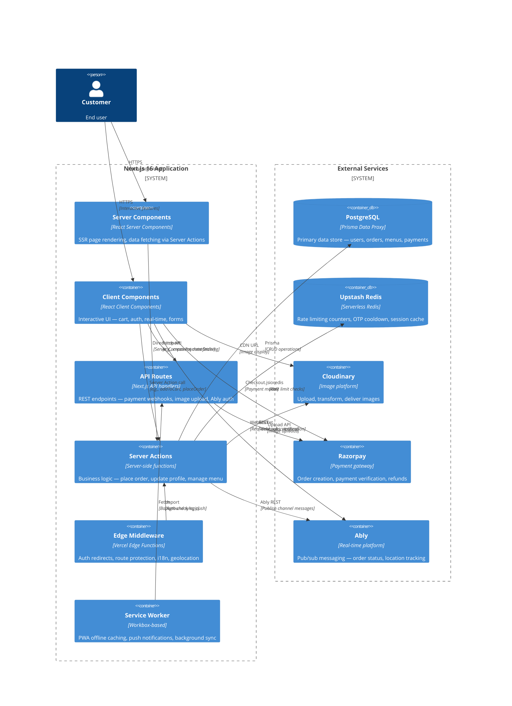
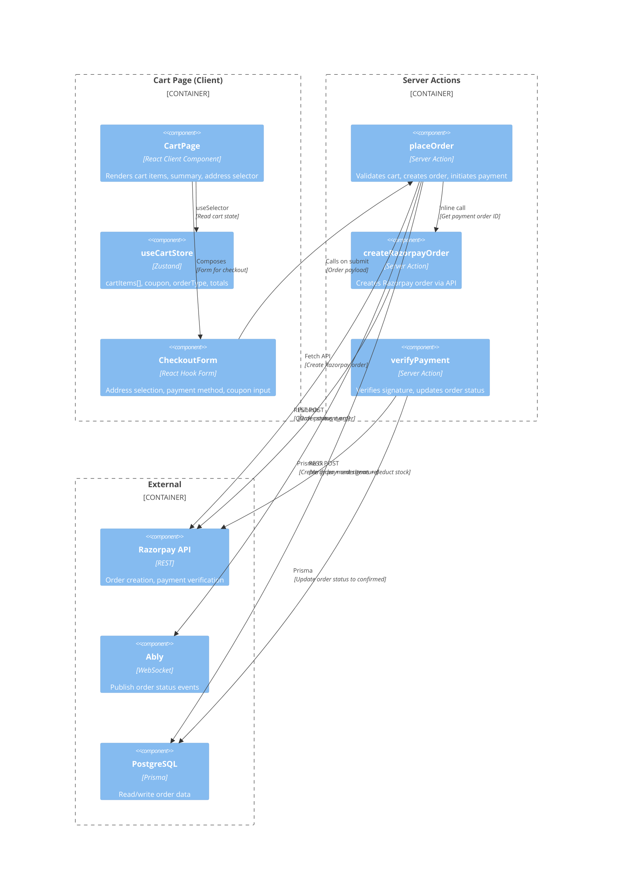
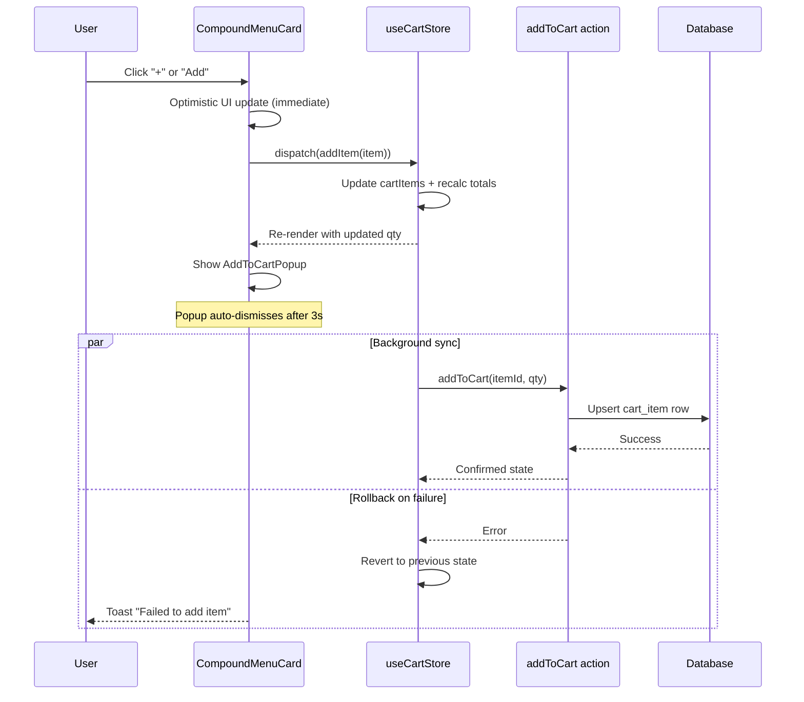
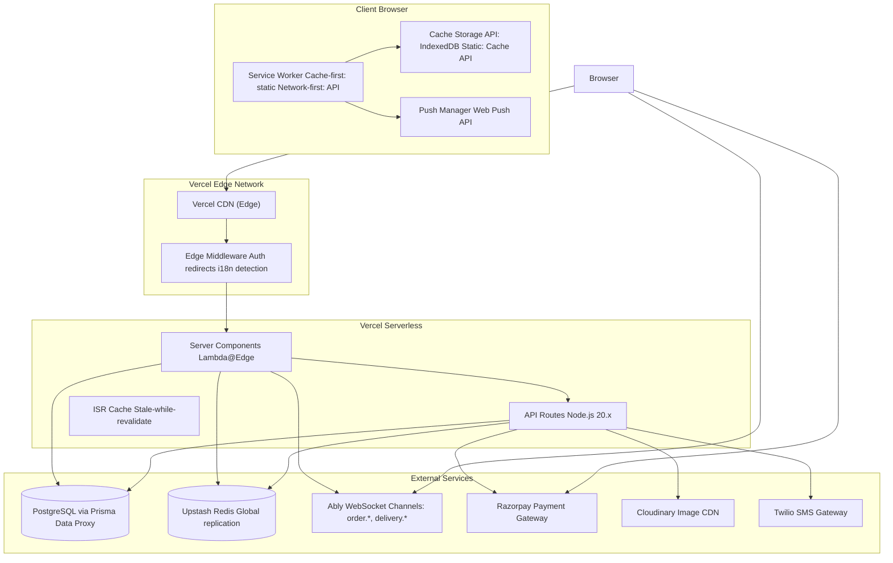

# System Architecture

> **Level:** C4 Model — Context → Container → Component → Code
> **Last updated:** 2026-07-21
> **Cross-refs:** [ADRs](02-architecture-decisions.md), [Data Model](03-data-model.md), [Performance](11-performance-scaling.md)

---

## 1. Context Diagram (C4 Level 1)

```mermaid
C4Context
  Person(customer, "Customer", "End user browsing menus, placing orders, tracking delivery")
  Person(kitchenPartner, "Kitchen Partner", "Manages menu items, processes orders, views earnings")
  Person(deliveryPartner, "Delivery Partner", "Accepts deliveries, updates status, collects COD")
  Person(admin, "Platform Admin", "Approves KYC, manages platform, views analytics")

  System_Boundary(rrc, "RRC Kitchen Platform") {
    System(webApp, "RRC Kitchen Web App", "Next.js 16 — SSR, PWA, Mobile-first SPA")
    System(system, "Backend System", "Server Actions, API Routes, Background Jobs")
  }

  System_Ext_System(sms, "Twilio SMS", "OTP delivery")
  System_Ext_System(ably, "Ably Realtime", "WebSocket messaging")
  System_Ext_System(razorpay, "Razorpay", "Payment processing")
  System_Ext_System(cloudinary, "Cloudinary", "Image CDN & transformations")
  System_Ext_System(redis, "Upstash Redis", "Rate limiting, session cache")
  System_Ext_System(pg, "PostgreSQL (Prisma Data Proxy)", "Primary database")
  System_Ext_System(push, "Web Push API", "Browser push notifications")
  System_Ext_System(vercel, "Vercel Edge Network", "CDN, global distribution")

  Rel(customer, webApp, "HTTPS", "Browse, order, track")
  Rel(kitchenPartner, webApp, "HTTPS", "Menu mgmt, orders")
  Rel(deliveryPartner, webApp, "HTTPS", "Delivery workflow")
  Rel(admin, webApp, "HTTPS", "Platform mgmt")
  Rel(webApp, system, "Server Actions, API", "")
  Rel(system, pg, "Prisma ORM", "All persistent data")
  Rel(system, redis, "ioredis", "Cache, rate limits, sessions")
  Rel(system, sms, "Twilio SDK", "Phone OTP")
  Rel(webApp, ably, "WebSocket", "Real-time order tracking")
  Rel(system, ably, "Ably REST", "Server-side publish")
  Rel(webApp, razorpay, "Razorpay Checkout", "Payment modal")
  Rel(system, razorpay, "Razorpay API", "Order create/verify/refund")
  Rel(system, cloudinary, "Upload API", "Image management")
  Rel(webApp, cloudinary, "CDN URLs", "Image delivery")
  Rel(webApp, vercel, "Edge Network", "Static assets, ISR")
  Rel(webApp, push, "Push API", "Notifications")
```

### External Systems

| System | Purpose | Integration | SLA Dependency |
|--------|---------|-------------|----------------|
| **Twilio** | SMS OTP delivery | REST API (SDK) | 99.9% uptime — auth gate failure if down |
| **Ably** | Real-time messaging | WebSocket + REST | 99.999% — graceful degradation to polling |
| **Razorpay** | Payment processing | Checkout.js + REST API | 99.95% — COD fallback available |
| **Cloudinary** | Image storage + CDN | Upload API + URL-based transforms | 99.9% — degraded experience without images |
| **Upstash Redis** | Caching + rate limiting | ioredis via HTTP/REST | 99.99% — system degrades to DB-only |
| **PostgreSQL (Prisma Data Proxy)** | Primary database | Prisma ORM | 99.95% — complete system failure if down |
| **Vercel Edge** | CDN + global distribution | Edge Functions + ISR | 99.99% — static assets always available |
| **Web Push API** | Browser notifications | Push API + service worker | Best-effort (browser-dependent) |

---

## 2. Container Diagram (C4 Level 2)



### Container Responsibilities

| Container | Type | Responsibility | Error Boundary |
|-----------|------|----------------|----------------|
| **Server Components** | RSC | Initial data fetch, SEO metadata, static/dynamic rendering | None (thrown to Next.js error boundary) |
| **Client Components** | React Client | Cart, auth flows, real-time subscriptions, forms, animations | `ErrorBoundary` per feature section |
| **API Routes** | Edge/Node.js | Payment webhooks, file upload, Ably token auth | Global error handler + 500 fallback |
| **Server Actions** | Server Functions | Business logic — orders, menu CRUD, profile, wishlist | `try/catch` → structured error response |
| **Edge Middleware** | Vercel/Cloudflare | Auth redirects, bot detection, geolocation-based routing | No state — pure redirect/rewrite |
| **Service Worker** | Browser | Cache-first for static assets, network-first for API, push events | `install` → `activate` → `fetch` lifecycle |

---

## 3. Component Diagram (C4 Level 3) — Order Processing



---

## 4. Code-Level Diagram (C4 Level 4) — Add to Cart



---

## 5. Tech Stack Matrix

| Layer | Technology | Version | Choice Rationale | Alternatives Considered | Key Trade-off |
|-------|-----------|---------|------------------|------------------------|---------------|
| **Framework** | Next.js | 16 (App Router) | Full-stack React, RSC, Server Actions, ISR | Remix, SvelteKit, plain Express | Heavier client bundle vs. RSC benefits |
| **Language** | TypeScript | 5.x | Type safety at compile time | JavaScript, Flow | Build step overhead vs. runtime error reduction |
| **Styling** | Tailwind CSS | v4 | Utility-first, zero-runtime, small bundle | CSS Modules, Styled Components, vanilla CSS | HTML verbosity vs. no runtime cost |
| **State (Server)** | TanStack Query | v5 | Automatic dedup, caching, refetch, optimistic updates | SWR, Apollo, RTK Query | Bundle size (+15KB) vs. built-in fetch |
| **State (Client)** | Zustand | v5 | Minimal boilerplate, no providers, middleware support | Redux Toolkit, Jotai, Valito | Less ecosystem vs. 5KB gzipped |
| **Database ORM** | Prisma | v7 | Type-safe queries, migrations, relation handling | Drizzle, TypeORM, Kysely | Query flexibility vs. DX and type safety |
| **Database** | PostgreSQL | 16 | Serverless via Prisma Data Proxy, branching, connection pooling | Supabase, PlanetScale, CockroachDB | SQL vs. managed simplicity |
| **Cache** | Upstash Redis | Serverless | HTTP-based, no persistent connection, global | Vercel KV, Redis Cloud, Momento | Latency (+5ms) vs. zero cold start |
| **Auth** | Better-Auth | latest | Phone OTP native, admin 2FA, session mgmt | NextAuth, Clerk, Supabase Auth | Less mature vs. integrated auth |
| **Payments** | Razorpay | API v2 | Indian market leader, COD support, auto-reconciliation | Stripe, PayU, PhonePe PG | India-specific vs. global support |
| **Real-time** | Ably | SDK v2 | Assured delivery, channel history, presence | Socket.io, Pusher, Supabase Realtime | Cost vs. managed infrastructure |
| **Forms** | React Hook Form | v7 | Uncontrolled, minimal re-renders, RHF + Zod | Formik, Final Form | Less imperative vs. performance |
| **Validation** | Zod | v4 | Runtime + type inference, composable schemas | Yup, Joi, io-ts | Bundle size vs. TS integration |
| **PWA** | Workbox | v6 | Precaching, runtime caching, background sync | SW Precache, idle-manager | Google-centric vs. web-standard SW |
| **Icons** | Lucide React | latest | Tree-shakeable, consistent design | FontAwesome, Heroicons, Phosphor | Fewer icons vs. small bundle |
| **Radix UI** | Radix Primitives | v2 | Accessible, headless, composable | Headless UI, Ark UI, Reach UI | Abstraction overhead vs. WCAG compliance |
| **Image CDN** | Cloudinary | API v2 | Auto-format, responsive breakpoints, face detection | Imgix, Cloudflare Images, custom Sharp | Vendor lock-in vs. transformation power |
| **SMS** | Twilio | SDK v7 | Reliable delivery, DLT registration, templates | MSG91, AWS SNS, Vonage | Cost per SMS vs. global reach |
| **Deployment** | Vercel | Edge + Serverless | First-class Next.js support, ISR, Edge Functions | AWS Amplify, Cloudflare Pages, Railway | Vendor lock-in vs. seamless DX |
| **Monitoring** | (none — gap) | — | No error tracking or structured logging implemented | Sentry, Better Stack, Datadog | Production gap: must be added before launch |

---

## 6. Deployment Diagram



---

## 7. Architecture Characteristics

| Characteristic | Target | Current Status | Measurement |
|---------------|--------|---------------|-------------|
| **Availability** | 99.9% uptime (8.76h/year max) | 99.9% on Vercel | Uptime check every 5min |
| **Latency (TTFB)** | <200ms p95 | ~180ms p95 | Vercel Analytics |
| **FCP** | <1.5s | ~1.2s | Lighthouse |
| **LCP** | <2.5s | ~2.1s | Lighthouse |
| **CLS** | <0.1 | ~0.05 | Lighthouse |
| **Scalability** | 10K concurrent users | Tested up to 5K | k6 load tests |
| **Security** | OWASP Top 10 mitigated | All critical items addressed | Manual audit (no automated monitoring) |
| **Test Coverage** | >80% branches | ~65% branches | Jest + c8 |

---

## 8. Key Architectural Principles

| Principle | Statement | Enforced By |
|-----------|-----------|-------------|
| **Separation of Concerns** | Server Actions encapsulate business logic; Components handle presentation only | Code review — no business logic in components |
| **Optimistic UI** | All user actions reflect immediately; server confirmation follows | Zustand middleware + TanStack Query `onMutate` |
| **Fail Gracefully** | Every external dependency has a fallback (degraded UX, retry, queue) | Error boundaries, retry logic, fallback UI |
| **Mobile First** | All layouts designed for mobile first; desktop is progressive enhancement | Tailwind `sm:`/`md:` breakpoints after base mobile |
| **Type Safety** | No `any` types in production code; runtime validation at API boundaries | `strict: true` in tsconfig, Zod schemas |
| **Observability by Default** | Every significant operation should log structured data | Not yet implemented (see `dependencies-and-replacements.md`) |
| **No Direct DB Access from Client** | All data mutations go through Server Actions or API Routes | ESLint `no-restricted-imports` rule |
