# Data Model & Storage Architecture

> **Status:** Active
> **Last updated:** 2026-08-05
> **Cross-refs:** [API Design](04-api-design.md), [System Architecture](01-system-architecture.md), [Architecture Decisions (Prisma)](02-architecture-decisions.md#adr-006-prisma-as-orm)

---

## 1. Entity Relationship Diagram

```mermaid
erDiagram
    User {
        string id PK
        string publicCode UK "KP-000001 style"
        string phoneNumber UK
        string role "user | kitchen | delivery | admin"
        string name
        string fullName
        string email UK
        string image
        string razorpayCustomerId
        boolean banned
        boolean twoFactorEnabled
        datetime createdAt
        datetime deletedAt "Soft delete"
    }

    Customer {
        string id PK
        string publicCode UK
        string userId FK, UK
        string name
        string phoneNumber
        datetime createdAt
    }

    Session {
        string id PK
        string userId FK
        string token UK
        datetime expiresAt
        string ipAddress
        string userAgent
    }

    KitchenPartner {
        string id PK
        string publicCode UK
        string slug UK
        string userId FK, UK
        string status "PENDINGAPPROVAL | APPROVED | ACTIVE | SUSPENDED | REJECTED"
        float avgRating
        int totalReviews
        json operatingHours
        int estimatedPrepTime
        datetime createdAt
    }

    KitchenAlias {
        string id PK
        string kitchenPartnerId FK, UK
        string displayName UK
        int sequenceNumber UK
        string imageUrl
        string description
        string customOfferText
    }

    KitchenPartnerKyc {
        string id PK
        string kitchenPartnerId FK, UK
        string bankAccountNumber
        string ifscCode
        string upiId
        string gpayNumber
    }

    Category {
        string id PK
        string name UK
        string imageUrl
        boolean isActive
        datetime createdAt
    }

    MenuItem {
        string id PK
        string publicCode UK
        string slug UK
        string menuId FK
        string name
        decimal price
        decimal compareAtPrice
        string foodType "VEG | NONVEG"
        string timeSlot "MORNING | LUNCH | EVENINGSNACKS | DINNER"
        string availableFor "TODAY | TOMORROW | BOTH"
        string cuisine
        boolean bestseller
        json highlights
        int serves
        string portionSize
        string allergens
        string metaTitle
        decimal deliveryFee
        boolean freeDelivery
        boolean isAvailable
        float avgRating
        datetime createdAt
    }

    MenuItemPhoto {
        string id PK
        string menuItemId FK
        string imageUrl
        string cloudinaryPublicId
        int sortOrder
    }

    Order {
        string id PK
        string publicCode UK
        string userId FK
        string addressId FK
        datetime serviceDate
        string serviceDateType "TODAY | TOMORROW | FUTURE"
        string timeSlot
        string status "CONFIRMED | PREPARING | READYFORPICKUP | COMPLETED | CANCELLED | REFUNDED"
        decimal totalAmount
        decimal discountAmount
        decimal commissionAmount "15% platform commission"
        string source "APP | PHONECALL"
        string deliveryStatus "ASSIGNED | ACCEPTED | PICKEDUP | INTRANSIT | DELIVERED | FAILED"
        string idempotencyKey UK
        datetime createdAt
    }

    OrderItem {
        string id PK
        string orderId FK
        string menuItemId FK
        string kitchenPartnerId FK
        int quantity
        decimal unitPrice "snapshot at order time"
        decimal packagingFee
        string status "CONFIRMED | UNAVAILABLE | REFUNDED"
    }

    OrderStatusHistory {
        string id PK
        string orderId FK
        string status
        datetime changedAt
    }

    DeliveryAssignment {
        string id PK
        string orderId FK, UK
        string deliveryPartnerId FK
        string assignedByAdminId FK
        string status "PENDING | DELIVERED | CANCELLED"
        datetime acceptedAt
        datetime deliveredAt
    }

    DeliveryLocation {
        string id PK
        string orderId FK
        string deliveryPartnerId FK
        float latitude
        float longitude
        datetime updatedAt
    }

    DeliveryPartner {
        string id PK
        string publicCode UK
        string userId FK, UK
        string status
        boolean isOnline
        float avgRating
        datetime createdAt
    }

    DeliveryPartnerKyc {
        string id PK
        string deliveryPartnerId FK, UK
        string bankAccountNumber
        string ifscCode
        string upiId
    }

    Payment {
        string id PK
        string publicCode UK
        string orderId FK, UK
        string provider "RAZORPAY | UPI_COLLECT"
        string providerOrderId
        string providerPaymentId
        string paymentMethod
        json paymentMethodDetail "method, app, vpa, bank, card_brand"
        decimal amount
        string status "PENDING | SUCCESS | PARTIAL_REFUND | FAILED | REFUNDED"
        string idempotencyKey UK
        datetime paidAt
    }

    UpiCollectRequest {
        string id PK
        string orderId FK, UK
        string paymentId FK, UK
        string vpa "rrc.order123@razorpay"
        string status "PENDING | PAID | EXPIRED | FAILED"
        datetime expiresAt "30 min TTL"
    }

    Refund {
        string id PK
        string publicCode UK
        string orderId FK
        string orderItemId FK
        string paymentId FK
        string razorpayRefundId UK
        decimal amount
        string reason "ITEM_OUT_OF_STOCK | KITCHEN_REJECTED | CUSTOMER_CANCELLED | QUALITY_ISSUE | LATE_DELIVERY | OTHER"
        string status "INITIATED | PROCESSING | PROCESSED | FAILED"
    }

    Review {
        string id PK
        string orderId FK, UK
        string userId FK
        string kitchenPartnerId FK
        int rating
        int tasteRating
        int packagingRating
        int portionSizeRating
        string comment
        string[] mediaUrls
    }

    MenuItemFeedback {
        string id PK
        string orderId FK
        string orderItemId FK, UK
        string menuItemId FK
        string userId FK
        boolean thumbsUp
        string[] tags
    }

    MenuItemReview {
        string id PK
        string orderId FK
        string orderItemId FK, UK
        string menuItemId FK
        string userId FK
        int rating
    }

    RrcKitchenReview {
        string id PK
        string kitchenPartnerId FK, UK
        int rating
        boolean recommendation
        string comment
    }

    WishlistItem {
        string id PK
        string userId FK
        string menuItemId FK
        datetime createdAt
    }

    KitchenWishlist {
        string id PK
        string userId FK
        string kitchenPartnerId FK
        datetime createdAt
    }

    Address {
        string id PK
        string userId FK
        string serviceZoneId FK
        string lineOne
        string pincode
        float latitude
        float longitude
        boolean isDefault
    }

    Coupon {
        string id PK
        string code UK
        string discountType "FLAT | PERCENTAGE"
        decimal discountValue
        decimal maxDiscount
        decimal minOrderValue
        string scope "PLATFORM | KITCHEN_SPECIFIC"
        string kitchenPartnerId FK
        datetime validFrom
        datetime validTo
        int usageLimitTotal
        int usageLimitPerUser
    }

    CouponRedemption {
        string id PK
        string couponId FK
        string userId FK
        string orderId FK, UK
        decimal discountAmount
    }

    PaymentOffer {
        string id PK
        string name
        string offerType "UPI | WALLET | CARDS | NETBANKING | ALL"
        string discountType
        decimal discountValue
        datetime validFrom
        datetime validTo
    }

    LoyaltyPoints {
        string id PK
        string userId FK, UK
        int points
        int lifetimePoints
        string tier "BRONZE..."
    }

    LoyaltyCoupon {
        string id PK
        string name
        string discountType
        decimal discountValue
        int pointsCost
        boolean isActive
    }

    Referral {
        string id PK
        string referrerId FK
        string referredId FK
        string referralCode UK
        string status "PENDING..."
        decimal rewardAmount
    }

    AdminProfile {
        string id PK
        string publicCode UK
        string userId FK, UK
        string[] permissions "AdminPermission[] — string enum"
        boolean isActive
        datetime createdAt
    }

    AdminInvite {
        string id PK
        string token UK
        string[] permissions
        string createdByUserId FK
        datetime expiresAt
        datetime consumedAt
    }

    AdminAuditLog {
        string id PK
        string actorUserId FK
        string action
        string targetType
        string targetId
        json metadata
        string ipAddress
        datetime createdAt
    }

    AdminApprovalRequest {
        string id PK
        string actionType "REMOVE_ADMIN | GRANT_PERMISSION | LARGE_REFUND | PAYOUT_SETTLEMENT | BAN_USER"
        string status "PENDING | APPROVED | REJECTED"
        json payload
    }

    TwoFactor {
        string id PK
        string userId FK
        string secret
        string backupCodes
        boolean verified
        datetime lockedUntil
    }

    SupportTicket {
        string id PK
        string userId FK
        string orderId FK
        string subject
        string description
        string category
        string priority "LOW | MEDIUM | HIGH | URGENT"
        string status "OPEN | INPROGRESS | RESOLVED | CLOSED"
        string[] mediaUrls
    }

    ContactMessage {
        string id PK
        string fullName
        string email
        string phone
        string subject
        string message
        string status "OPEN..."
    }

    SearchPageContent {
        string id PK
        string keyword UK
        boolean isActive
        string bannerImageUrl
        string heading
        int cardsPerPage
        string defaultSort
        int version
    }

    CategoryPageContent {
        string id PK
        string categoryId FK, UK
        string heroLayout "LEFT_TEXT..."
        string desktopBannerUrl
        string mobileBannerUrl
        string metaTitle
        string metaDescription
        string[] keywords
        string[] featuredKitchenIds
        int version
    }

    KitchenSearchPageContent {
        string id PK
        string keyword UK
        string desktopBannerUrl
        string searchTitle
        boolean showDeliveryTime
        boolean showDistance
        boolean showPureVegBadge
        int version
    }

    CravingsRule {
        string id PK
        string name
        string triggerItemId FK
        string kitchenId FK
        string title
        string message
        string priority "HIGH | MEDIUM | LOW"
        boolean isActive
        string updatedBy
    }

    CravingsRuleItem {
        string id PK
        string ruleId FK
        string menuItemId FK
        int sortOrder
    }

    KitchenPayout {
        string id PK
        string kitchenPartnerId FK
        string orderId FK, UK
        decimal grossAmount
        decimal commissionAmount
        decimal couponBorneByKitchen
        decimal netAmount
        string status "PENDING | PROCESSING | SETTLED | FAILED"
        string razorpayPayoutId UK
    }

    DeliveryPartnerPayout {
        string id PK
        string deliveryPartnerId FK
        string orderId FK, UK
        decimal amount "10% commission"
        string status
    }

    NotificationLog {
        string id PK
        string userId FK
        string channel
        string templateKey
        string status
    }

    PushSubscription {
        string id PK
        string userId FK
        string endpoint UK
        string p256dh
        string auth
    }

    PublicIdCounter {
        string id PK
        string prefix UK "KP | DP | ADM | ORD | PYMT | RFD | M | CUS"
        int sequence
        int digits
    }

    User ||--o| Customer : is
    User ||--o{ Session : has
    User ||--o{ Address : has
    User ||--o{ Order : places
    User ||--o{ Review : writes
    User ||--o{ WishlistItem : has
    User ||--o{ KitchenWishlist : has
    User ||--o{ SupportTicket : opens
    User ||--o{ PushSubscription : has
    User ||--o| AdminProfile : is
    User ||--o| KitchenPartner : owns
    User ||--o| DeliveryPartner : is

    KitchenPartner ||--o| KitchenAlias : branded_as
    KitchenPartner ||--o| KitchenPartnerKyc : has
    KitchenPartner ||--o{ OrderItem : fulfills
    KitchenPartner ||--o{ Review : receives
    KitchenPartner ||--o{ KitchenPayout : receives
    KitchenPartner ||--o{ CravingsRule : triggers

    KitchenAlias ||--o{ MenuItem : contains
    Category ||--o{ MenuItem : categorizes
    Category ||--o{ CategoryPageContent : drives

    MenuItem ||--o{ MenuItemPhoto : has
    MenuItem ||--o{ OrderItem : referenced_in
    MenuItem ||--o{ CravingsRuleItem : recommended_in

    Order ||--o{ OrderItem : contains
    Order ||--o{ OrderStatusHistory : tracks
    Order ||--o{ DeliveryLocation : has
    Order ||--o| Payment : has
    Order ||--o| DeliveryAssignment : assigned_to
    Order ||--o{ Refund : refunded_by
    Order ||--o| UpiCollectRequest : maybe

    DeliveryPartner ||--o{ DeliveryAssignment : performs
    DeliveryPartner ||--o{ DeliveryLocation : broadcasts
    DeliveryPartner ||--o{ DeliveryPartnerPayout : receives

    Payment ||--o{ Refund : has_refunds
    Payment ||--o| UpiCollectRequest : backed_by

    CravingsRule ||--o{ CravingsRuleItem : contains
    AdminProfile ||--o{ AdminInvite : creates
    AdminProfile ||--o{ AdminAuditLog : logs
```



---

## 2. Index Strategy

### 2.1 Primary Indexes (auto-generated by Prisma)
All `id` fields have a primary B-tree index.

### 2.2 Secondary Indexes

| Table | Index | Type | Purpose | Query Pattern |
|-------|-------|------|---------|---------------|
| `User` | `phoneNumber` | Unique | Phone OTP lookup | `findUnique({ where: { phoneNumber } })` |
| `User` | `email` | Unique | Admin login | `findUnique({ where: { email } })` |
| `User` | `publicCode` | Unique | Support lookups | `findUnique({ where: { publicCode } })` |
| `Session` | `token` | Unique | Session validation | `findUnique({ where: { token } })` |
| `Session` | `userId` | B-tree | User sessions | `findMany({ where: { userId } })` |
| `KitchenPartner` | `slug` | Unique | URL routing | `findUnique({ where: { slug } })` |
| `KitchenPartner` | `status` | B-tree | Approval queues | `findMany({ where: { status } })` |
| `KitchenPartner` | `avgRating` | B-tree | Top-rated kitchens | `orderBy: { avgRating: 'desc' }` |
| `KitchenAlias` | `displayName` | Unique | Brand lookup | `findUnique({ where: { displayName } })` |
| `KitchenAlias` | `sequenceNumber` | Unique | Kitchen numbering | `findUnique({ where: { sequenceNumber } })` |
| `MenuItem` | `slug` | Unique | Menu item URL | `findUnique({ where: { slug } })` |
| `MenuItem` | `[menuId, timeSlot, foodType]` | Composite | Kitchen menu by slot | `findMany({ where: { menuId, timeSlot, foodType } })` |
| `MenuItem` | `[isAvailable, timeSlot, foodType]` | Composite | Catalog browsing | `findMany({ where: { isAvailable, timeSlot, foodType } })` |
| `MenuItem` | `categoryId` | B-tree | Category pages | `findMany({ where: { categoryId } })` |
| `Order` | `userId` | B-tree | User order history | `findMany({ where: { userId } })` |
| `Order` | `[serviceDate, timeSlot]` | Composite | Slot-based queries | `findMany({ where: { serviceDate, timeSlot } })` |
| `Order` | `status` | B-tree | Status queues | `findMany({ where: { status } })` |
| `Order` | `deliveryPartnerId` | B-tree | Partner deliveries | `findMany({ where: { deliveryPartnerId } })` |
| `Order` | `idempotencyKey` | Unique | Duplicate order prevention | `findUnique({ where: { idempotencyKey } })` |
| `OrderItem` | `orderId` | B-tree | Order items | `findMany({ where: { orderId } })` |
| `OrderItem` | `kitchenPartnerId` | B-tree | Kitchen order view | `findMany({ where: { kitchenPartnerId } })` |
| `OrderStatusHistory` | `orderId` | B-tree | Status timeline | `findMany({ where: { orderId } })` |
| `DeliveryAssignment` | `orderId` | Unique | Assignment lookup | `findUnique({ where: { orderId } })` |
| `DeliveryAssignment` | `deliveryPartnerId` | B-tree | Partner assignments | `findMany({ where: { deliveryPartnerId } })` |
| `DeliveryLocation` | `orderId` | B-tree | Tracking fallback | `findMany({ where: { orderId } })` |
| `Review` | `kitchenPartnerId` | B-tree | Kitchen reviews | `findMany({ where: { kitchenPartnerId } })` |
| `Review` | `orderId` | Unique | One review per order | `findUnique({ where: { orderId } })` |
| `Review` | `[kitchenPartnerId, rating]` | Composite | Avg rating calc | `aggregate({ where: { kitchenPartnerId }, _avg: { rating } })` |
| `WishlistItem` | `[userId, menuItemId]` | Composite Unique | Prevent duplicates | `findUnique({ where: { userId_menuItemId } })` |
| `Coupon` | `code` | Unique | Coupon validation | `findUnique({ where: { code } })` |
| `Payment` | `orderId` | Unique | Payment lookup | `findUnique({ where: { orderId } })` |
| `Payment` | `idempotencyKey` | Unique | Webhook idempotency | `findUnique({ where: { idempotencyKey } })` |
| `Refund` | `razorpayRefundId` | Unique | Webhook processing | `findUnique({ where: { razorpayRefundId } })` |
| `UpiCollectRequest` | `orderId` / `paymentId` | Unique | VPA↔order mapping | `findUnique({ where: { orderId } })` |
| `CravingsRule` | `[triggerItemId, isActive]` | Composite | Rule resolution | `findMany({ where: { triggerItemId, isActive } })` |
| `CravingsRuleItem` | `[ruleId, menuItemId]` | Composite Unique | Rule items | `findMany({ where: { ruleId } })` |
| `PublicIdCounter` | `prefix` | Unique | Atomic code allocation | `update({ where: { prefix }, data: { sequence: { increment: 1 } } })` |
| `CategoryPageContent` | `categoryId` | Unique | Category CMS lookup | `findUnique({ where: { categoryId } })` |
| `SearchPageContent` | `keyword` | Unique | Keyword CMS lookup | `findUnique({ where: { keyword } })` |

### 2.3 Full-Text Search

For menu item search across kitchens, PostgreSQL `tsvector` is used:

```sql
CREATE INDEX idx_menu_item_search ON "MenuItem" USING GIN (
  to_tsvector('english', name || ' ' || coalesce(description, ''))
);
```

Query pattern:
```sql
SELECT * FROM "MenuItem"
WHERE to_tsvector('english', name || ' ' || coalesce(description, '')) @@ plainto_tsquery('english', $searchTerm)
  AND "isAvailable" = true
LIMIT 20;
```

---

## 3. Migration Strategy

### 3.1 Prisma Migrate

All schema changes use `prisma migrate`:

```bash
# Development: create and apply migration
npx prisma migrate dev --name add_order_tracking_table

# Staging/Production: apply pending migrations
npx prisma migrate deploy
```

### 3.2 Migration Guidelines

| Scenario | Approach | Risk Level |
|----------|----------|------------|
| New table | Add model → `prisma migrate dev` → verify in staging | Low |
| New optional column | Add field (nullable) → deploy → populate data → make required | Low |
| New required column | Add with default → deploy → remove default | Medium |
| Rename column | Add new column → dual-write → backfill → deploy read path → remove old | High |
| Rename table | Create new table → dual-write → backfill → deploy → drop old | High |
| Add index | `@@index` in schema → `prisma migrate dev` | Low |
| Remove index | Remove `@@index` → `prisma migrate dev` | Low |
| Drop table | DO NOT DROP until verified no references after 1 week | High |

### 3.3 Zero-Downtime Deployments

For production:
1. Run `prisma migrate deploy` BEFORE deploying new code
2. New columns must be nullable (or have defaults) to work with old code
3. Remove old columns after all pods run new code

---

## 4. Query Patterns & N+1 Prevention

### 4.1 Critical Query: Kitchen Detail Page

```typescript
// ❌ N+1 Pattern (Avoid)
const kitchen = await prisma.kitchenPartner.findUnique({ where: { alias: slug } });
const aliases = await prisma.kitchenAlias.findMany({ where: { kitchenPartnerId: kitchen.id } });
// For each alias, fetch menu items separately!

// ✅ Optimal Pattern (lib/kitchen-detail.ts → queryKitchenDetail)
const kitchen = await prisma.kitchenPartner.findUnique({
  where: { slug },
  include: {
    kitchenAlias: true,
    kitchenAddress: true,
    reviews: { orderBy: { createdAt: 'desc' }, take: 10 },
    menus: {
      include: {
        menuItems: {
          where: { isAvailable: true },
          include: { photos: { orderBy: { sortOrder: 'asc' }, take: 1 } },
          orderBy: { createdAt: 'desc' },
        },
      },
    },
    _count: { select: { reviews: true, orderItems: true } },
  },
});
```

### 4.2 N+1 Detection

Use Prisma's query logging in development:

```bash
DATABASE_URL=... npx prisma generate --watch
# Or enable logging in dev:
```

```typescript
const prisma = new PrismaClient({
  log: ['query', 'info', 'warn', 'error'],
});
```

Additionally, ESLint rule `@tanstack/query/no-unnecessary-includes` prevents over-fetching.

### 4.3 Pagination Pattern

```typescript
async function getOrders(userId: string, cursor?: string, limit = 20) {
  return prisma.order.findMany({
    where: { userId },
    take: limit + 1, // Fetch one extra to check if next page exists
    ...(cursor ? { cursor: { id: cursor }, skip: 1 } : {}),
    orderBy: { createdAt: 'desc' },
    include: {
      orderItems: { include: { menuItem: { select: { name: true, slug: true } } } },
    },
  });
}
// Client: if results.length > limit, next cursor = results[limit - 1].id
```

### 4.4 Batch Operations

```typescript
// Bulk status update
await prisma.$transaction(
  orderIds.map((id) =>
    prisma.order.update({
      where: { id },
      data: { status: "CANCELLED" },
    })
  )
);
```

---

## 5. Redis Cache Strategy

Upstash Redis (serverless) is used for hot-path caching, live rider state, and the order-event stream:

| Cache Key | TTL | Purpose | Invalidation Trigger |
|-----------|-----|---------|---------------------|
| `kitchen:{slug}:detail` | 60s | Kitchen detail page | Menu update |
| `menu:{kitchenId}:items` | 30s | Menu items list | Menu CRUD |
| `menu:cache` | — | Menu cache (busted on order) | New order |
| `deliveryPersons:live` | — | Geo-index of online delivery partners | Location heartbeat |
| `deliveryOrder:{id}:lastLoc` | — | Rider's last known position (tracking) | Location update |
| `order-events` | — | Redis stream — `ORDER_CONFIRMED` etc. | Append on order events |
| `otp:cooldown:{phone}` | 60s | OTP rate limiting | Auto-expire |
| `otp:ip:{ip}` | 3600s | IP rate limiting | Auto-expire |

> Note: the generic `user:{id}:profile` / `coupon:{code}` / `rating:{kitchenId}` / `search:results:{query}` keys documented previously are not currently implemented — server-side data is cached with `lib/server-cache.ts` (`cached()` wrapper, 30–60s) and Next.js `'use cache'; cacheLife('hours')`.

---

## 6. Data Retention & Cleanup

| Data | Retention | Cleanup Strategy |
|------|-----------|-----------------|
| Soft-deleted users | 90 days | Hard delete after 90d via cron |
| Order tracking history | 1 year | Archive to cold storage |
| Session records | 30 days post-expiry | Daily cron `deleteMany expiresAt < now - 30d` |
| Admin audit logs | 3 years | Keep indefinitely per compliance |
| Payment records | 7 years (tax compliance) | Keep indefinitely |
| OTP logs | 24 hours | Auto-generated logs with TTL index |
| Cart items | 7 days | Cron: delete `CartItem` where `updatedAt < 7d ago` |
| Push subscriptions | On unsubscribe | Delete when push fails with `410 Gone` |
