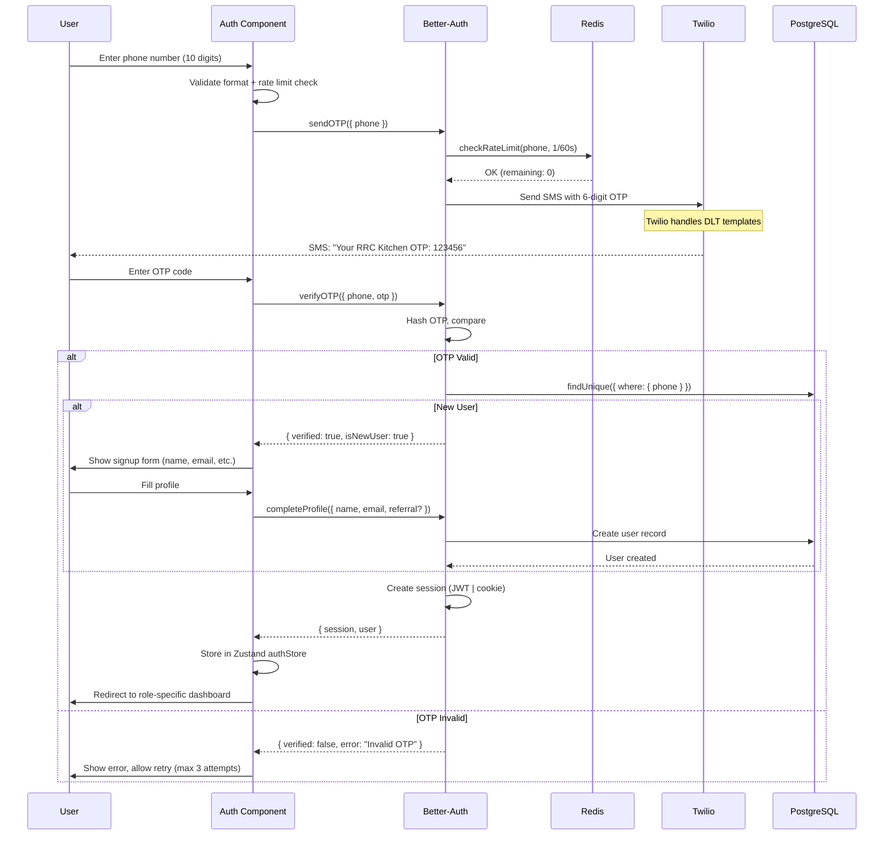
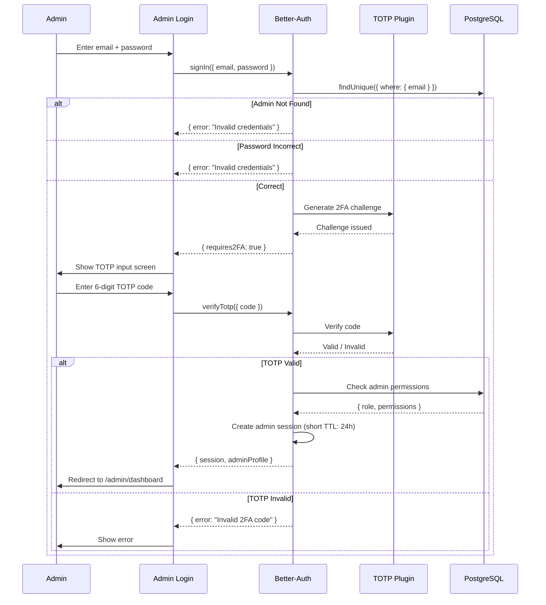
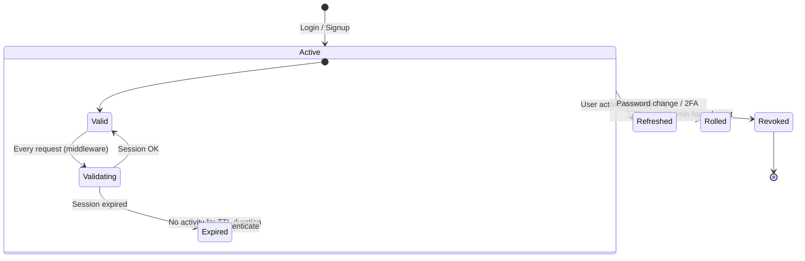
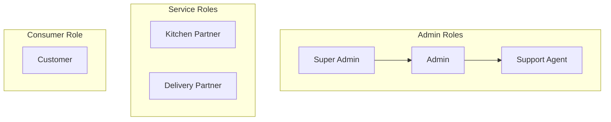

# Authentication & Security Architecture

> **Status:** Active
> **Last updated:** 2026-07-21
> **Cross-refs:** [API Design](04-api-design.md), [Architecture Decisions (Better-Auth)](02-architecture-decisions.md#adr-005-better-auth-for-authentication), [Roles](16-roles-permissions.md)

---

## 1. Authentication Flows

### 1.1 Customer / Kitchen Partner / Delivery Partner (Phone OTP)



### 1.2 Admin Authentication (Email + TOTP 2FA)



### 1.3 Session Lifecycle



| Role | Session TTL | Renewal Strategy | Max Concurrent |
|------|-------------|-----------------|----------------|
| Customer | 7 days | On any authenticated request | Unlimited |
| Kitchen Partner | 7 days | On any authenticated request | 5 |
| Delivery Partner | 7 days | On any authenticated request | 3 |
| Admin | 24 hours | On dashboard interaction | 2 |

---

## 2. Authorization (RBAC)

### 2.1 Role Hierarchy



### 2.2 Role Permissions Matrix

| Permission | Customer | Kitchen Partner | Delivery Partner | Support Agent | Admin | Super Admin |
|-----------|----------|----------------|-----------------|---------------|-------|-------------|
| Browse menus | ✓ | ✓ | ✓ | ✓ | ✓ | ✓ |
| Place orders | ✓ | ✗ | ✗ | ✓ | ✓ | ✓ |
| Manage own profile | ✓ | ✓ | ✓ | ✓ | ✓ | ✓ |
| Manage own menu | ✗ | ✓ (own) | ✗ | ✗ | ✓ (all) | ✓ (all) |
| View incoming orders | ✗ | ✓ (own) | ✗ | ✓ | ✓ | ✓ |
| Accept deliveries | ✗ | ✗ | ✓ (assigned) | ✗ | ✗ | ✗ |
| Manage all kitchens | ✗ | ✗ | ✗ | ✗ | ✓ | ✓ |
| Approve KYC | ✗ | ✗ | ✗ | ✗ | ✓ | ✓ |
| View financials | ✗ | ✓ (own) | ✓ (own) | ✗ | ✓ | ✓ |
| Manage coupons | ✗ | ✗ | ✗ | ✗ | ✓ | ✓ |
| Process payouts | ✗ | ✗ | ✗ | ✗ | ✓ | ✓ |
| Ban users | ✗ | ✗ | ✗ | ✗ | ✓ | ✓ |
| Manage support | ✗ | ✗ | ✗ | ✓ | ✓ | ✓ |
| Invite admins | ✗ | ✗ | ✗ | ✗ | ✓ | ✓ |
| View audit logs | ✗ | ✗ | ✗ | ✗ | ✓ | ✓ |
| Platform config | ✗ | ✗ | ✗ | ✗ | ✗ | ✓ |

### 2.3 Admin Permission Bitfield

```typescript
enum AdminPermission {
  MANAGE_ORDERS = 1 << 0,     // 1
  MANAGE_MENU = 1 << 1,       // 2
  APPROVE_KYC = 1 << 2,       // 4
  VIEW_FINANCIALS = 1 << 3,   // 8
  MANAGE_COUPONS = 1 << 4,    // 16
  MANAGE_PAYOUTS = 1 << 5,    // 32
  BAN_USERS = 1 << 6,         // 64
  MANAGE_SUPPORT = 1 << 7,    // 128
  MANAGE_CMS = 1 << 8,        // 256
  MANAGE_ADMINS = 1 << 9,     // 512
  MANAGE_CATALOG = 1 << 10,   // 1024
}

// Example: Support Agent has only MANAGE_SUPPORT
const supportPermissions = AdminPermission.MANAGE_SUPPORT; // 128

// Example: Full admin has all except MANAGE_ADMINS
const fullAdmin = (1 << 10) - 1 ^ AdminPermission.MANAGE_ADMINS; // 1023
```

---

## 3. Threat Model

### 3.1 Assets

| Asset | Sensitivity | Storage | Impact if Compromised |
|-------|-------------|---------|----------------------|
| User PII (phone, email, address) | PII | PostgreSQL (encrypted at rest) | GDPR/DPDP violation, identity theft |
| Password hash (admin) | Critical | PostgreSQL (bcrypt, cost=12) | Full admin access |
| Session tokens | Critical | Cookie (httpOnly, secure) | Account takeover |
| Payment data | PCI DSS | Razorpay (tokenized) | Financial fraud |
| OTP codes | Medium | Memory (hashed) | Account takeover |
| API keys (Razorpay, Twilio, etc.) | Critical | Environment variables | Financial loss, service abuse |
| Kitchen bank details | Critical | PostgreSQL (encrypted) | Financial fraud |

### 3.2 Threats & Mitigations

| Threat | Likelihood | Impact | Mitigation |
|--------|-----------|--------|------------|
| **OTP bombing** | High | Medium | Rate limiting (1/60s per phone, 5/hour per IP, 10/day per phone) |
| **Session hijacking** | Medium | Critical | `httpOnly`, `Secure`, `SameSite=Strict` cookies; short-lived JWTs |
| **SQL injection** | Low | Critical | Prisma parameterized queries; no raw SQL in application code |
| **IDOR** | Medium | High | Every resource access validates ownership via `userId` |
| **CSRF** | Medium | High | `SameSite=Strict` + `Origin` header validation |
| **XSS** | Low | High | React escaping; `dangerouslySetInnerHTML` ESLint-banned |
| **Brute force (admin)** | Medium | Critical | Rate limiting (10/60s); TOTP 2FA; account lockout after 5 attempts |
| **Man-in-the-middle** | Low | High | HTTPS everywhere; HSTS headers |
| **Dependency vulnerability** | Medium | High | `npm audit` in CI; Dependabot alerts; weekly review |
| **Cloudinary unsigned upload** | Medium | Medium | Server-side validation of upload results; rate limited |
| **OTP interception (SS7)** | Low | High | OTP retry limits; consider app-based TOTP for future |
| **Refund fraud** | Low | High | Refund only to original payment method; manual review for >₹1000 |

### 3.3 Data Classification

| Class | Example | Encryption at Rest | Encryption in Transit | Access Control |
|-------|---------|-------------------|----------------------|----------------|
| **Public** | Menu items, kitchen names, ratings | No | TLS | Everyone |
| **Internal** | Coupon codes, aggregated analytics | No | TLS | Authenticated users |
| **Confidential** | User addresses, order details | Yes (AES-256) | TLS | User, kitchen, admin |
| **Restricted** | Phone numbers, bank details, passwords | Yes (AES-256) | TLS | User (own), admin (with permission) |
| **Critical** | API keys, payment tokens | Yes (encrypted env vars) | TLS | Infrastructure only |

---

## 4. Security Headers

| Header | Value | Rationale |
|--------|-------|-----------|
| `Strict-Transport-Security` | `max-age=63072000; includeSubDomains` | Enforce HTTPS for 2 years |
| `Content-Security-Policy` | `default-src 'self'; script-src 'self' 'unsafe-eval' https://*.razorpay.com; style-src 'self' 'unsafe-inline'; img-src 'self' https://res.cloudinary.com data:; connect-src 'self' https://*.razorpay.com https://*.ably.io wss://*.ably.io; frame-src https://*.razorpay.com` | Strict CSP with Razorpay/Ably/Cloudinary exceptions |
| `X-Content-Type-Options` | `nosniff` | Prevent MIME sniffing |
| `X-Frame-Options` | `DENY` | Prevent clickjacking |
| `Referrer-Policy` | `strict-origin-when-cross-origin` | Minimal referrer leakage |
| `Permissions-Policy` | `camera=(), microphone=(), geolocation=(self), payment=(self)` | Limit API access to what's needed |

---

## 5. Input Validation & Sanitization

### 5.1 Phone Number

```typescript
const phoneSchema = z.string()
  .regex(/^[6-9]\d{9}$/, 'Invalid Indian phone number')
  .transform(p => `+91${p}`); // Normalize to E.164

// Stored as: +919876543210
// User enters: 9876543210
```

### 5.2 OTP

```typescript
const otpSchema = z.string()
  .length(6)
  .regex(/^\d{6}$/, 'OTP must be 6 digits');
```

### 5.3 Price & Amount

```typescript
// All monetary values stored in paise (integer) to avoid float issues
const amountSchema = z.number().int().min(0); // In paise
// Display: ₹(amount / 100).toFixed(2)
```

### 5.4 HTML Sanitization

No user-supplied HTML is rendered. Markdown is not supported. All text is escaped by React.

---

## 6. CSRF Protection Strategy

| Layer | Mechanism |
|-------|-----------|
| **Cookie** | `SameSite=Strict` for all cookies |
| **API Routes** | Origin header validation (`Origin` must match `ALLOWED_ORIGINS`) |
| **Server Actions** | Next.js built-in CSRF protection (origin check) |
| **State-changing GET** | Banned — no mutation via GET requests |

---

## 7. Session Validation Middleware

```typescript
// middleware.ts — Edge Middleware
export function middleware(request: NextRequest) {
  const session = request.cookies.get('session_token');
  const path = request.nextUrl.pathname;

  // Public routes
  if (path.startsWith('/_next') || path.startsWith('/api/public') ||
      path === '/' || path === '/auth/login' || path === '/auth/signup') {
    return NextResponse.next();
  }

  // Admin routes
  if (path.startsWith('/admin')) {
    if (!session) return redirectToLogin(request);
    const isValid = await validateAdminSession(session.value);
    if (!isValid) return redirectToLogin(request);
  }

  // Protected customer routes
  if (path.startsWith('/account') || path.startsWith('/checkout')) {
    if (!session) return redirectToLogin(request);
  }

  return NextResponse.next();
}
```

---

## 8. Audit Logging

All admin actions are logged to `AdminAuditLog`:

```typescript
interface AuditLogEntry {
  adminId: string;
  action: string;           // e.g., "UPDATE_ORDER_STATUS"
  entityType: string;       // e.g., "order"
  entityId: string;         // e.g., "order_abc123"
  before: Record<string, unknown>;  // Previous state (redacted PII)
  after: Record<string, unknown>;   // New state (redacted PII)
  ipAddress: string;
  userAgent: string;
}
```

**PII Redaction:**
- Phone numbers: `+919876xxxx10`
- Email: `d****@example.com`
- Address: Show only city/pincode, hide street/house number
- Bank details: Show only last 4 digits

---

## 9. Security Checklist (Pre-Deployment)

- [ ] All environment secrets rotated before production
- [ ] SSL/TLS certificate valid (not self-signed)
- [ ] CSP headers configured and tested
- [ ] Rate limiting verified for OTP and auth endpoints
- [ ] Admin accounts have TOTP 2FA enforced
- [ ] No `console.log` of sensitive data (ESLint rule)
- [ ] `npm audit` shows 0 critical vulnerabilities
- [ ] Session cookies set with `httpOnly`, `Secure`, `SameSite`
- [ ] Webhook endpoints verify HMAC signatures
- [ ] File upload validates MIME type + size + dimensions
- [ ] Database connection uses SSL
- [ ] CORS restricted to production origin
- [ ] `.env` files not in repository (gitignored)
