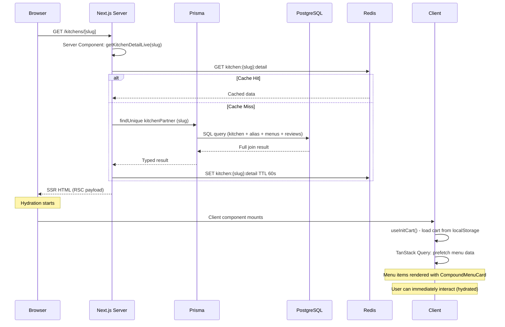
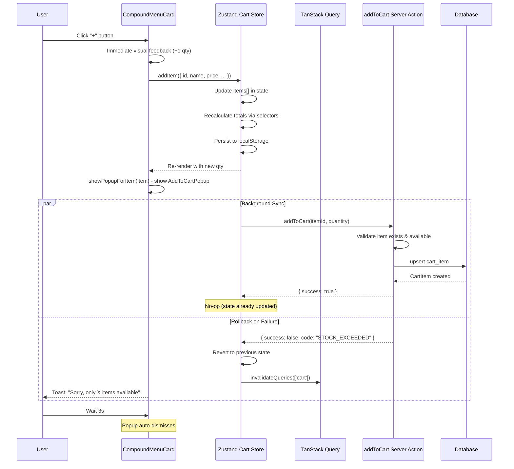
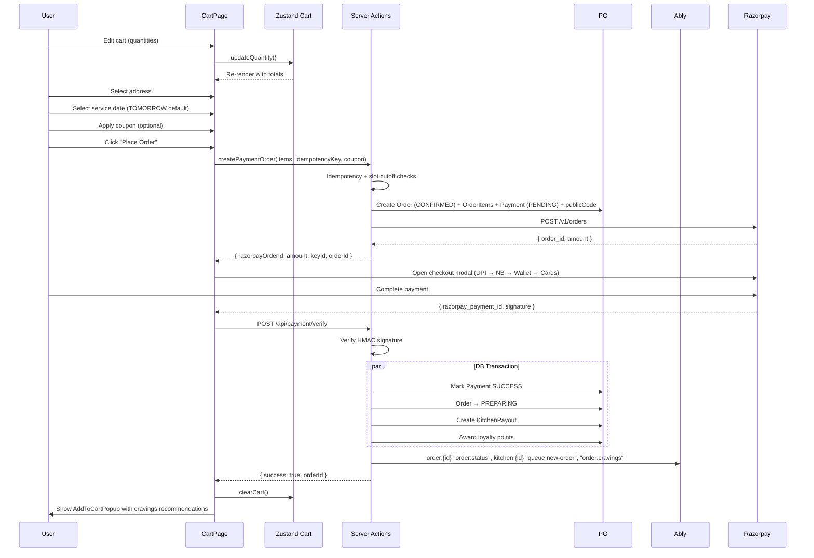
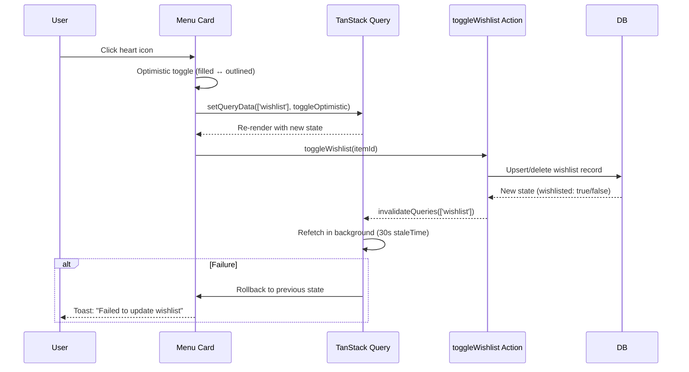
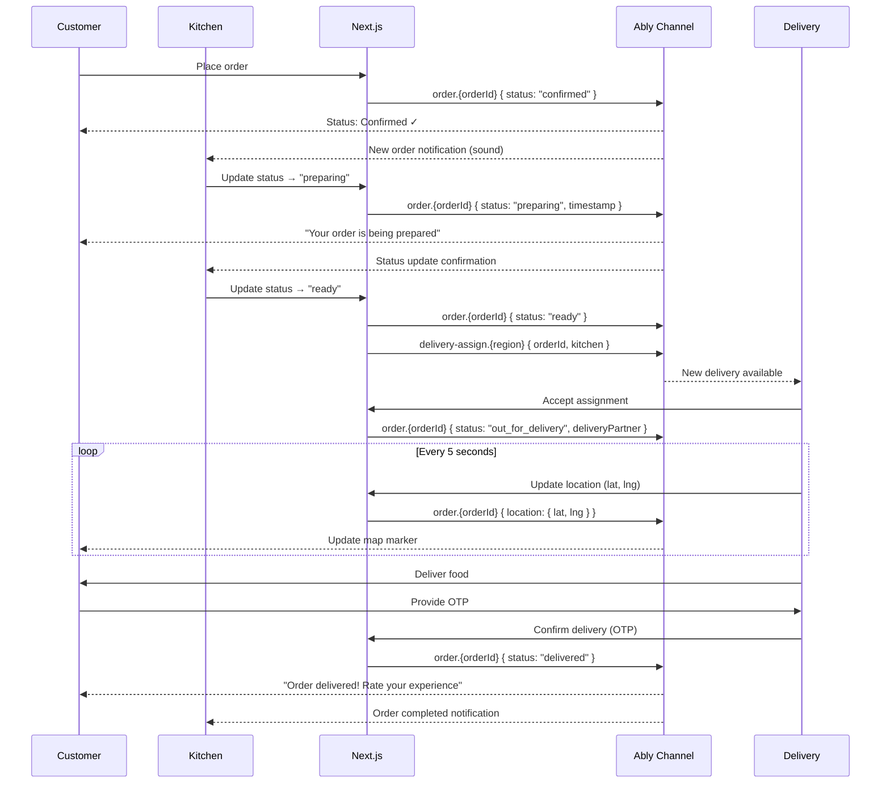
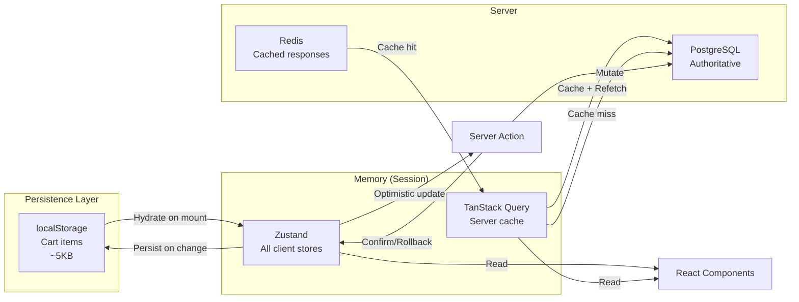

# State Management & Data Flow Architecture

> **Status:** Active
> **Last updated:** 2026-08-05
> **Cross-refs:** [System Architecture](01-system-architecture.md), [API Design](04-api-design.md), [Component System](07-component-system.md)

---

## 1. State Management Layers

```mermaid
%%{init: {'flowchart': {'curve': 'basis', 'useMaxWidth': true}}}%%
flowchart TB
    subgraph "Layer 1: Server State (TanStack Query)"
        MQ["Menu Queries staleTime: 30s cacheTime: 5min"]
        WQ["Wishlist Queries staleTime: 30s gcTime: 5min"]
        PQ["Profile Queries staleTime: Infinity gcTime: 30min"]
        OQ["Order Queries staleTime: 0 gcTime: 10min"]
    end

    subgraph "Layer 2: Client State (Zustand)"
        CS["Cart Store persist: localStorage optimistic updates"]
        MS["Menu Store search, filters, view"]
        AS["Auth Store session, role, UI step"]
        US["UI Store modals, toasts, sidebar"]
    end

    subgraph "Layer 3: Form State (React Hook Form)"
        SF["Signup Form RHF + Zod validation"]
        CF["Checkout Form RHF + address selector"]
        AF["Admin Forms RHF + permission grids"]
    end

    subgraph "Layer 4: URL State (next/navigation)"
        RS["Route State searchParams, path"]
        QS["Query State useSearchParams"]
    end

    subgraph "Layer 5: Real-time State (Ably)"
        OS["Order State status updates, location"]
        KS["Kitchen State incoming orders"]
    end

    UI["React Components"] --> MQ
    UI --> WQ
    UI --> PQ
    UI --> OQ
    UI --> CS
    UI --> MS
    UI --> AS
    UI --> US
    UI --> SF
    UI --> CF
    UI --> AF
    UI --> RS
    UI --> OS
    UI --> KS
```



---

## 2. Store Architecture

### 2.1 Zustand Stores

#### Cart Store (`stores/cart-store.ts`)

```typescript
interface CartItem {
  id: string;              // MenuItem.id
  aliasId: string;         // KitchenAlias.id (for same-kitchen validation)
  name: string;
  price: number;           // Current price (snapshot)
  discountedPrice: number | null;
  quantity: number;
  photoUrl?: string;
  isVeg: boolean;
  preparationTime: number;
}

interface CartState {
  // Data
  items: CartItem[];
  couponCode: string | null;
  couponDiscount: number;
  orderType: 'prebook' | null;
  deliveryAddressId: string | null;
  scheduledAt: string | null; // ISO 8601 (for prebook)
  notes: string;

  // Computed (derived, not stored)
  // Use selectors instead of storing derived state

  // Actions
  addItem: (item: Omit<CartItem, 'quantity'> & { quantity?: number }) => void;
  removeItem: (itemId: string) => void;
  updateQuantity: (itemId: string, quantity: number) => void;
  clearCart: () => void;
  setOrderType: (type: 'prebook') => void;
  setCoupon: (code: string, discount: number) => void;
  removeCoupon: () => void;
  setDeliveryAddress: (id: string) => void;
  setScheduledAt: (iso: string | null) => void;
  setNotes: (notes: string) => void;
}

// Selectors (memoized)
const selectCartItems = (state: CartState) => state.items;
const selectCartCount = (state: CartState) =>
  state.items.reduce((sum, item) => sum + item.quantity, 0);
const selectCartSubtotal = (state: CartState) =>
  state.items.reduce((sum, item) => sum + item.price * item.quantity, 0);
const selectCartTotal = (state: CartState) => {
  const subtotal = selectCartSubtotal(state);
  return subtotal - state.couponDiscount;
};
const selectIsSingleKitchen = (state: CartState) => {
  const uniqueKitchens = new Set(state.items.map(i => i.aliasId));
  return uniqueKitchens.size <= 1;
};
```

#### Menu Store (`stores/menu-store.ts`)

```typescript
interface MenuState {
  searchQuery: string;
  selectedCategory: string | null;
  vegFilter: 'all' | 'veg' | 'non-veg';
  sortBy: 'popularity' | 'price_asc' | 'price_desc' | 'rating';
  viewMode: 'grid' | 'list';

  // Actions
  setSearchQuery: (q: string) => void;
  setCategory: (cat: string | null) => void;
  setVegFilter: (filter: 'all' | 'veg' | 'non-veg') => void;
  setSortBy: (sort: MenuState['sortBy']) => void;
  toggleViewMode: () => void;
  resetFilters: () => void;
}
```

#### Auth Store (`stores/auth-store.ts`)

```typescript
interface AuthState {
  // Session
  session: Session | null;
  user: User | null;
  role: 'customer' | 'kitchen' | 'delivery' | 'admin' | null;

  // UI flow
  step: 'phone' | 'otp' | 'profile' | 'complete';
  phone: string;
  otpCode: string;
  retryAfter: number; // Countdown for OTP resend

  // Actions
  setSession: (session: Session) => void;
  setUser: (user: User) => void;
  setStep: (step: AuthState['step']) => void;
  setPhone: (phone: string) => void;
  setOtp: (otp: string) => void;
  setRetryAfter: (seconds: number) => void;
  logout: () => void;
  resetAuth: () => void;
}
```

### 2.2 Store Inventory

`stores/` contains **42 feature-scoped Zustand stores** plus a barrel `index.ts`. Naming: camelCase file, `Store`-suffixed export (`stores/cartStore.ts` → `useCartStore`). Notable examples:

| Area | Stores |
|------|--------|
| Cart / menu | `cartStore`, `menuStore`, `favouritesStore` |
| Admin screens | `adminStore`, `adminOrdersStore`, `adminKitchensStore`, `adminPaymentsStore`, `adminCouponsStore`, `adminLoyaltyCouponsStore`, `adminPaymentOffersStore`, `adminCustomersStore`, `adminDeliveryStore`, `adminSupportStore`, `adminInvitesStore`, `adminMenuStore`, `adminCategoriesStore`, `adminTwoFactorStore`, `adminTwoFactorSetupStore` |
| CMS editors | `categoryPageStore`, `categoryPageEditorStore`, `kitchenSearchPageStore`, `searchEditorStore`, `menuEditorStore`, `cravingsPopupStore` |
| Discovery | `kitchenDetailStore`, `kitchenReviewsStore`, `kitchensGridStore`, `locationDialogStore`, `locationSearchStore`, `thanjavurMapStore`, `loyaltyStore` |
| Orders / account | `orderTrackingStore`, `orderTrackingMapStore`, `ratingStore`, `userOrdersStore`, `userProfileStore`, `supportStore`, `helpStore` |
| Dashboards | `deliveryDashboardStore`, `kitchenDashboardStore`, `acceptInviteStore` |

**Convention:** TanStack Query owns server data; a `useEffect` syncs query results into the zustand store; components read via selectors. See [17-cravings-popup](17-cravings-popup.md) §4 for the canonical example of this pattern.

### 2.3 Store Boundaries & Guidelines

| Guideline | Rationale |
|-----------|-----------|
| **No derived state in stores** | Prevents inconsistency; compute in selectors |
| **Server data never duplicated in Zustand** | TanStack Query owns server state; Zustand owns UI state |
| **Cart persists to localStorage** | Survives page refresh, tab close |
| **Menu filters do not persist** | Fresh defaults per session |
| **Auth does not persist** | Session validated on mount via `useSession()` |

---

## 3. Data Flow Diagrams

### 3.1 Kitchen Detail Page Load



### 3.2 Add to Cart Flow (Optimistic)



### 3.3 Order Placement Flow



### 3.4 Wishlist Toggle Flow



### 3.5 Order Tracking (Real-time)



---

## 4. Optimistic Update Strategy

| Operation | Strategy | Rollback Trigger | UI Feedback |
|-----------|----------|-----------------|-------------|
| Add to Cart | Update Zustand immediately | Server Action error (stock, auth) | Toast: error message |
| Update qty | Update Zustand immediately | Server validation failure | Toast: "Only X available" |
| Remove from Cart | Update Zustand immediately | Server error | Toast: "Failed to remove" |
| Toggle Wishlist | Update TanStack cache | Server error | Toast: "Failed to update" |
| Apply Coupon | Wait for validation | Server says invalid | Inline validation error |
| Place Order | Show loading state | Payment fails | Redirect to retry |

---

## 5. Offline Strategy

| Scenario | Behavior | Data Source |
|----------|----------|-------------|
| **No network (app load)** | Show cached HTML (service worker) | Cache Storage |
| **No network (add to cart)** | Optimistic update + queue | Zustand (localStorage) |
| **No network (checkout)** | Disable checkout button | Network status check |
| **Network restored** | Sync queued operations | Background sync event |
| **Slow network (3G)** | Show stale data, refetch in background | TanStack Query staleTime |
| **Offline image** | Show blurred placeholder | inline SVG placeholder |

---

## 6. State Synchronization Matrix



---

## 7. Real-time State (Ably)

Cross-component real-time state is handled by dedicated Ably hooks, not a generic event bus:

```typescript
// hooks/useAblySubscribe.ts
useAblySubscribe(channelName, eventName, callback);      // generic
useAblyOrderChannel(orderId, handlers);                  // order:{id} events
useAblyKitchenChannel(kitchenId, handlers);              // kitchen:{id} queue events
useAblyDeliveryPersonChannel(deliveryPartnerId, handlers); // deliveryPartner:{id} offers
```

- Client: `lib/ably/client.ts` (`Ably.Realtime`, token auth via `/api/ably-token`)
- Server publish: `lib/ably/server.ts` (`Ably.Rest` singleton) from payment/order/dispatch/refund actions
- Consumers: `track-order-client.tsx`, `add-to-cart-popup.tsx` (order:cravings), `live-order-tracking-map.tsx`, `kitchen-detail-client.tsx`

Full channel/event catalogue: [09-real-time-system.md](09-real-time-system.md).
