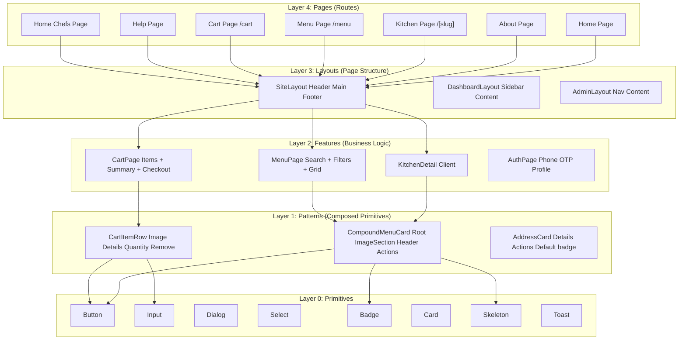
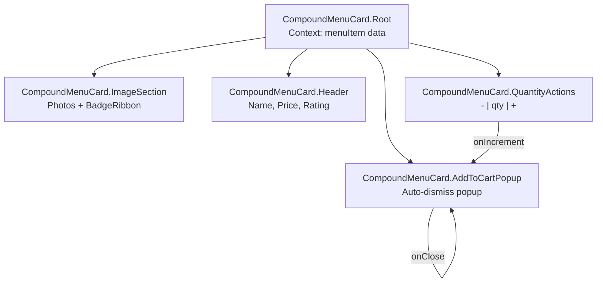
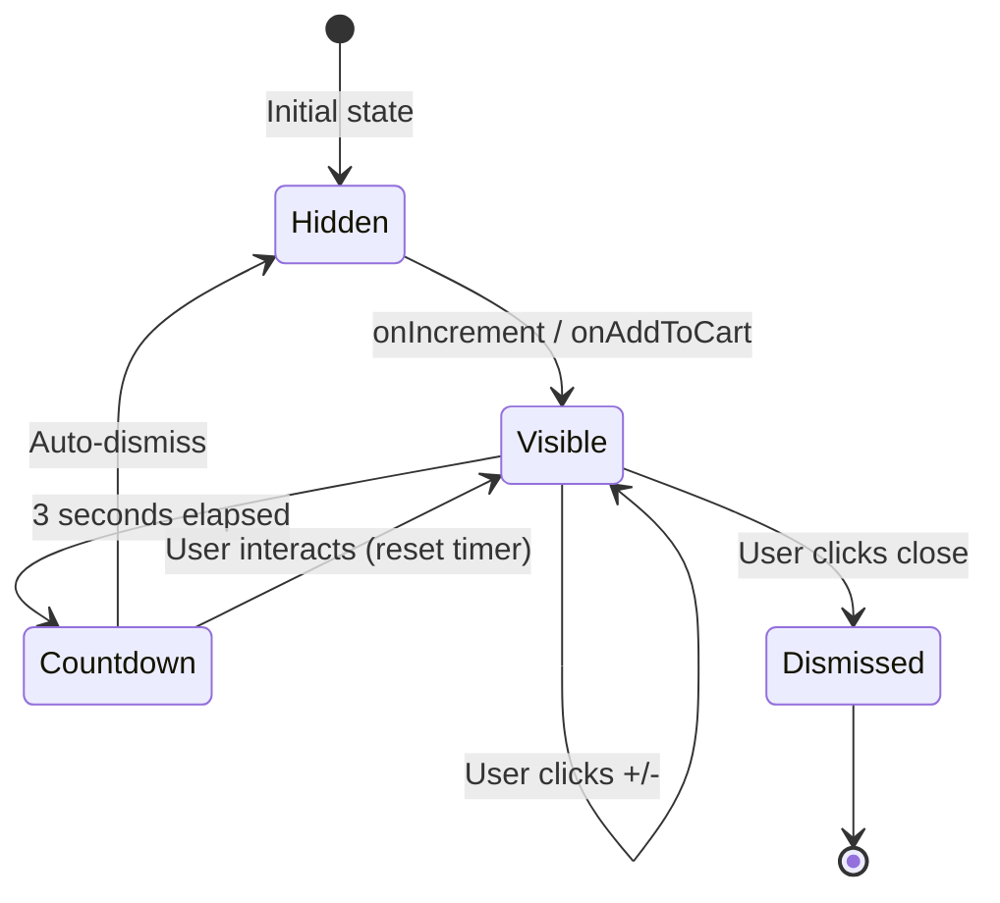
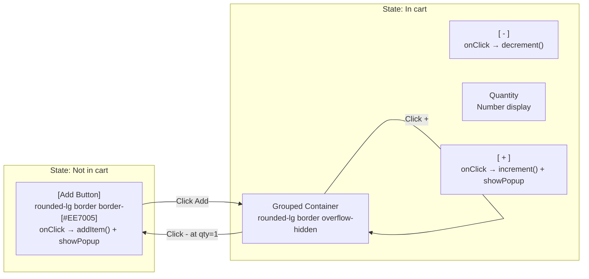
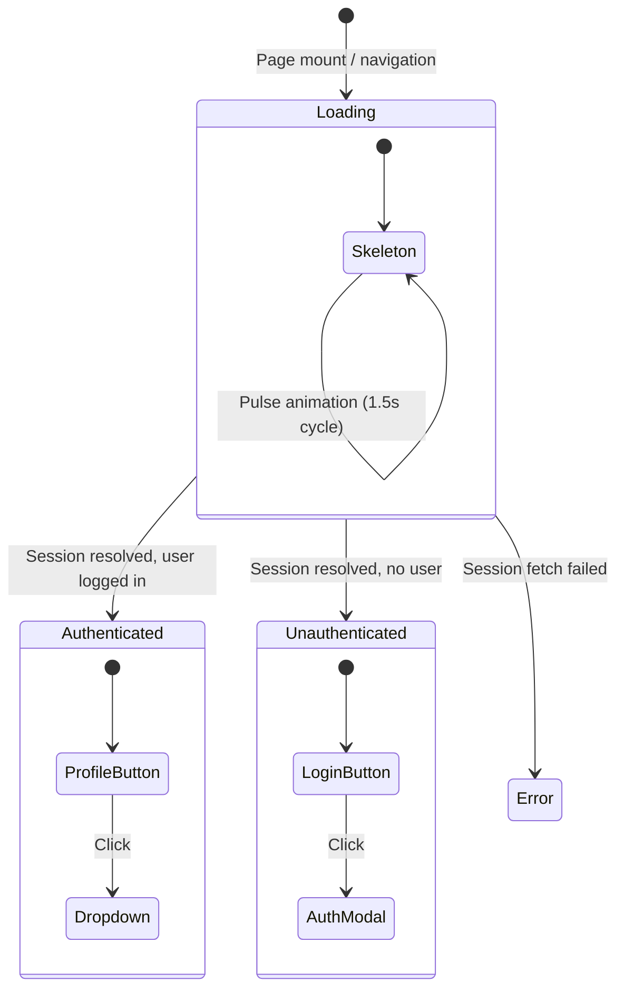
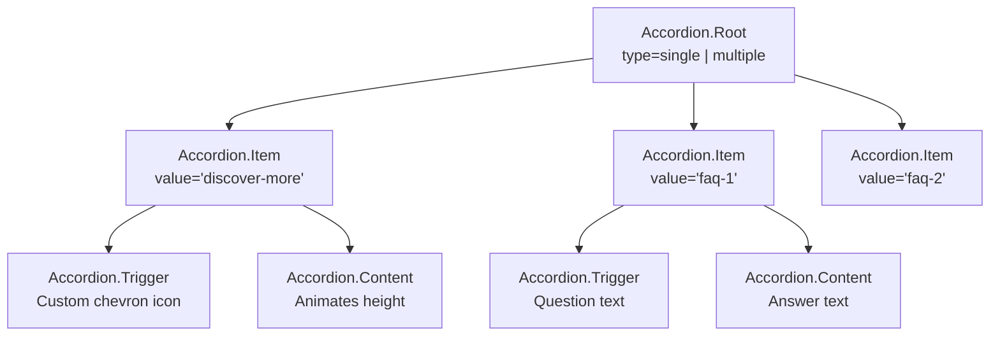
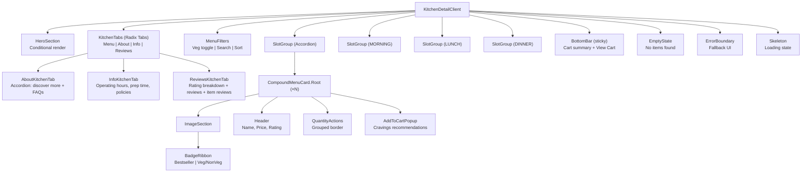
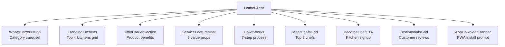

# Component System & Design Architecture

> **Status:** Active
> **Last updated:** 2026-09-20
> **Cross-refs:** [State Management](06-state-data-flow.md), [Design System](https://github.com/your-org/rrc-kitchen/wiki/Design-System), [System Architecture](01-system-architecture.md)

---

## 1. Component Architecture Layers



---

## 2. Design System Tokens

### 2.1 Color Palette

| Token | Value (Light) | Value (Dark) | Usage |
|-------|--------------|--------------|-------|
| `--color-primary` | `#EE7005` (orange) | `#FF8A2E` | Primary actions, links, active states |
| `--color-primary-foreground` | `#FFFFFF` | `#FFFFFF` | Text on primary |
| `--color-secondary` | `#FFEDD5` (orange-100) | `#3C1F00` | Secondary/ghost buttons |
| `--color-accent` | `#22C55E` (green) | `#4ADE80` | Veg indicator, success states |
| `--color-destructive` | `#EF4444` (red) | `#F87171` | Non-veg indicator, errors, remove actions |
| `--color-background` | `#FFFFFF` | `#09090B` | Page background |
| `--color-foreground` | `#09090B` | `#FAFAFA` | Primary text |
| `--color-muted` | `#F4F4F5` | `#27272A` | Muted background |
| `--color-muted-foreground` | `#71717A` | `#A1A1AA` | Secondary text |
| `--color-border` | `#E4E4E7` | `#27272A` | Borders, dividers |
| `--color-ring` | `#EE7005` | `#FF8A2E` | Focus rings |

### 2.2 Typography

| Token | Size | Weight | Line Height | Usage |
|-------|------|--------|-------------|-------|
| `text-xs` | 0.75rem (12px) | 400 | 1rem | Caption, metadata |
| `text-sm` | 0.875rem (14px) | 500 | 1.25rem | Body small, labels |
| `text-base` | 1rem (16px) | 500 | 1.5rem | Body text |
| `text-lg` | 1.125rem (18px) | 600 | 1.75rem | Section headers |
| `text-xl` | 1.25rem (20px) | 600 | 1.75rem | Card titles |
| `text-2xl` | 1.5rem (24px) | 700 | 2rem | Page headers |
| `text-3xl` | 1.875rem (30px) | 700 | 2.25rem | Hero titles |

### 2.3 Spacing

| Token | Value | Usage |
|-------|-------|-------|
| `--spacing-1` | 0.25rem | Micro gaps |
| `--spacing-2` | 0.5rem | Tight gaps |
| `--spacing-3` | 0.75rem | Default padding |
| `--spacing-4` | 1rem | Card padding |
| `--spacing-5` | 1.25rem | Section padding |
| `--spacing-6` | 1.5rem | Large padding |
| `--spacing-8` | 2rem | Page padding |
| `--spacing-10` | 2.5rem | Hero section |

### 2.4 Border Radius

| Token | Value | Usage |
|-------|-------|-------|
| `--radius-sm` | 0.375rem | Badges, small elements |
| `--radius-md` | 0.5rem | Inputs, buttons |
| `--radius-lg` | 0.75rem | Cards, modals |
| `--radius-xl` | 1rem | Large containers |
| `--radius-full` | 9999px | Avatars, pills |

---

## 3. Key Component Patterns

### 3.1 CompoundMenuCard Pattern



**Context API:**
```typescript
// Context shared via CompoundMenuCard.Root
interface MenuCardContext {
  item: MenuItem;
  quantity: number;
  showPopup: boolean;
  onIncrement: () => void;
  onDecrement: () => void;
  onAddToCart: () => void;
  onDismissPopup: () => void;
}
```

**Usage:**
```tsx
<CompoundMenuCard.Root item={item}>
  <CompoundMenuCard.ImageSection>
    <CompoundMenuCard.BadgeRibbon />
  </CompoundMenuCard.ImageSection>
  <CompoundMenuCard.Header />
  <CompoundMenuCard.QuantityActions />
  <CompoundMenuCard.AddToCartPopup />
</CompoundMenuCard.Root>
```

### 3.2 AddToCartPopup Pattern



**Timing:**
- Popup stays visible for 3 seconds after last interaction
- Each +/- click resets the 3-second timer
- Close button immediately dismisses
- Item quantity shown in popup stays in sync with cart

### 3.3 Quantity Controls Pattern



**Border styling:**
```tsx
// Single grouped border for +/-/qty
<div className="rounded-lg border border-[#EE7005] overflow-hidden inline-flex items-center">
  <button onClick={handleDecrement} className="...">−</button>
  <span className="...">{quantity}</span>
  <button onClick={handleIncrement} className="...">+</button>
</div>
```

### 3.4 Header Skeleton Pattern



### 3.5 Accordion Section Pattern



---

## 4. Component Hierarchy (Kitchen Detail Page)



> The kitchen detail page lives at `/kitchens/[slug]` (`app/kitchens/[slug]/page.tsx`), backed by `lib/kitchen-detail.ts`. Related kitchens are a grid (`related-kitchens-grid.tsx`), not a carousel. Related/removed components: `fast-delivery-carousel`, `kitchen-about-section`, `related-kitchens-carousel`, `order-type-selector`, `payment-method-selector`, `rating-prompt`, `components/order/cravings-popup.tsx` (superseded by `AddToCartPopup` with cravings, see [17-cravings-popup](17-cravings-popup.md)).

---

## 5. Accessibility Compliance

| WCAG Criterion | Implementation | Verified |
|----------------|----------------|----------|
| **1.1.1 Non-text Content** | All images have `alt` text; decorative images use `alt=""` | Manual review |
| **1.3.1 Info and Relationships** | Semantic HTML (`<nav>`, `<main>`, `<section>`, `<h1-h6>`) | ESLint `jsx-a11y` |
| **1.4.3 Contrast (Minimum)** | All text meets 4.5:1 contrast ratio | Design tokens pre-validated |
| **2.1.1 Keyboard** | All interactive elements focusable + activatable via keyboard | Radix primitives + manual testing |
| **2.4.3 Focus Order** | Logical tab order follows visual order | Manual testing |
| **2.4.7 Focus Visible** | Custom focus ring (`ring-2 ring-[#EE7005]`) | Tailwind preflight |
| **2.5.3 Label in Name** | Accessible names match visible labels | ESLint `jsx-a11y` |
| **3.2.1 On Focus** | No unexpected context changes on focus | Code review |
| **3.3.2 Labels or Instructions** | All form fields have associated labels | RHF + label association |
| **4.1.2 Name, Role, Value** | ARIA attributes on custom components | Radix primitives handle this |

### Radix UI Primitive Mapping

| Application Component | Radix Primitive | Accessible? |
|---------------------|-----------------|-------------|
| Modal/Dialog | `@radix-ui/react-dialog` | ✓ |
| Select | `@radix-ui/react-select` | ✓ |
| Dropdown Menu | `@radix-ui/react-dropdown-menu` | ✓ |
| Accordion | `@radix-ui/react-accordion` | ✓ |
| Tabs | `@radix-ui/react-tabs` | ✓ |
| Toast | `@radix-ui/react-toast` | ✓ |
| Tooltip | `@radix-ui/react-tooltip` | ✓ |
| Popover | `@radix-ui/react-popover` | ✓ |
| Checkbox | `@radix-ui/react-checkbox` | ✓ |
| Radio Group | `@radix-ui/react-radio-group` | ✓ |

---

## 6. Performance Considerations

| Technique | Application | Impact |
|-----------|-------------|--------|
| **Server Components** | Kitchen detail, menu list, static pages | Zero JS for initial render |
| **Streaming SSR** | Pages with slow data fetches | Faster TTFB by streaming HTML |
| **Dynamic imports** | Cart page, admin panel | Chunk splitting |
| `next/dynamic` | Heavy components (maps, charts) | Load only when needed |
| `React.lazy` | Popups, modals | Load on interaction |
| **Image optimization** | `next/image` with Cloudinary | Optimal format + size |
| **CSS containment** | `content-visibility: auto` on long lists | Skip rendering off-screen items |
| **Memoization** | `useMemo` for computed values, `useCallback` for handlers | Prevent unnecessary re-renders |
| **Virtualization** | `@tanstack/react-virtual` for 50+ item lists | Only render visible items |

---

## 7. Key Feature Components (Added September 2026)

### 7.1 HomeClient Component

**Location:** `components/home/home-client.tsx`

**Purpose:** Comprehensive home page orchestrator integrating category navigation, kitchen discovery, service features, and social proof.

**Architecture:**


**State Management:**
```typescript
// From stores/homeStore.ts
const { selectedCategory, sortOption, vegFilter, selectedCuisines } = useHomeFilters();
const { setSelectedCategory, setSortOption, setVegFilter, setSelectedCuisines } = useHomeActions();
const { data: categories = [] } = useKitchenCategories();
const { data: allChefs = [], isLoading: chefsLoading } = useHomeKitchensQuery();
const { data: testimonials = [], isLoading: testimonialsLoading } = useTestimonialsQuery();
```

**Key Features:**
- **Sticky Mobile Search & Filters**: Appears on scroll with smart hide/show based on scroll direction
- **Responsive Grid**: Horizontal scroll on mobile, CSS grid on desktop
- **Skeleton States**: Comprehensive loading states for all data sections
- **Optimized Images**: Next.js Image with Cloudinary CDN integration
- **Scroll-aware UI**: Detects when user scrolls past header and kitchen section

**Mobile Sticky Header Logic:**
- `isPastHeader`: Triggers when scrolled >120px
- `isPastInlineFilters`: Shows filter bar when scrolled past kitchen section
- `scrollDirection`: Hides search when scrolling down, shows when scrolling up
- `inKitchenSection`: Ensures filters only show in relevant section

### 7.2 AboutUsClient Component

**Location:** `components/about/about-us-client.tsx`

**Purpose:** Brand story, mission, values, and platform statistics display.

**Props Interface:**
```typescript
interface AboutUsStats {
  chefsCount: number;
  customersCount: number;
  ordersCount: number;
}
```

**Sections:**
1. **Hero Section**: Full-width image with gradient overlay + breadcrumbs
2. **Stats Grid**: 4-column metrics (chefs, customers, orders, hygiene)
3. **Mission Card**: Platform purpose with target icon
4. **Why RRC Kitchen**: 5 checkmarks with benefits
5. **Our Journey**: Timeline narrative with path graphic
6. **How It Works**: 7-step process (matches HomeClient)
7. **Values Section**: 4-column grid (Love & Care, Hygiene First, Trust, Community)
8. **Home Chef CTA**: Recruitment banner with floating badge
9. **App Download Banner**: PWA install prompt

**Styling Pattern:**
- Consistent color palette: `#003015` (dark green), `#F04E00` (orange), `#087A35` (green)
- Card-based layout with subtle shadows: `shadow-[0_2px_8px_rgba(0,0,0,0.05)]`
- Rounded corners: `rounded-[16px]` for cards, `rounded-[24px]` for major sections
- Border tokens: `border-[#E7E7E7]` (neutral), `border-[#FFE5D7]` (warm)

### 7.3 WhatsOnYourMind Component

**Location:** `components/home/whats-on-your-mind.tsx`

**Purpose:** Category navigation carousel with image tiles.

**Features:**
- Horizontal scroll with snap points (`snap-x snap-mandatory`)
- Optimized images with Cloudinary transformations
- Skeleton loading state
- Links to `/categories/[slug]`

**Layout:**
```tsx
// Mobile: horizontal scroll
<div className="flex gap-4 overflow-x-auto snap-x snap-mandatory scrollbar-none">
  {categories.map(cat => (
    <Link href={`/categories/${cat.slug}`} className="snap-start shrink-0 w-24">
      <Image src={cat.imageUrl} ... />
      <span>{cat.name}</span>
    </Link>
  ))}
</div>
```

### 7.4 KitchenCard Component

**Location:** `components/kitchen/kitchen-card.tsx`

**Purpose:** Reusable kitchen display card with rating, cuisine tags, and image.

**Variants:**
- `home`: Compact card for home page grid
- `grid`: Default variant for kitchen listing pages
- `featured`: Larger card with additional metadata

**Key Elements:**
```typescript
interface KitchenCardProps {
  kitchen: {
    id: string;
    slug: string;
    displayName: string;
    imageUrl: string | null;
    avgRating: number | null;
    totalReviews: number;
    cuisineTags: string[];
    isActive: boolean;
  };
  variant?: 'home' | 'grid' | 'featured';
}
```

### 7.5 LiveChatWidget Component

**Location:** `components/chat/live-chat-widget.tsx`

**Purpose:** Real-time customer support chat interface.

**Features:**
- Ably WebSocket integration for instant messaging
- Persistent chat history
- Typing indicators
- Unread message badge
- Minimize/maximize state
- Emoji picker support

**State:**
```typescript
const [messages, setMessages] = useState<Message[]>([]);
const [isOpen, setIsOpen] = useState(false);
const [isTyping, setIsTyping] = useState(false);
const [unreadCount, setUnreadCount] = useState(0);
```

### 7.6 InstallPrompt Component

**Location:** `components/patterns/install-prompt.tsx`

**Purpose:** Native PWA install prompt for desktop and mobile.

**Features:**
- Detects `beforeinstallprompt` event
- Dismissable banner
- Platform-specific instructions (iOS, Android, Desktop)
- Stores dismissal state in localStorage
- Auto-hides after installation

**Detection Logic:**
```typescript
useEffect(() => {
  const handler = (e: BeforeInstallPromptEvent) => {
    e.preventDefault();
    setDeferredPrompt(e);
    setShowPrompt(true);
  };
  window.addEventListener('beforeinstallprompt', handler);
  return () => window.removeEventListener('beforeinstallprompt', handler);
}, []);
```

### 7.7 AppDownloadBanner Component

**Location:** `components/home/app-download-banner.tsx`

**Purpose:** Promotes PWA installation with QR code and app store links.

**Features:**
- QR code generation for quick mobile install
- Platform detection (iOS/Android/Desktop)
- Custom imagery and branding
- Dismissable state
- Tracks installation events

---

## 8. Component Directory Structure

```
components/
├── ui/                          # Primitives (shadcn/ui)
│   ├── button.tsx
│   ├── input.tsx
│   ├── card.tsx
│   ├── dialog.tsx
│   ├── select.tsx
│   ├── badge.tsx
│   ├── skeleton.tsx
│   └── toast.tsx
├── patterns/                    # Composed primitives
│   ├── compound-menu-card/
│   ├── error-boundary.tsx
│   ├── install-prompt.tsx       # ✨ New
│   └── loading-spinner.tsx
├── home/                        # Home page features
│   ├── home-client.tsx          # ✨ New
│   ├── hero-carousel.tsx        # Updated
│   ├── whats-on-your-mind.tsx   # ✨ New
│   ├── app-download-banner.tsx  # ✨ New
│   └── home-skeleton.tsx
├── about/                       # About page
│   └── about-us-client.tsx      # ✨ New
├── kitchen/                     # Kitchen features
│   ├── kitchen-card.tsx         # Updated
│   ├── kitchen-detail-client.tsx # Updated
│   ├── kitchen-grid.tsx
│   ├── kitchen-filters.tsx
│   └── dashboard/
├── menu/                        # Menu features
│   ├── menu-card.tsx
│   ├── menu-detail.tsx
│   └── add-to-cart-popup.tsx
├── cart/                        # Cart features
│   ├── cart-content.tsx         # Updated
│   ├── cart-item-row.tsx
│   └── checkout-form.tsx
├── chat/                        # Chat features
│   └── live-chat-widget.tsx     # ✨ New
├── admin/                       # Admin dashboard
│   ├── dashboard-client.tsx     # Updated
│   ├── orders-client.tsx        # Updated
│   ├── delivery-client.tsx      # Updated
│   └── cravings-popup-client.tsx
├── delivery-partner/            # Delivery partner features
│   └── dashboard/
│       └── support-page-client.tsx # Updated
├── account/                     # Customer account
│   ├── profile-form.tsx
│   └── support-content.tsx      # Updated
├── site/                        # Site-wide components
│   ├── site-header.tsx          # Updated
│   ├── site-footer.tsx          # Updated
│   └── site-nav.tsx
├── layout/                      # Layout components
│   └── app-shell.tsx            # Updated
├── support/                     # Support features
│   └── support-client.tsx       # Updated
├── help/                        # Help center
│   └── help-content.tsx
└── home-chefs/                  # Home chefs page
    └── home-chefs-client.tsx    # ✨ New
```

---

## 9. Component Naming Conventions

| Pattern | Example | Usage |
|---------|---------|-------|
| `*-client.tsx` | `home-client.tsx` | Client components (use client directive) |
| `*-server.tsx` | `menu-server.tsx` | Server components (explicit naming) |
| `*-form.tsx` | `checkout-form.tsx` | Form components with React Hook Form |
| `*-card.tsx` | `kitchen-card.tsx` | Card-based display components |
| `*-grid.tsx` | `kitchen-grid.tsx` | Grid layout components |
| `*-list.tsx` | `order-list.tsx` | List layout components |
| `*-modal.tsx` | `auth-modal.tsx` | Modal/dialog components |
| `*-popup.tsx` | `add-to-cart-popup.tsx` | Auto-dismiss popups |
| `*-skeleton.tsx` | `home-skeleton.tsx` | Loading state components |
| `*-content.tsx` | `cart-content.tsx` | Main content area of a page |
| `use-*.ts` | `use-cart.ts` | Custom hooks |

---

## 10. State Management Per Component Type

| Component Type | State Solution | Example |
|---------------|----------------|---------|
| **Home Features** | Zustand + TanStack Query | `useHomeFilters()`, `useHomeKitchensQuery()` |
| **Cart** | Zustand with persistence | `useCartStore()` |
| **Admin Dashboard** | Zustand per module | `useAdminOrdersStore()`, `useAdminKitchensStore()` |
| **Kitchen Detail** | TanStack Query | `useQuery(['kitchen', slug])` |
| **Auth** | Zustand + Better-Auth | `useAuthStore()`, `useSession()` |
| **Forms** | React Hook Form + Zod | `useForm<FormData>()` |
| **Real-time** | Ably + React state | `useAblySubscribe()` |
| **UI Components** | Local React state | `useState()`, `useReducer()` |
