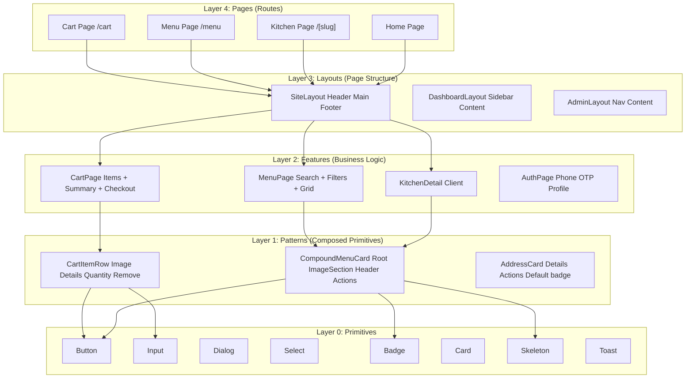
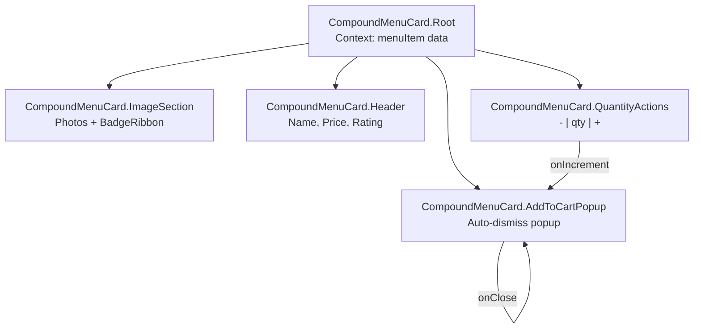
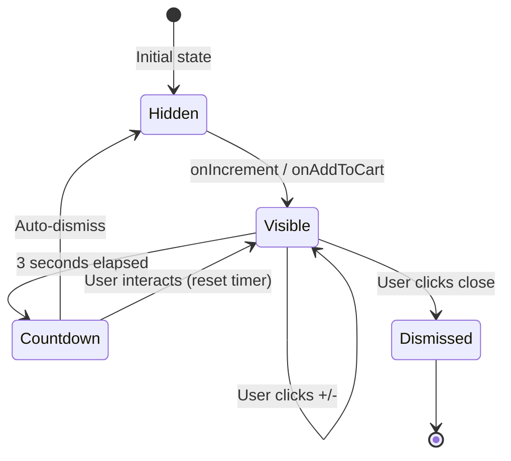
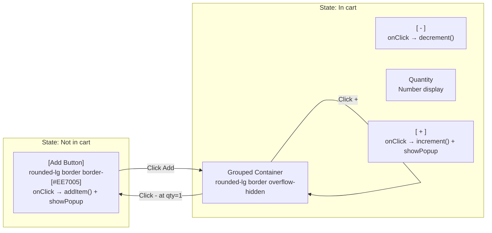
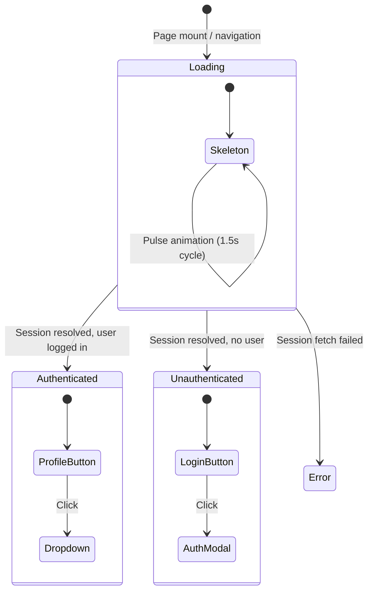
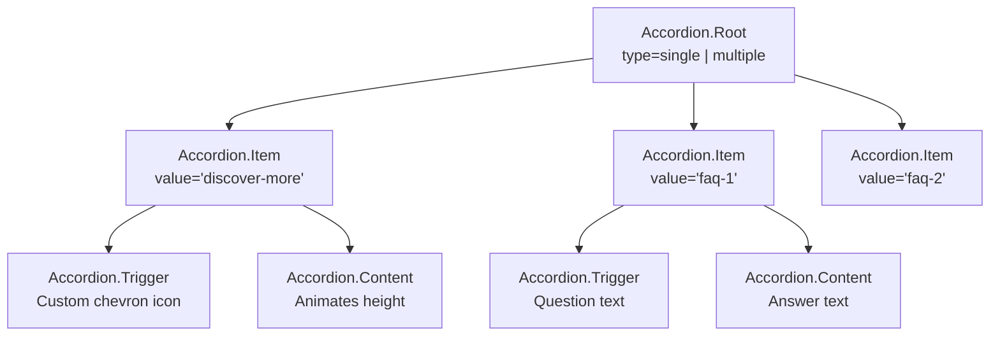
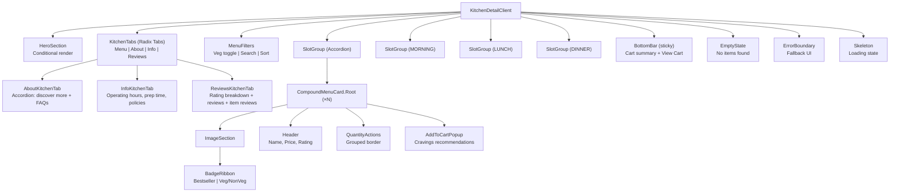

# Component System & Design Architecture

> **Status:** Active
> **Last updated:** 2026-08-05
> **Cross-refs:** [State Management](06-state-data-flow.md), [Design System](https://github.com/your-org/rrc-kitchen/wiki/Design-System), [System Architecture](01-system-architecture.md)

---

## 1. Component Architecture Layers



---

## 2. Design System Tokens

### 2.1 Color Palette

| Token | Value (Light) | Value (Dark) | Usage |
|-------|--------------|--------------|-------|
| `--color-primary` | `#EE7005` (orange) | `#FF8A2E` | Primary actions, links, active states |
| `--color-primary-foreground` | `#FFFFFF` | `#FFFFFF` | Text on primary |
| `--color-secondary` | `#FFEDD5` (orange-100) | `#3C1F00` | Secondary/ghost buttons |
| `--color-accent` | `#22C55E` (green) | `#4ADE80` | Veg indicator, success states |
| `--color-destructive` | `#EF4444` (red) | `#F87171` | Non-veg indicator, errors, remove actions |
| `--color-background` | `#FFFFFF` | `#09090B` | Page background |
| `--color-foreground` | `#09090B` | `#FAFAFA` | Primary text |
| `--color-muted` | `#F4F4F5` | `#27272A` | Muted background |
| `--color-muted-foreground` | `#71717A` | `#A1A1AA` | Secondary text |
| `--color-border` | `#E4E4E7` | `#27272A` | Borders, dividers |
| `--color-ring` | `#EE7005` | `#FF8A2E` | Focus rings |

### 2.2 Typography

| Token | Size | Weight | Line Height | Usage |
|-------|------|--------|-------------|-------|
| `text-xs` | 0.75rem (12px) | 400 | 1rem | Caption, metadata |
| `text-sm` | 0.875rem (14px) | 500 | 1.25rem | Body small, labels |
| `text-base` | 1rem (16px) | 500 | 1.5rem | Body text |
| `text-lg` | 1.125rem (18px) | 600 | 1.75rem | Section headers |
| `text-xl` | 1.25rem (20px) | 600 | 1.75rem | Card titles |
| `text-2xl` | 1.5rem (24px) | 700 | 2rem | Page headers |
| `text-3xl` | 1.875rem (30px) | 700 | 2.25rem | Hero titles |

### 2.3 Spacing

| Token | Value | Usage |
|-------|-------|-------|
| `--spacing-1` | 0.25rem | Micro gaps |
| `--spacing-2` | 0.5rem | Tight gaps |
| `--spacing-3` | 0.75rem | Default padding |
| `--spacing-4` | 1rem | Card padding |
| `--spacing-5` | 1.25rem | Section padding |
| `--spacing-6` | 1.5rem | Large padding |
| `--spacing-8` | 2rem | Page padding |
| `--spacing-10` | 2.5rem | Hero section |

### 2.4 Border Radius

| Token | Value | Usage |
|-------|-------|-------|
| `--radius-sm` | 0.375rem | Badges, small elements |
| `--radius-md` | 0.5rem | Inputs, buttons |
| `--radius-lg` | 0.75rem | Cards, modals |
| `--radius-xl` | 1rem | Large containers |
| `--radius-full` | 9999px | Avatars, pills |

---

## 3. Key Component Patterns

### 3.1 CompoundMenuCard Pattern



**Context API:**
```typescript
// Context shared via CompoundMenuCard.Root
interface MenuCardContext {
  item: MenuItem;
  quantity: number;
  showPopup: boolean;
  onIncrement: () => void;
  onDecrement: () => void;
  onAddToCart: () => void;
  onDismissPopup: () => void;
}
```

**Usage:**
```tsx
<CompoundMenuCard.Root item={item}>
  <CompoundMenuCard.ImageSection>
    <CompoundMenuCard.BadgeRibbon />
  </CompoundMenuCard.ImageSection>
  <CompoundMenuCard.Header />
  <CompoundMenuCard.QuantityActions />
  <CompoundMenuCard.AddToCartPopup />
</CompoundMenuCard.Root>
```

### 3.2 AddToCartPopup Pattern



**Timing:**
- Popup stays visible for 3 seconds after last interaction
- Each +/- click resets the 3-second timer
- Close button immediately dismisses
- Item quantity shown in popup stays in sync with cart

### 3.3 Quantity Controls Pattern



**Border styling:**
```tsx
// Single grouped border for +/-/qty
<div className="rounded-lg border border-[#EE7005] overflow-hidden inline-flex items-center">
  <button onClick={handleDecrement} className="...">−</button>
  <span className="...">{quantity}</span>
  <button onClick={handleIncrement} className="...">+</button>
</div>
```

### 3.4 Header Skeleton Pattern



### 3.5 Accordion Section Pattern



---

## 4. Component Hierarchy (Kitchen Detail Page)



> The kitchen detail page lives at `/kitchens/[slug]` (`app/kitchens/[slug]/page.tsx`), backed by `lib/kitchen-detail.ts`. Related kitchens are a grid (`related-kitchens-grid.tsx`), not a carousel. Related/removed components: `fast-delivery-carousel`, `kitchen-about-section`, `related-kitchens-carousel`, `order-type-selector`, `payment-method-selector`, `rating-prompt`, `components/order/cravings-popup.tsx` (superseded by `AddToCartPopup` with cravings, see [17-cravings-popup](17-cravings-popup.md)).

---

## 5. Accessibility Compliance

| WCAG Criterion | Implementation | Verified |
|----------------|----------------|----------|
| **1.1.1 Non-text Content** | All images have `alt` text; decorative images use `alt=""` | Manual review |
| **1.3.1 Info and Relationships** | Semantic HTML (`<nav>`, `<main>`, `<section>`, `<h1-h6>`) | ESLint `jsx-a11y` |
| **1.4.3 Contrast (Minimum)** | All text meets 4.5:1 contrast ratio | Design tokens pre-validated |
| **2.1.1 Keyboard** | All interactive elements focusable + activatable via keyboard | Radix primitives + manual testing |
| **2.4.3 Focus Order** | Logical tab order follows visual order | Manual testing |
| **2.4.7 Focus Visible** | Custom focus ring (`ring-2 ring-[#EE7005]`) | Tailwind preflight |
| **2.5.3 Label in Name** | Accessible names match visible labels | ESLint `jsx-a11y` |
| **3.2.1 On Focus** | No unexpected context changes on focus | Code review |
| **3.3.2 Labels or Instructions** | All form fields have associated labels | RHF + label association |
| **4.1.2 Name, Role, Value** | ARIA attributes on custom components | Radix primitives handle this |

### Radix UI Primitive Mapping

| Application Component | Radix Primitive | Accessible? |
|---------------------|-----------------|-------------|
| Modal/Dialog | `@radix-ui/react-dialog` | ✓ |
| Select | `@radix-ui/react-select` | ✓ |
| Dropdown Menu | `@radix-ui/react-dropdown-menu` | ✓ |
| Accordion | `@radix-ui/react-accordion` | ✓ |
| Tabs | `@radix-ui/react-tabs` | ✓ |
| Toast | `@radix-ui/react-toast` | ✓ |
| Tooltip | `@radix-ui/react-tooltip` | ✓ |
| Popover | `@radix-ui/react-popover` | ✓ |
| Checkbox | `@radix-ui/react-checkbox` | ✓ |
| Radio Group | `@radix-ui/react-radio-group` | ✓ |

---

## 6. Performance Considerations

| Technique | Application | Impact |
|-----------|-------------|--------|
| **Server Components** | Kitchen detail, menu list, static pages | Zero JS for initial render |
| **Streaming SSR** | Pages with slow data fetches | Faster TTFB by streaming HTML |
| **Dynamic imports** | Cart page, admin panel | Chunk splitting |
| `next/dynamic` | Heavy components (maps, charts) | Load only when needed |
| `React.lazy` | Popups, modals | Load on interaction |
| **Image optimization** | `next/image` with Cloudinary | Optimal format + size |
| **CSS containment** | `content-visibility: auto` on long lists | Skip rendering off-screen items |
| **Memoization** | `useMemo` for computed values, `useCallback` for handlers | Prevent unnecessary re-renders |
| **Virtualization** | `@tanstack/react-virtual` for 50+ item lists | Only render visible items |
