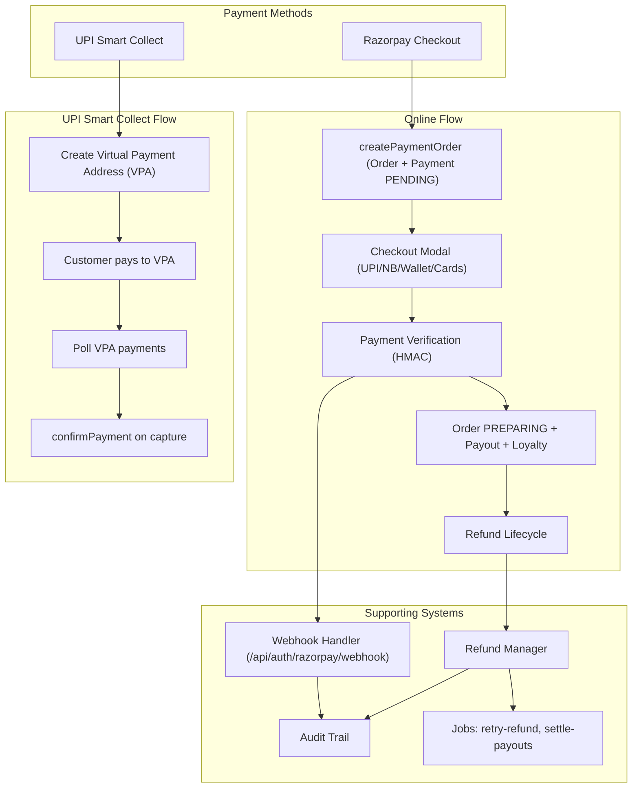
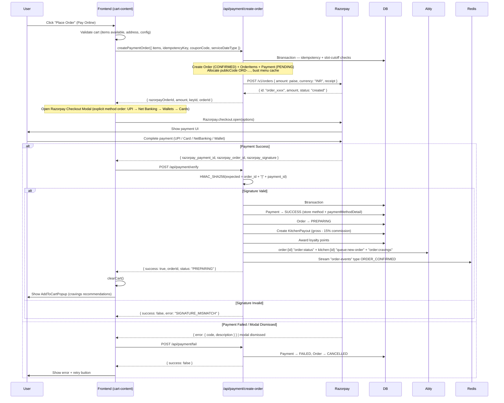
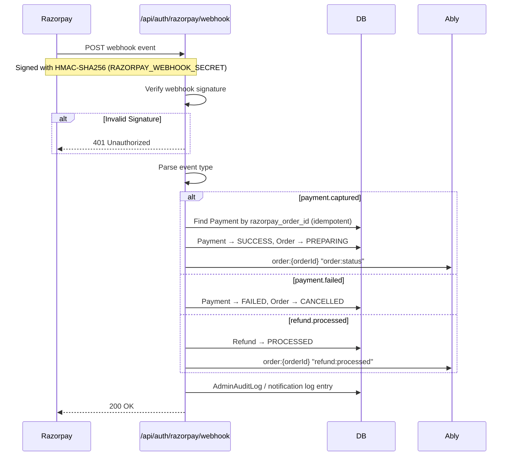
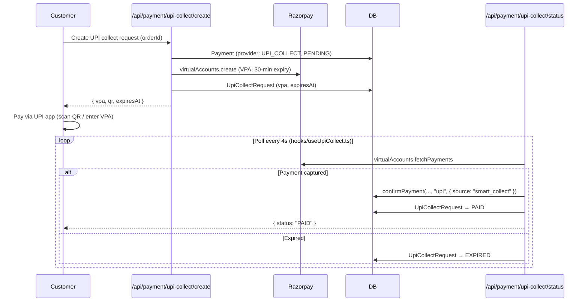
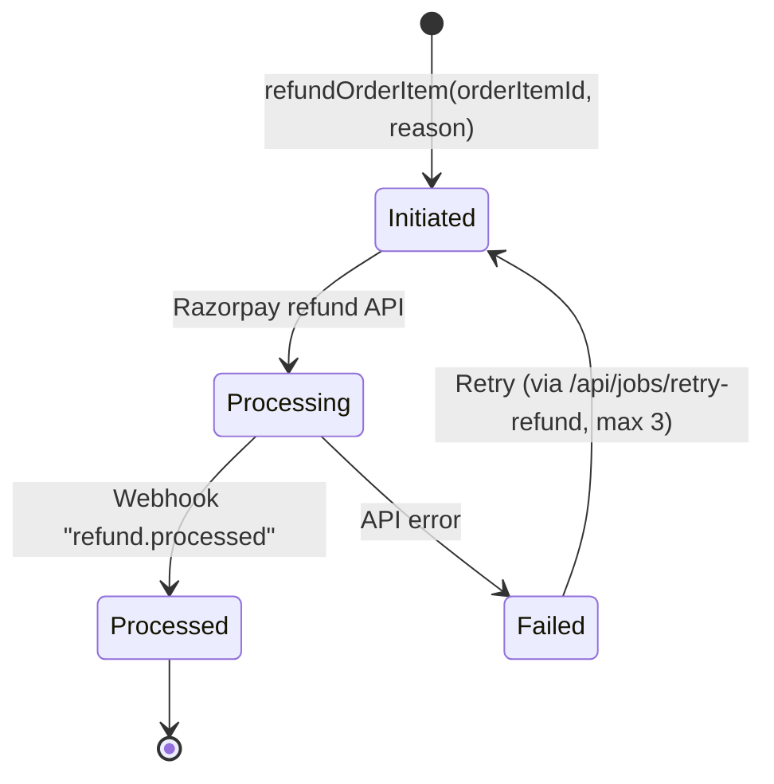
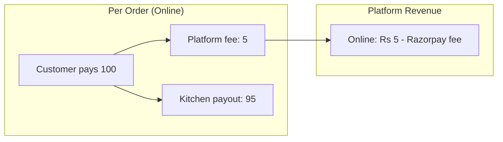

# Payment System Architecture

> **Status:** Active
> **Last updated:** 2026-08-05
> **Cross-refs:** [API Design](04-api-design.md), [Data Model](03-data-model.md), [Architecture Decisions (Razorpay)](02-architecture-decisions.md#adr-012-payment---razorpay--cod)

---

## 1. Payment System Overview



**COD was fully removed (ADR-019).** There is no cash collection, delivery OTP, remittance, or reconciliation engine. All orders are prepaid.

---

## 2. Online Payment Flow

### 2.1 Full Sequence



### 2.2 Razorpay Checkout Options

```typescript
// hooks/useRazorpay.ts — initiateCheckout()
const options = {
  key: process.env.NEXT_PUBLIC_RAZORPAY_KEY_ID,
  amount: order.amount,                       // Amount in paise
  currency: 'INR',
  name: 'RRC Kitchen',
  description: `Order #${order.orderId}`,
  order_id: order.razorpayOrderId,
  prefill: { contact: user.phone },
  theme: { color: '#EE7005' },
  modal: {
    ondismiss: () => failPayment(orderId),    // POST /api/payment/fail
  },
  handler: (response) => verifyPayment(response), // POST /api/payment/verify
};

// Method order is forced via Razorpay's payment block config:
// UPI → Net Banking → Wallets → Cards (PAYMENT_BLOCKS_CONFIG)
```

### 2.3 Webhook Processing



---

## 3. UPI Smart Collect (backend-ready)

Falls back on / complements Razorpay Checkout for UPI-only payment: a per-order Razorpay Virtual Payment Address (VPA) that the customer pays from any UPI app.

### 3.1 Flow



### 3.2 Model

- `UpiCollectRequest`: `orderId` (unique), `paymentId` (unique), `vpa`, `razorpayVpaId`, `status` (`PENDING | PAID | EXPIRED | FAILED`), `expiresAt` (30 min)
- `Payment.provider` distinguishes `RAZORPAY` vs `UPI_COLLECT`
- Helpers in `lib/razorpay.ts`: `createVpa()`, `fetchVpaPayments()`

> **Status note:** server flow, API routes, and the `useUpiCollect` hook are complete and tested, but no UI currently wires the flow — Razorpay Checkout is the active path.

---

## 5. Refund Lifecycle



Entry points:
- `refundOrderItem(orderItemId, reason)` — per-item refund: orderItem → UNAVAILABLE, order → REFUNDED, payment → PARTIAL_REFUND/REFUNDED, publishes `order:item-unavailable`
- `refundOrder(orderId, reason)` — full-order refund, publishes `order:refund`
- `processWebhookRefund(razorpayRefundId)` — marks PROCESSED on `refund.processed` webhook
- Background retry: `POST /api/jobs/retry-refund`

### Refund Rules

| Scenario | Refund Method | Processing Time | Fee |
|----------|--------------|-----------------|-----|
| Item unavailable / kitchen rejected | Per-item refund to source | 3-5 business days | None |
| Order cancelled before preparation | Full refund to source | 3-5 business days | None |
| Quality complaint (verified) | Partial/Full refund | 3-5 business days | None |
| Duplicate payment | Full refund | 24-48 hours | None |

---

## 6. Payment Security

| Concern | Mitigation |
|---------|------------|
| **Amount tampering** | Amount calculated server-side; Razorpay verifies amount against order |
| **Duplicate payment** | Idempotency via `idempotencyKey` (unique) on Order and Payment |
| **Webhook spoofing** | HMAC-SHA256 verification with `RAZORPAY_WEBHOOK_SECRET` |
| **Refund fraud** | Refund only to original payment source; manual review for >₹1000; large refunds require `AdminApprovalRequest` |
| **PCI DSS scope** | No card data stored; handled entirely by Razorpay (SAQ A eligible) |
| **UPI VPA abuse** | 30-min VPA expiry; idempotent `UpiCollectRequest`; payment matched to the exact order |

---

## 7. Error Handling

### Online Payment Errors

| Error | User Message | Recovery |
|-------|-------------|----------|
| `PAYMENT_CANCELLED` | "Payment cancelled" | Retry checkout |
| `PAYMENT_FAILED` | "Payment failed. Please try again" | Retry; check bank limit |
| `AMOUNT_MISMATCH` | "Order amount changed. Please try again" | Refresh checkout |
| `SIGNATURE_MISMATCH` | "Payment verification failed" | Contact support; order not placed |
| `WEBHOOK_FAILURE` | (Silent - internal) | Admin alert; manual reconciliation |

---

## 8. Accounting Impact


