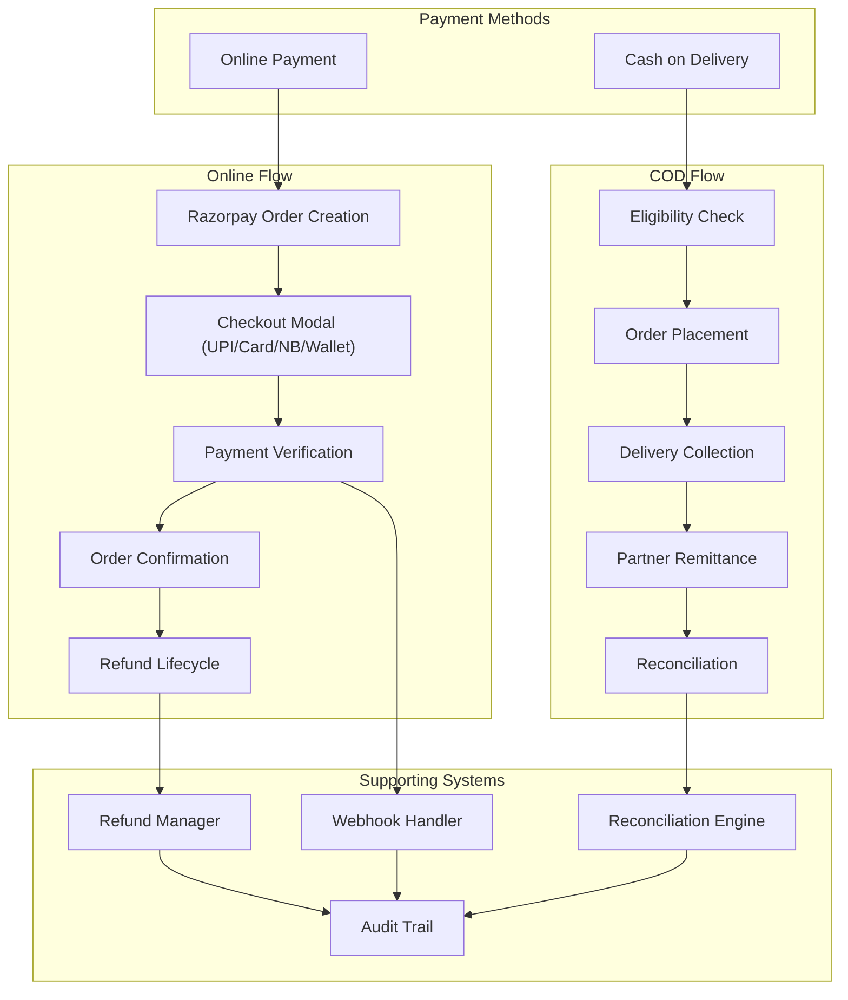
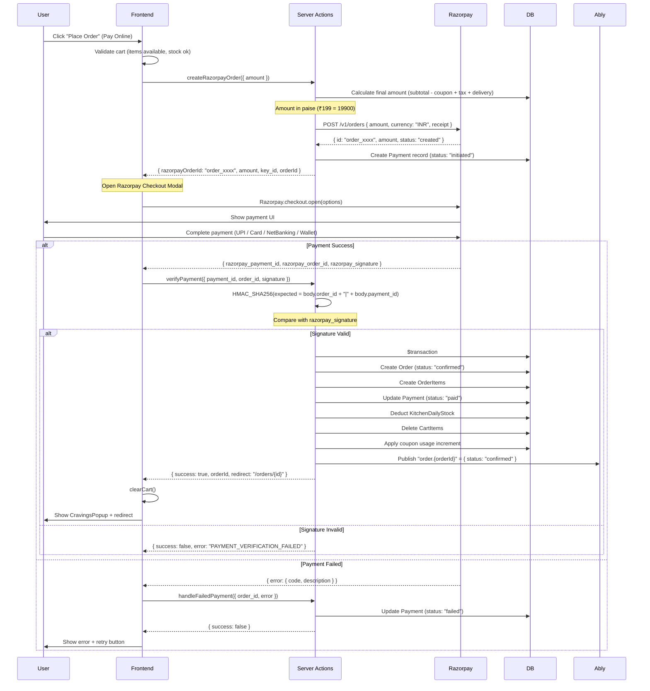
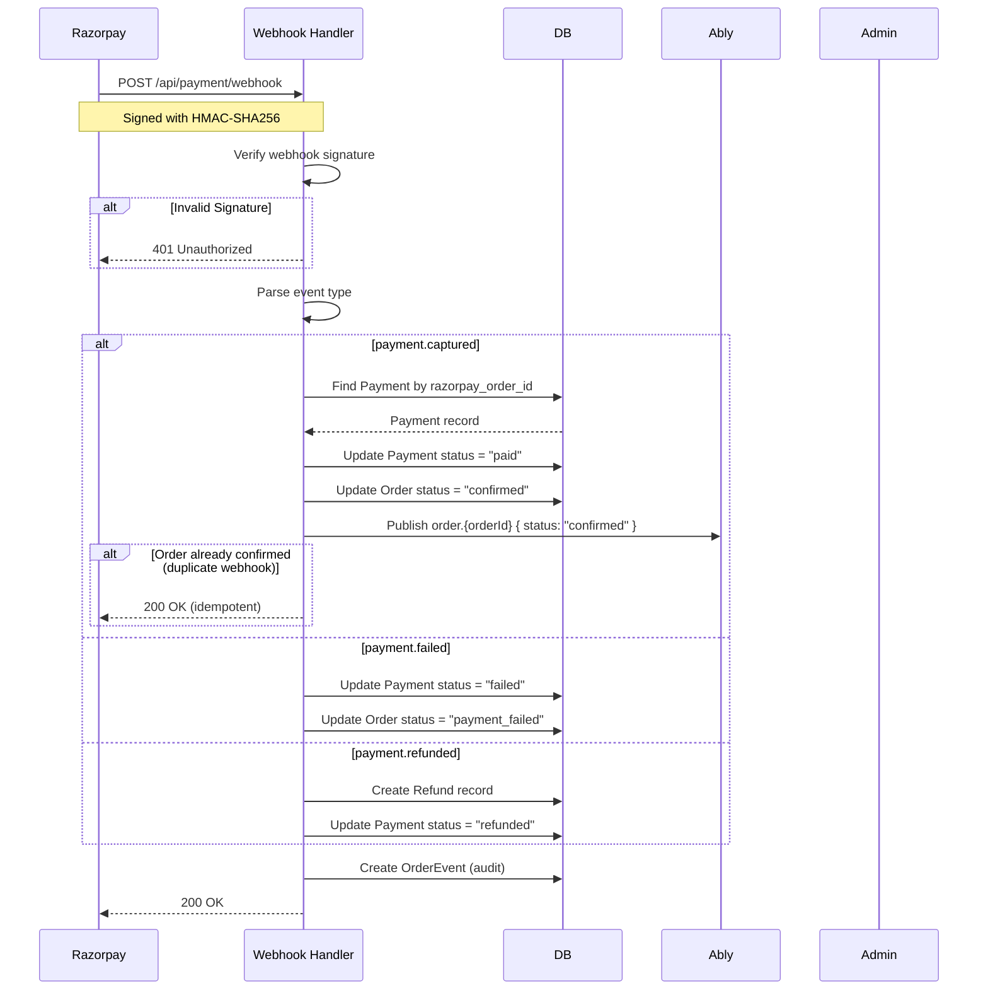
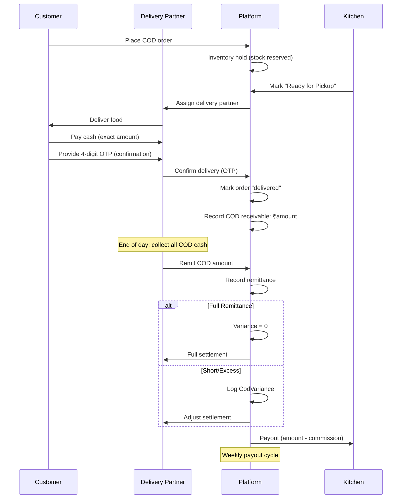
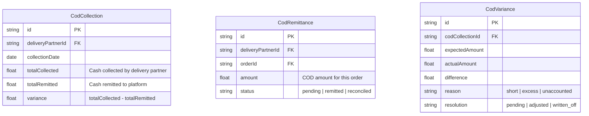
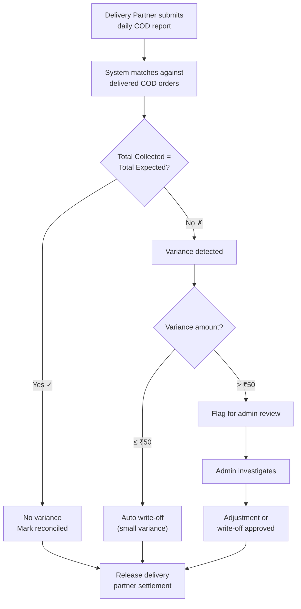
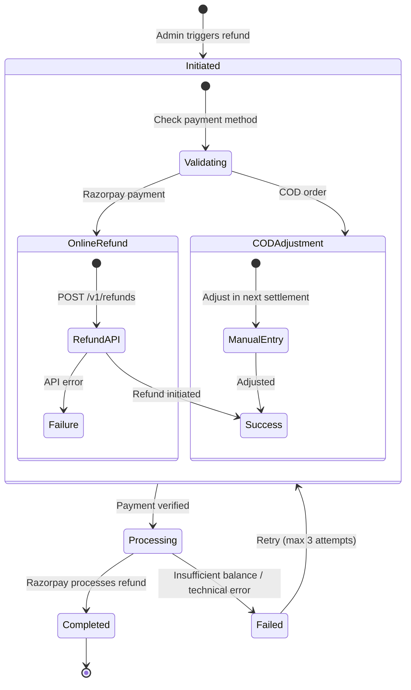
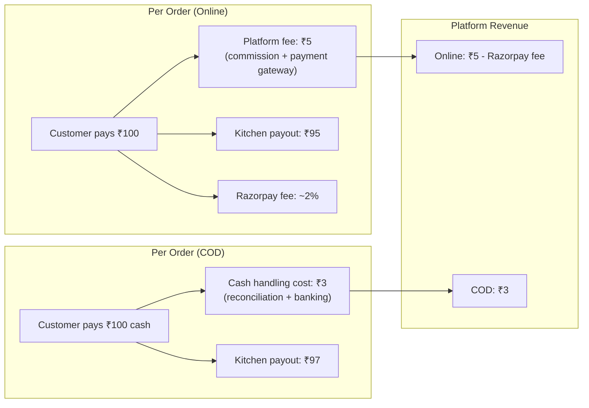

# Payment System Architecture

> **Status:** Active
> **Last updated:** 2026-07-21
> **Cross-refs:** [API Design](04-api-design.md), [Data Model](03-data-model.md), [Architecture Decisions (Razorpay)](02-architecture-decisions.md#adr-012-payment---razorpay--cod)

---

## 1. Payment System Overview



---

## 2. Online Payment Flow

### 2.1 Full Sequence



### 2.2 Razorpay Checkout Options

```typescript
const options = {
  key: process.env.RAZORPAY_KEY_ID,           // Razorpay API Key ID
  amount: order.amount,                         // Amount in paise
  currency: 'INR',
  name: 'RRC Kitchen',
  description: `Order #${order.orderId}`,
  order_id: order.razorpayOrderId,              // From createRazorpayOrder
  prefill: {
    contact: user.phone,                        // Auto-fill customer phone
  },
  theme: {
    color: '#EE7005',                           // Brand primary color
  },
  modal: {
    ondismiss: () => {
      // Handle modal close without payment
    },
  },
  handler: async (response) => {
    // Handle successful payment
    const result = await verifyPayment({
      razorpay_order_id: response.razorpay_order_id,
      razorpay_payment_id: response.razorpay_payment_id,
      razorpay_signature: response.razorpay_signature,
    });
  },
};
```

### 2.3 Webhook Processing



---

## 3. COD (Cash on Delivery) Flow

### 3.1 Eligibility Logic

```typescript
async function checkCodEligibility(
  userId: string,
  orderAmount: number
): Promise<{ eligible: boolean; reason?: string }> {
  // Rule 1: Amount limit
  if (orderAmount > 200000) { // ₹2000 in paise
    return { eligible: false, reason: "Order exceeds COD limit" };
  }

  // Rule 2: User history
  const recentFailedCod = await prisma.order.count({
    where: {
      userId,
      paymentMethod: 'cod',
      status: 'cancelled',
      createdAt: { gte: subDays(new Date(), 30) },
    },
  });
  if (recentFailedCod >= 3) {
    return { eligible: false, reason: "Too many failed COD deliveries" };
  }

  // Rule 3: Kitchen accepts COD
  const kitchenAcceptsCod = true; // Configurable per kitchen

  return { eligible: true };
}
```

### 3.2 COD Settlement Flow



---

## 4. Reconciliation Engine

### 4.1 Data Model



### 4.2 Reconciliation Process



---

## 5. Refund Lifecycle



### Refund Rules

| Scenario | Refund Method | Processing Time | Fee |
|----------|--------------|-----------------|-----|
| Order cancelled before preparation | Full refund to source | 3-5 business days | None |
| Order cancelled during preparation | Partial refund (net of ingredient cost) | 3-5 business days | Platform fee retained |
| Delivery failed (no-show) | Full refund | 3-5 business days | None |
| Quality complaint (verified) | Partial/Full refund | 3-5 business days | None |
| Duplicate payment | Full refund | 24-48 hours | None |

---

## 6. Payment Security

| Concern | Mitigation |
|---------|------------|
| **Amount tampering** | Amount calculated server-side; Razorpay verifies amount against order |
| **Duplicate payment** | Idempotency via `razorpay_order_id` unique constraint |
| **Webhook spoofing** | HMAC-SHA256 verification with `RAZORPAY_WEBHOOK_SECRET` |
| **Refund fraud** | Refund only to original payment source; manual review for >₹1000 |
| **PCI DSS scope** | No card data stored; handled entirely by Razorpay (SAQ A eligible) |
| **OTP delivery bypass** | COD requires delivery OTP verification |

---

## 7. Error Handling

### Online Payment Errors

| Error | User Message | Recovery |
|-------|-------------|----------|
| `PAYMENT_CANCELLED` | "Payment cancelled" | Retry checkout |
| `PAYMENT_FAILED` | "Payment failed. Please try again" | Retry; check bank limit |
| `AMOUNT_MISMATCH` | "Order amount changed. Please try again" | Refresh checkout |
| `SIGNATURE_MISMATCH` | "Payment verification failed" | Contact support; order not placed |
| `WEBHOOK_FAILURE` | (Silent - internal) | Admin alert; manual reconciliation |

### COD Errors

| Error | User Message | Recovery |
|-------|-------------|----------|
| `COD_NOT_ELIGIBLE` | "COD not available for this order" | Pay online or reduce order |
| `COD_FAILED` | "COD order could not be placed" | Try again; pay online |
| `DELIVERY_OTP_INVALID` | "Invalid delivery OTP" | Retry OTP |

---

## 8. Accounting Impact


