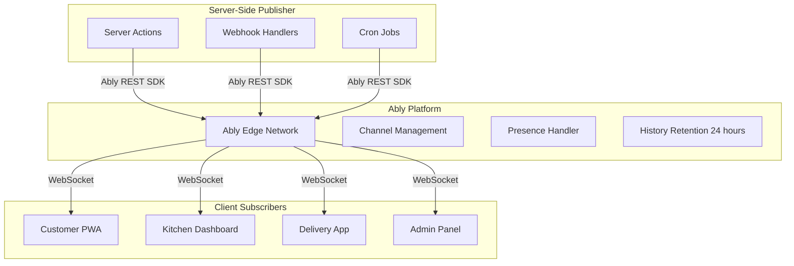
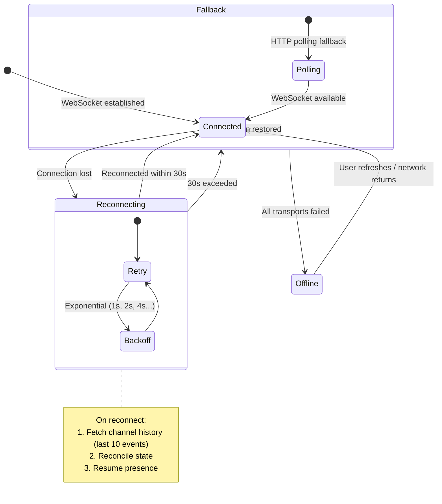
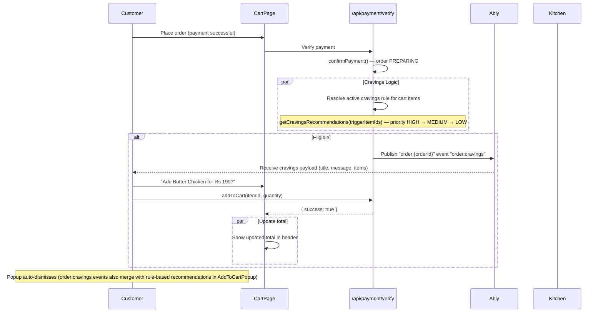

# Real-Time System Architecture

> **Status:** Active
> **Last updated:** 2026-08-05
> **Cross-refs:** [System Architecture](01-system-architecture.md), [Architecture Decisions (Ably)](02-architecture-decisions.md#adr-008-ably-for-real-time-over-websocket-custom), [Data Model](03-data-model.md)

---

## 1. Real-Time Infrastructure



---

## 2. Channel Naming Convention

| Channel Pattern | Subscribers | Permissions | Purpose |
|----------------|------------|-------------|---------|
| `order:{orderId}` | Customer (owner), Kitchen (fulfiller), Admin | Subscribe | Order status updates |
| `kitchen:{kitchenId}` | Kitchen partner, Admin | Subscribe | Incoming orders, queue status |
| `deliveryPartner:{deliveryPartnerId}` | Delivery partner | Subscribe | Delivery offers (assignment) |
| `category:{categoryId}` | Kitchen partners (menu push) | Subscribe | Menu category changes |
| `user:{userId}` | User | Subscribe | Fallback capability grant |

> Location is **not** streamed over Ably — the delivery partner heartbeats position to `POST /api/rider/location`, stored in Redis as `deliveryOrder:{id}:lastLoc` and polled by the tracking UI (with `DeliveryLocation` rows as persistence fallback).

---

## 3. Event Schema

### 3.1 Order Events

```typescript
// Payload: All order events
interface OrderEvent {
  event: string;
  orderId: string;
  timestamp: string; // ISO 8601
  data: Record<string, unknown>;
}

// Event Types (as published today)
type OrderEventType =
  | 'order:status'           // Status transition (CONFIRMED → PREPARING → READYFORPICKUP → COMPLETED)
  | 'delivery:status'        // Delivery phase (ASSIGNED / ACCEPTED / PICKEDUP / INTRANSIT / DELIVERED)
  | 'order:ready'            // Kitchen marked order ready for pickup
  | 'order:cravings'         // Real-time upsell popup payload (post-payment)
  | 'order:item-unavailable' // Item refunded as unavailable
  | 'order:refund'           // Full-order refund
  | 'refund:processed'       // Razorpay refund webhook processed

// Example: order:status
{
  event: 'order:status',
  orderId: 'ord_abc123',
  timestamp: '2026-07-21T14:30:00Z',
  data: {
    status: 'OUT_FOR_DELIVERY',
    deliveryPartner: { name: 'Rahul', phone: '+919876543210' },
  },
}
```

### 3.2 Kitchen Events

```typescript
interface KitchenEvent {
  event: string;
  kitchenId: string;
  timestamp: string;
  data: Record<string, unknown>;
}

type KitchenEventType =
  | 'queue:new-order'    // New order received (published on payment confirm)
  | 'queue:status'       // Queue/order status change
  | 'order:ready'        // Order marked ready (published on READYFORPICKUP)
```

### 3.3 Delivery Offer Events

```typescript
interface DeliveryOfferEvent {
  event: 'delivery:offer';
  orderId: string;
  timestamp: string;
  data: {
    orderId: string;
    kitchenLat: number;
    kitchenLng: number;
  };
}
// Published to deliveryPartner:{id} when an order is READYFORPICKUP:
// auto-assigned to the nearest online partner (Redis deliveryPersons:live
// geosearch, 5km) or to all online partners as fallback.
```

### 3.4 Cravings Popup Events

```typescript
interface CravingsEvent {
  event: 'order:cravings';
  orderId: string;
  timestamp: string;
  data: {
    title: string;
    message: string;
    items: Array<{
      id: string;
      name: string;
      price: number;
      discountedPrice?: number;
      photoUrl?: string;
      isVeg: boolean;
    }>;
  };
}
```

---

### 4.1 Client Subscription Hooks

```typescript
// hooks/useAblySubscribe.ts
function useAblySubscribe<T = unknown>(
  channelName: string | null,
  eventName: string,
  callback: (data: T) => void
): { connected: boolean; error: Error | null } {
  const [connected, setConnected] = useState(false);
  const [error, setError] = useState<Error | null>(null);

  useEffect(() => {
    if (!channelName) return;

    const ably = getAblyClient(); // lib/ably/client.ts — Ably.Realtime, authUrl: /api/ably-token

    ably.connection.on('connected', () => setConnected(true));
    ably.connection.on('failed', (err) => setError(err));

    const channel = ably.channels.get(channelName);
    channel.subscribe(eventName, (message) => {
      callback(message.data as T);
    });

    return () => {
      channel.unsubscribe();
      destroyAblyClient(); // Close + release singleton
    };
  }, [channelName, eventName]);

  return { connected, error };
}

// Convenience hooks
useAblyOrderChannel(orderId, { onStatus, onCravings });
useAblyKitchenChannel(kitchenId, { onNewOrder, onQueueStatus });
useAblyDeliveryPersonChannel(deliveryPartnerId, { onOffer });
```

---

## 5. Reliability Guarantees

| Property | Ably Guarantee | Application Handling |
|----------|---------------|---------------------|
| **Delivery** | At-least-once | Idempotent event handlers; dedupe by `eventId` |
| **Ordering** | Per-channel ordering | Single channel per order_id preserves message order |
| **Persistence** | 24-hour history | Replay missed events on reconnect |
| **Connection** | Automatic reconnection | Exponential backoff (1s, 2s, 4s, max 30s) |
| **Fallback** | MQTT → SSE → Long-polling | Automatic transport downgrade |
| **Presence** | 30s heartbeat | Detect kitchen/disconnect online status |

### Disconnection Handling



---

## 6. Token Authentication

### Server-Side Token Issuance

```typescript
// POST /api/ably-token
export async function POST(request: Request) {
  const session = await getSession();
  if (!session) return Response.json({ error: 'Unauthorized' }, { status: 401 });

  // Validate ownership of requested channel (order/kitchen/deliveryPartner)
  // → 403 for channels the user does not own; falls back to user:{id} capability
  const { userId } = session;
  const clientId = `user:${userId}`;

  const tokenRequest = await ably.auth.createTokenRequest({
    clientId,
    capability: {
      [`order:${orderId}`]: ['subscribe'],
      [`kitchen:${kitchenId}`]: ['subscribe'],
      [`deliveryPartner:${id}`]: ['subscribe'],
      [`user:${userId}`]: ['subscribe'],
    },
    ttl: 15 * 60 * 1000, // 15 minutes
  });

  return Response.json(tokenRequest);
}
```

### Channel-Level Authorization

| Channel Pattern | Customer | Kitchen | Delivery | Admin |
|----------------|----------|---------|----------|-------|
| `order:{ownOrderId}` | Subscribe | Subscribe | Subscribe | Subscribe |
| `order:{otherOrderId}` | ✗ | ✗ | ✗ | ✗ (must be assigned) |
| `kitchen:{ownKitchenId}` | ✗ | Subscribe | ✗ | ✗ (via other tooling) |
| `kitchen:{otherKitchenId}` | ✗ | ✗ | ✗ | ✗ |
| `deliveryPartner:{ownId}` | ✗ | ✗ | Subscribe | ✗ |
| `user:{id}` | Own only | Own only | Own only | Own only |

---

## 7. Cravings Popup (Real-Time Upsell)



---

## 8. Monitoring & Alerting

| Metric | Threshold | Action |
|--------|-----------|--------|
| Connection failure rate | >5% in 5 min | Alert on-call |
| Message publish latency | >500ms p99 | Alert on-call |
| Channel history retrieval | >1s p99 | Investigate Ably status |
| Concurrent connections | >80% of plan limit | Scale up Ably plan |
| Token auth failures | >10 in 5 min | Alert on-call (possible auth issue) |

### Ably Dashboard Metrics

```typescript
// Custom metrics to track
interface AblyMetrics {
  connected: number;          // Current connected clients
  messagesPerMinute: number;  // Messages published
  channelsOccupied: number;   // Active channels
  connectionFailures: number; // Failed connections
  messageLatency: number;     // ms p50/p95/p99
}
```
