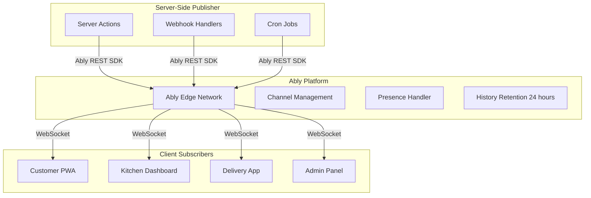
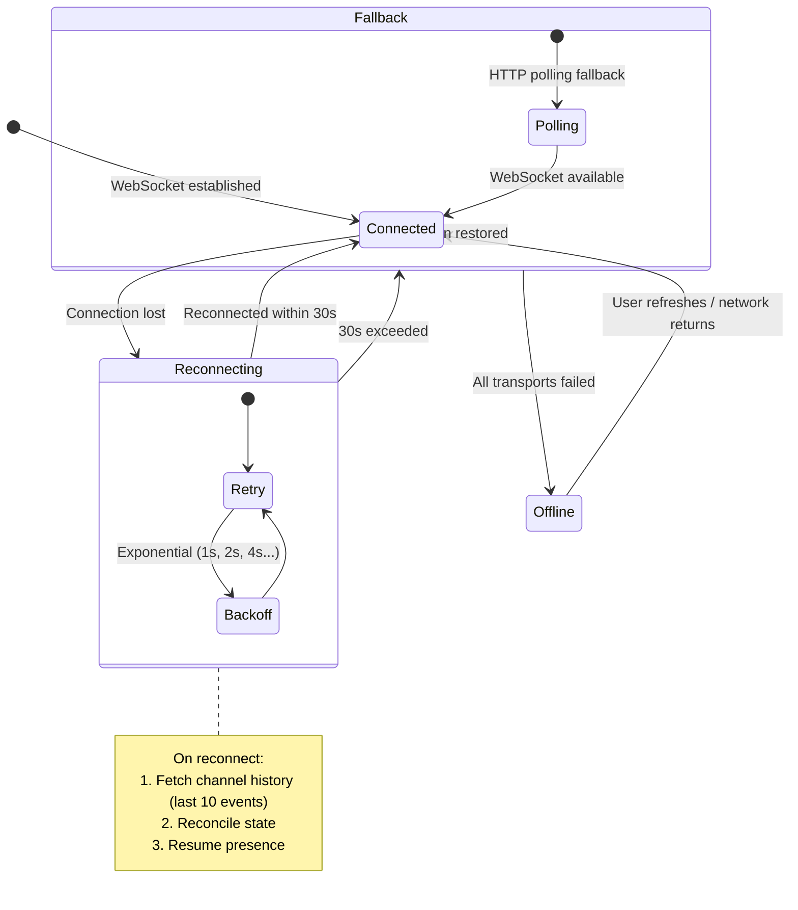
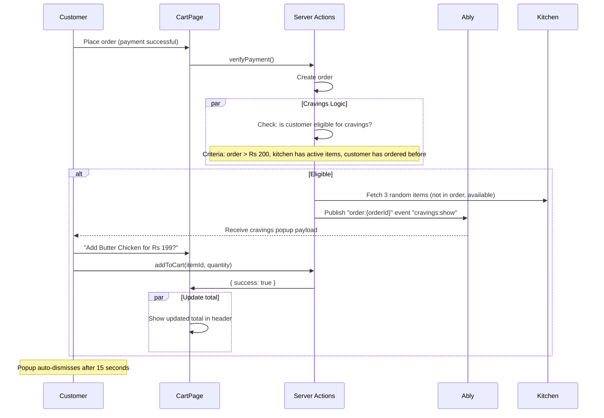

# Real-Time System Architecture

> **Status:** Active
> **Last updated:** 2026-07-21
> **Cross-refs:** [System Architecture](01-system-architecture.md), [Architecture Decisions (Ably)](02-architecture-decisions.md#adr-008-ably-for-real-time-over-websocket-custom), [Data Model](03-data-model.md)

---

## 1. Real-Time Infrastructure



---

## 2. Channel Naming Convention

| Channel Pattern | Subscribers | Permissions | Purpose |
|----------------|------------|-------------|---------|
| `order:{orderId}` | Customer (owner), Kitchen (fulfiller), Admin | Subscribe | Order status updates |
| `kitchen:{kitchenId}` | Kitchen partner, Admin | Subscribe, Presence | Incoming orders, kitchen status |
| `delivery:{deliveryId}` | Delivery partner, Admin | Subscribe, Publish | Assignment notifications |
| `delivery:location:{deliveryId}` | Customer, Admin | Subscribe | Live location tracking |
| `admin:notifications` | Admin | Subscribe | Alerts, audit events |
| `cravings:{kitchenId}` | Customer (in checkout flow) | Subscribe | Real-time upsell popups |

---

## 3. Event Schema

### 3.1 Order Events

```typescript
// Payload: All order events
interface OrderEvent {
  event: string;
  orderId: string;
  userId: string;
  kitchenId: string;
  timestamp: string; // ISO 8601
  data: Record<string, unknown>;
}

// Event Types
type OrderEventType =
  | 'order:confirmed'      // Order placed successfully
  | 'order:preparing'      // Kitchen started preparation
  | 'order:ready'          // Order ready for pickup/delivery
  | 'order:out_for_delivery' // Delivery partner picked up
  | 'order:delivered'      // Order delivered
  | 'order:cancelled'      // Order cancelled by customer/kitchen
  | 'order:payment_failed' // Payment processing failed
  | 'order:cravings'       // Real-time upsell popup

// Example: order:out_for_delivery
{
  event: 'order:out_for_delivery',
  orderId: 'ord_abc123',
  userId: 'usr_xyz',
  kitchenId: 'kit_123',
  timestamp: '2026-07-21T14:30:00Z',
  data: {
    deliveryPartner: {
      name: 'Rahul',
      phone: '+919876543210',
    },
    estimatedDelivery: '2026-07-21T14:45:00Z',
  },
}
```

### 3.2 Delivery Location Events

```typescript
interface DeliveryLocationEvent {
  event: 'delivery:location';
  deliveryId: string;
  orderId: string;
  timestamp: string;
  data: {
    lat: number;
    lng: number;
    bearing: number;     // Degrees
    speed: number;       // km/h
    accuracy: number;    // Meters
  };
}
```

### 3.3 Kitchen Events

```typescript
interface KitchenEvent {
  event: string;
  kitchenId: string;
  timestamp: string;
  data: Record<string, unknown>;
}

type KitchenEventType =
  | 'kitchen:new_order'         // New order received
  | 'kitchen:order_cancelled'   // Customer cancelled
  | 'kitchen:stock_low'         // Menu item running low
  | 'kitchen:status_change'     // Online/Offline/Busy
  | 'kitchen:delivery_assigned' // Delivery partner assigned
```

### 3.4 Cravings Popup Events

```typescript
interface CravingsEvent {
  event: 'cravings:show';
  orderId: string;
  timestamp: string;
  data: {
    items: Array<{
      id: string;
      name: string;
      price: number;
      discountedPrice?: number;
      photoUrl?: string;
      isVeg: boolean;
    }>;
    expiresAt: string; // ISO 8601 — popup auto-dismisses
  };
}
```

---

## 4. Client Subscription Hook

```typescript
// hooks/useAblyChannel.ts
function useAblyChannel<T = unknown>(
  channelName: string | null,
  eventName: string,
  callback: (data: T) => void
): { connected: boolean; error: Error | null } {
  const [connected, setConnected] = useState(false);
  const [error, setError] = useState<Error | null>(null);

  useEffect(() => {
    if (!channelName) return;

    const ably = new Ably.Realtime({
      authUrl: '/api/ably/auth',
      authMethod: 'POST',
    });

    ably.connection.on('connected', () => setConnected(true));
    ably.connection.on('failed', (err) => setError(err));

    const channel = ably.channels.get(channelName);
    channel.subscribe(eventName, (message) => {
      callback(message.data as T);
    });

    return () => {
      channel.unsubscribe();
      ably.close();
    };
  }, [channelName, eventName]);

  return { connected, error };
}

// Usage
function OrderTracker({ orderId }: { orderId: string }) {
  const { connected } = useAblyChannel<OrderEvent>(
    `order:${orderId}`,
    'order:status',
    (event) => {
      setStatus(event.data.status);
      setLastUpdate(event.timestamp);
    }
  );

  return (
    <div>
      {!connected && <p>Connecting to live updates...</p>}
      <StatusTimeline status={status} />
    </div>
  );
}
```

---

## 5. Reliability Guarantees

| Property | Ably Guarantee | Application Handling |
|----------|---------------|---------------------|
| **Delivery** | At-least-once | Idempotent event handlers; dedupe by `eventId` |
| **Ordering** | Per-channel ordering | Single channel per order_id preserves message order |
| **Persistence** | 24-hour history | Replay missed events on reconnect |
| **Connection** | Automatic reconnection | Exponential backoff (1s, 2s, 4s, max 30s) |
| **Fallback** | MQTT → SSE → Long-polling | Automatic transport downgrade |
| **Presence** | 30s heartbeat | Detect kitchen/disconnect online status |

### Disconnection Handling



---

## 6. Token Authentication

### Server-Side Token Issuance

```typescript
// POST /api/ably/auth
export async function POST(request: Request) {
  const session = await getSession();
  if (!session) {
    return Response.json({ error: 'Unauthorized' }, { status: 401 });
  }

  const { userId, role } = session;
  const clientId = `${role}:${userId}`;

  // Define channel capabilities based on role
  const capabilities: Record<string, string[]> = {
    [`order:${userId}`]: ['subscribe'],
    [`kitchen:${session.kitchenId}`]: ['subscribe', 'presence'],
    [`delivery:${session.deliveryId}`]: ['subscribe', 'publish'],
    [`delivery:location:${session.deliveryId}`]: ['publish'],
  };

  const token = await ably.auth.createTokenRequest({
    clientId,
    capability: capabilities,
    ttl: 3600, // 1 hour
  });

  return Response.json(token);
}
```

### Channel-Level Authorization

| Channel Pattern | Customer | Kitchen | Delivery | Admin |
|----------------|----------|---------|----------|-------|
| `order:{ownOrderId}` | Subscribe | Subscribe | Subscribe | Subscribe |
| `order:{otherOrderId}` | ✗ | ✗ | ✗ | Subscribe |
| `kitchen:{ownKitchenId}` | ✗ | Subscribe + Presence | ✗ | Subscribe |
| `kitchen:{otherKitchenId}` | ✗ | ✗ | ✗ | Subscribe |
| `delivery:{ownId}` | ✗ | ✗ | Subscribe + Publish | Subscribe |
| `delivery:location:{ownId}` | ✗ | ✗ | Publish | Subscribe |
| `delivery:location:{otherId}` | Subscribe (on assigned order) | ✗ | ✗ | Subscribe |
| `admin:notifications` | ✗ | ✗ | ✗ | Subscribe |
| `cravings:{kitchenId}` | Subscribe | ✗ | ✗ | ✗ |

---

## 7. Cravings Popup (Real-Time Upsell)



---

## 8. Monitoring & Alerting

| Metric | Threshold | Action |
|--------|-----------|--------|
| Connection failure rate | >5% in 5 min | Alert on-call |
| Message publish latency | >500ms p99 | Alert on-call |
| Channel history retrieval | >1s p99 | Investigate Ably status |
| Concurrent connections | >80% of plan limit | Scale up Ably plan |
| Token auth failures | >10 in 5 min | Alert on-call (possible auth issue) |

### Ably Dashboard Metrics

```typescript
// Custom metrics to track
interface AblyMetrics {
  connected: number;          // Current connected clients
  messagesPerMinute: number;  // Messages published
  channelsOccupied: number;   // Active channels
  connectionFailures: number; // Failed connections
  messageLatency: number;     // ms p50/p95/p99
}
```
