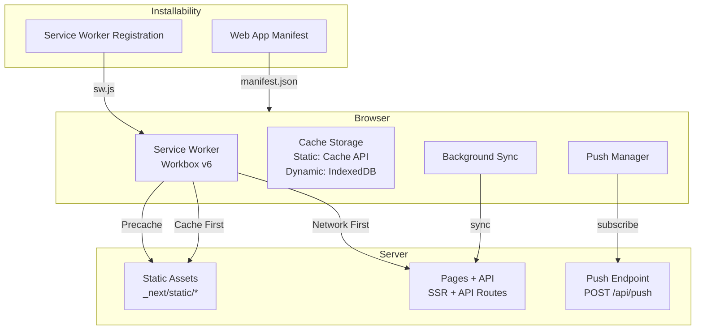
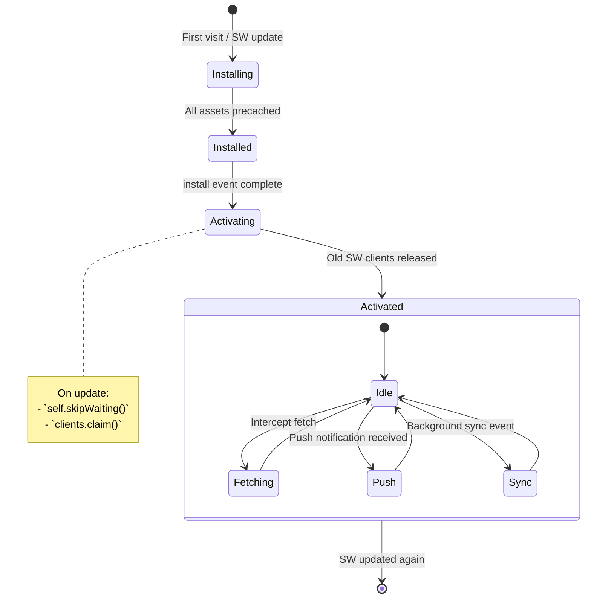
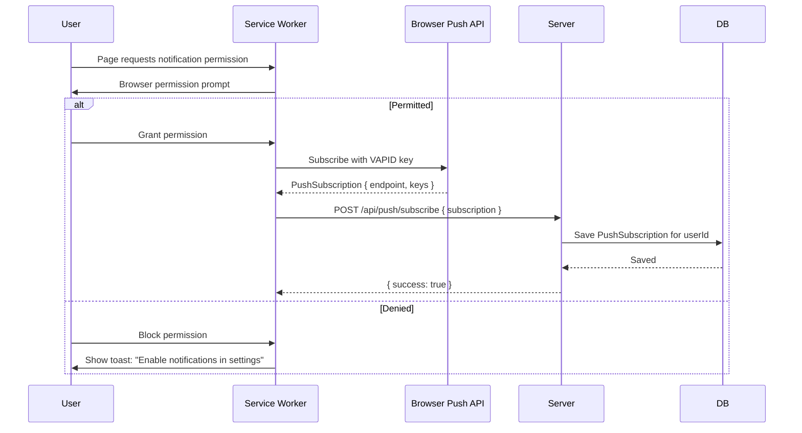
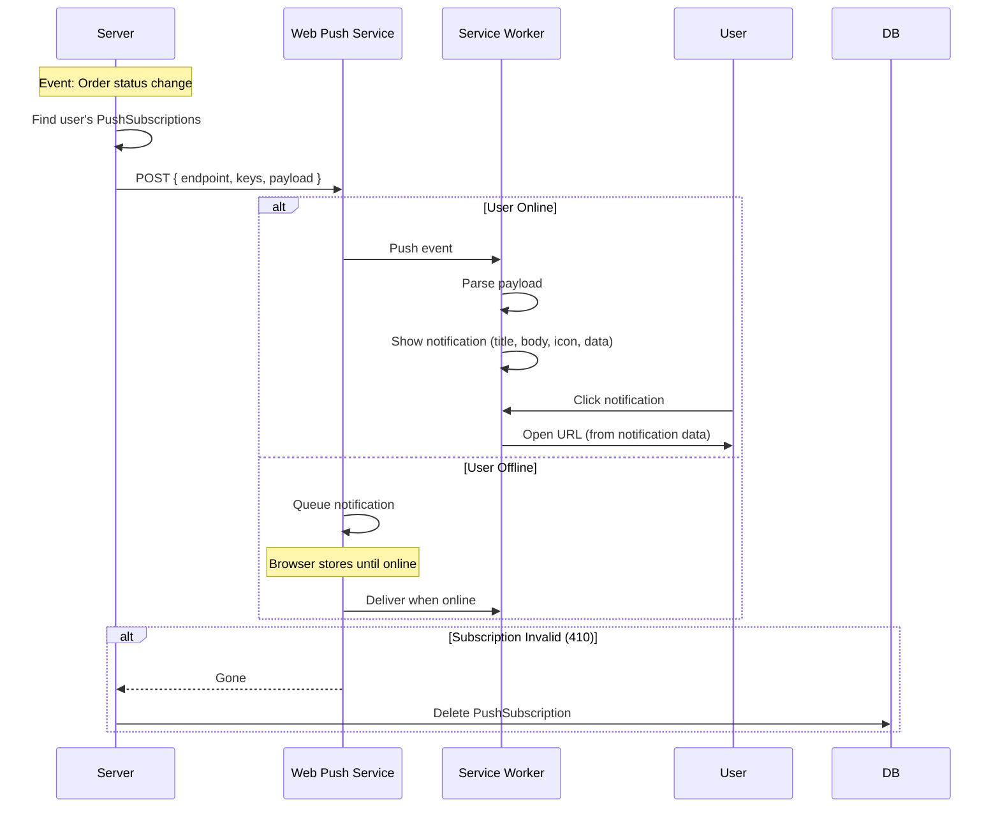

# PWA & Offline Architecture

> **Status:** Active
> **Last updated:** 2026-07-21
> **Cross-refs:** [System Architecture](01-system-architecture.md), [Performance](11-performance-scaling.md), [State Management](06-state-data-flow.md)

---

## 1. PWA Overview



---

## 2. Service Worker Architecture

### 2.1 Lifecycle



### 2.2 Caching Strategies

| Asset Type | Strategy | Cache Name | Max Entries | Max Age |
|------------|----------|------------|-------------|---------|
| **JS/CSS chunks** | Cache First (Stale-While-Revalidate) | `static-assets` | 100 | 30 days |
| **Fonts** | Cache First | `fonts` | 10 | 30 days |
| **Images (Cloudinary)** | Cache First (via Cloudinary CDN) | `images` | 50 | 7 days |
| **HTML pages** | Network First (fallback to cache) | `pages` | 20 | 24 hours |
| **API responses** | Network Only | — | — | — |
| **Server Actions** | Network Only | — | — | — |

```typescript
// sw.ts — Workbox configuration
import { precacheAndRoute } from 'workbox-precaching';
import { registerRoute } from 'workbox-routing';
import { CacheFirst, NetworkFirst, NetworkOnly } from 'workbox-strategies';
import { ExpirationPlugin } from 'workbox-expiration';

// Precache all static assets (generated at build time)
precacheAndRoute(self.__WB_MANIFEST);

// Cache First: Static assets (.js, .css)
registerRoute(
  ({ request }) => request.destination === 'script' || request.destination === 'style',
  new CacheFirst({
    cacheName: 'static-assets',
    plugins: [
      new ExpirationPlugin({ maxEntries: 100, maxAgeSeconds: 30 * 24 * 60 * 60 }),
    ],
  })
);

// Cache First: Fonts
registerRoute(
  ({ url }) => url.origin === self.location.origin && url.pathname.includes('/fonts/'),
  new CacheFirst({
    cacheName: 'fonts',
    plugins: [
      new ExpirationPlugin({ maxEntries: 10, maxAgeSeconds: 30 * 24 * 60 * 60 }),
    ],
  })
);

// Network First: HTML pages
registerRoute(
  ({ request }) => request.mode === 'navigate',
  new NetworkFirst({
    cacheName: 'pages',
    plugins: [
      new ExpirationPlugin({ maxEntries: 20, maxAgeSeconds: 24 * 60 * 60 }),
    ],
  })
);

// Network Only: API and Server Actions
registerRoute(
  ({ url }) => url.pathname.startsWith('/api/'),
  new NetworkOnly()
);
```

### 2.3 Offline Fallback Page

```typescript
// When network-first fails, serve offline page
const OFFLINE_URL = '/offline';

self.addEventListener('fetch', (event) => {
  if (event.request.mode === 'navigate') {
    event.respondWith(
      (async () => {
        try {
          return await networkFirst(event.request);
        } catch {
          const cache = await caches.open('pages');
          const cached = await cache.match(OFFLINE_URL);
          return cached || new Response('Offline', { status: 503 });
        }
      })()
    );
  }
});
```

---

## 3. Push Notification Architecture

### 3.1 Subscription Flow



### 3.2 Push Delivery Flow



### 3.3 Notification Payload

```typescript
interface PushPayload {
  title: string;
  body: string;
  icon: string;           // 192x192 app icon
  badge: string;          // 96x96 badge icon
  tag: string;            // Group notifications by tag
  data: {
    url: string;          // Deep link on click
    orderId?: string;
    type: 'order' | 'promo' | 'system';
  };
  actions?: Array<{
    action: string;
    title: string;
    icon?: string;
  }>;
}

// Example: Order status notification
{
  title: 'Order Confirmed!',
  body: 'Your order #ORD123 from Tandoori Express has been confirmed.',
  icon: '/icons/icon-192.png',
  badge: '/icons/badge-96.png',
  tag: 'order-ord123',
  data: {
    url: '/orders/ord123',
    orderId: 'ord123',
    type: 'order',
  },
  actions: [
    { action: 'track', title: 'Track Order' },
    { action: 'cancel', title: 'Cancel' },
  ],
}
```

---

## 4. Background Sync

```typescript
// Service Worker: Register sync
self.addEventListener('sync', (event) => {
  if (event.tag === 'sync-cart') {
    event.waitUntil(syncCart());
  }
  if (event.tag === 'sync-wishlist') {
    event.waitUntil(syncWishlist());
  }
});

async function syncCart() {
  const db = await openDB('rrc-offline', 1);
  const pendingItems = await db.getAll('pendingCartItems');

  for (const item of pendingItems) {
    try {
      await fetch('/api/cart/sync', {
        method: 'POST',
        body: JSON.stringify(item),
        headers: { 'Content-Type': 'application/json' },
      });
      await db.delete('pendingCartItems', item.id);
    } catch {
      // Will retry on next sync event
    }
  }
}
```

---

## 5. Offline Behavior Matrix

| Feature | Online | Offline | Partial Connectivity |
|---------|--------|---------|---------------------|
| **Home page** | SSR (fresh) | Cached version (24h old) | Stale-while-revalidate |
| **Kitchen menus** | Fresh from server | Cached version (1h old) | Show cached, refetch |
| **Item detail** | Fresh from server | Cached version | Show cached, refetch |
| **Search** | Server-side search | Disabled, show cached items | Show cached results |
| **Cart** | Full functionality | Full functionality (localStorage) | Full functionality |
| **Add to cart** | Optimistic + server sync | Optimistic + queue | Optimistic + queue |
| **Checkout** | Full | Disabled (no network) | Show "retry" state |
| **Order tracking** | Real-time (WebSocket) | Cached status (last known) | Polling fallback |
| **Reviews** | Submit to server | Queue for later | Queue for later |
| **Profile** | Fresh | Cached (show stale) | Stale-while-revalidate |
| **Images** | Cloudinary CDN | Cached images | Show blurred placeholder |
| **Auth (login)** | Full | Disabled | Show cached session |

---

## 6. Web App Manifest

```json
{
  "name": "RRC Kitchen — Order Food Online",
  "short_name": "RRC Kitchen",
  "description": "Order from the best kitchens near you. Fresh food, fast delivery.",
  "start_url": "/",
  "display": "standalone",
  "background_color": "#FFFFFF",
  "theme_color": "#EE7005",
  "orientation": "portrait-primary",
  "icons": [
    { "src": "/icons/icon-192.png", "sizes": "192x192", "type": "image/png" },
    { "src": "/icons/icon-512.png", "sizes": "512x512", "type": "image/png" },
    { "src": "/icons/icon-192-maskable.png", "sizes": "192x192", "type": "image/png", "purpose": "maskable" },
    { "src": "/icons/icon-512-maskable.png", "sizes": "512x512", "type": "image/png", "purpose": "maskable" }
  ],
  "screenshots": [
    { "src": "/screenshots/home.png", "sizes": "1080x1920", "type": "image/png" },
    { "src": "/screenshots/menu.png", "sizes": "1080x1920", "type": "image/png" }
  ],
  "categories": ["food", "lifestyle"],
  "prefer_related_applications": false,
  "related_applications": []
}
```

### Manifest Settings Rationale

| Setting | Value | Why |
|---------|-------|-----|
| `display` | `standalone` | Native app feel without browser chrome |
| `background_color` | `#FFFFFF` | Smooth splash screen transition (no white flash) |
| `orientation` | `portrait-primary` | Mobile-first, no landscape needed for food ordering |
| `maskable` icons | Included | Adaptive icons on Android |
| `screenshots` | Included | Store listing enrichment for Play Store |

---

## 7. Performance Impact of Service Worker

| Metric | Without SW | With SW | Improvement |
|--------|-----------|---------|-------------|
| Repeat visit load time (JS) | ~800ms | ~50ms (from cache) | 93% faster |
| Repeat visit HTML load | ~400ms | ~50ms (cache hit) / ~300ms (network first) | 25-87% faster |
| Offline availability | None | All previously visited pages | ✓ |
| Push notification delivery | None | Yes (SW registration required) | ✓ |
| Bundle size (SW overhead) | — | ~8KB (Workbox runtime) | Negligible |

---

## 8. Testing Checklist

- [ ] App installable on Android Chrome (shows install prompt)
- [ ] App installable on iOS Safari (share → Add to Home Screen)
- [ ] Full navigation offline for previously visited kitchen pages
- [ ] Cart persists offline and syncs when online
- [ ] Images show cached versions when offline
- [ ] Push notification received when app is closed
- [ ] Push notification click opens correct page
- [ ] Service worker updates without breaking (skipWaiting + clientsClaim)
- [ ] Background sync restores pending actions after reconnect
- [ ] Manifest passes Lighthouse PWA audit
