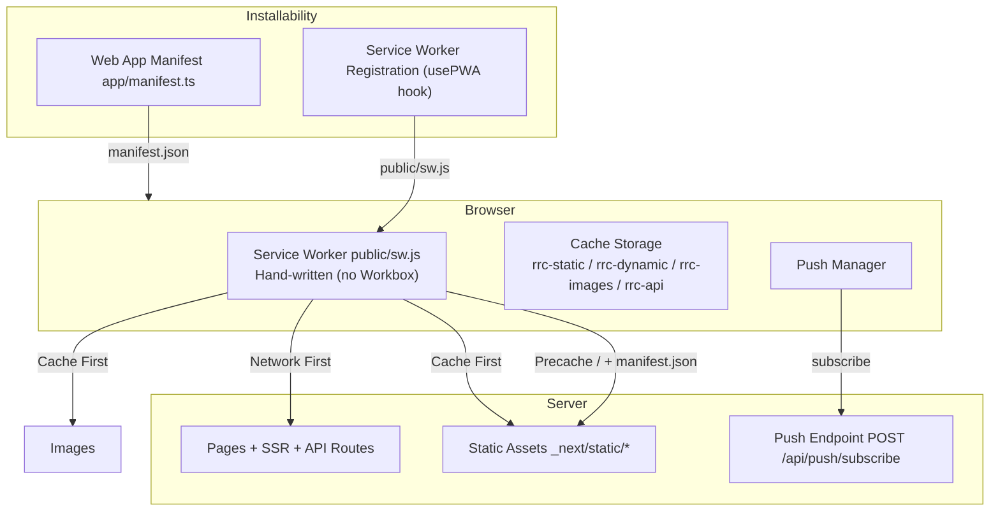
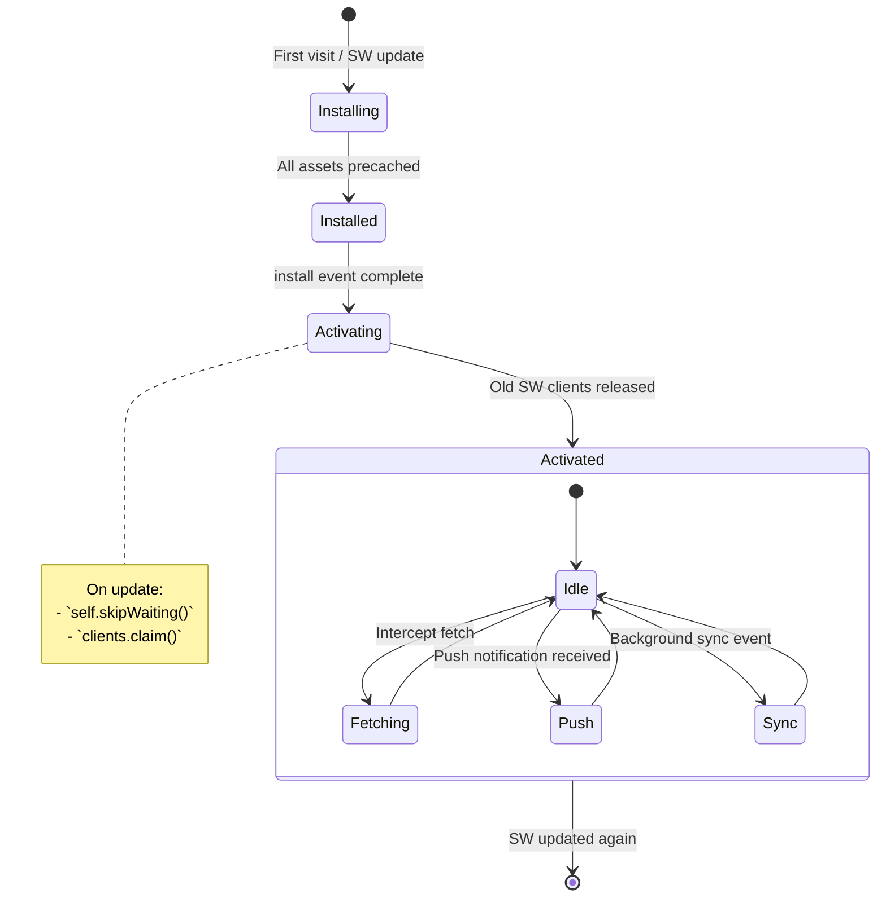
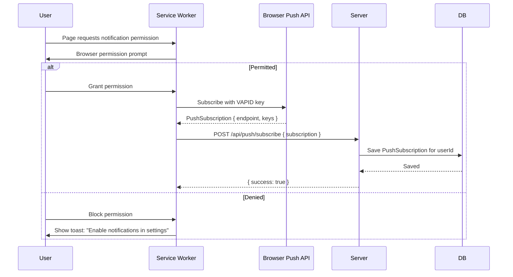
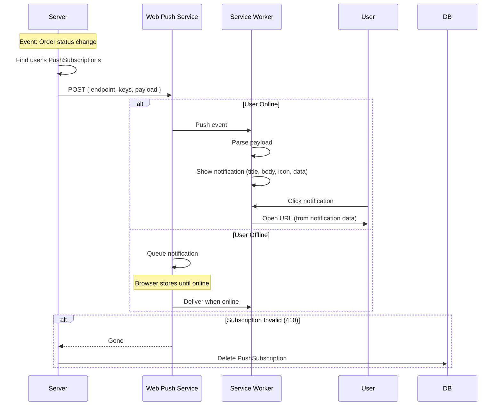
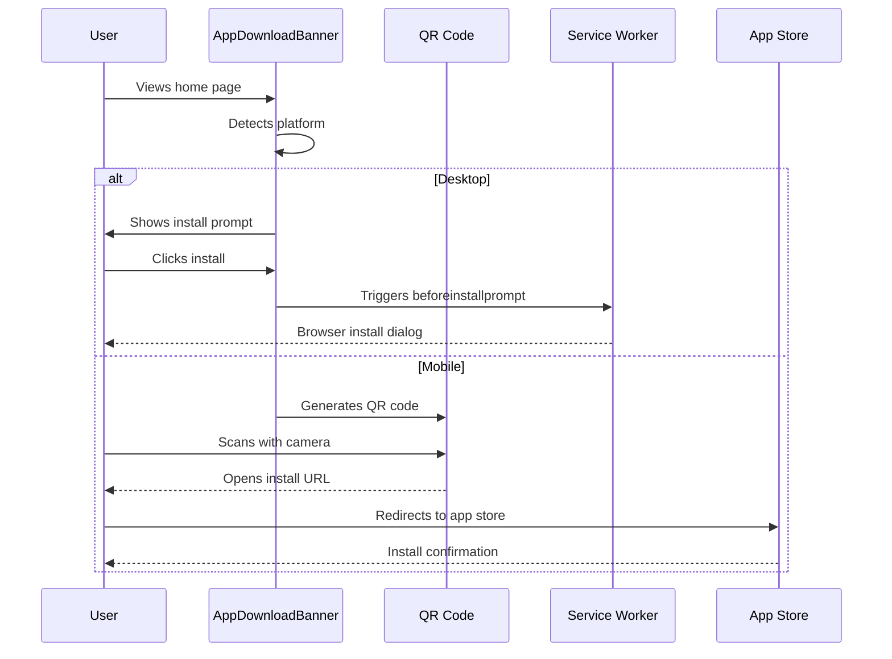

# PWA & Offline Architecture

> **Status:** Active
> **Last updated:** 2026-09-20
> **Cross-refs:** [System Architecture](01-system-architecture.md), [Performance](11-performance-scaling.md), [State Management](06-state-data-flow.md)

---

## 1. PWA Overview



> **Note:** No Workbox, no IndexedDB, no Background Sync. The service worker is a hand-written `public/sw.js` (~220 lines) registered by `hooks/usePWA.ts`.

---

## 2. Service Worker Architecture

### 2.1 Lifecycle



### 2.2 Caching Strategies

| Asset Type | Strategy | Cache Name | Max Age |
|------------|----------|------------|---------|
| **Precache (install)** | `/` + `/manifest.json` | `rrc-static-v1` | — |
| **JS/CSS / `_next/static/`** | Cache First | `rrc-static-v1` | — |
| **Images (png/jpg/webp/avif/svg)** | Cache First (revalidate in background after 7 days) | `rrc-images-v1` | 7 days |
| **`/api/` calls** | Network First | `rrc-api-v1` | — |
| **HTML navigation** | Network First (fallback to cached `/`) | `rrc-dynamic-v1` | — |
| **Other same-origin GET** | Stale-While-Revalidate | `rrc-dynamic-v1` | — |

```javascript
// public/sw.js — hand-written (no Workbox)
const CACHE_VERSION = 'v1';
const STATIC_CACHE = `rrc-static-${CACHE_VERSION}`;
const DYNAMIC_CACHE = `rrc-dynamic-${CACHE_VERSION}`;
const IMAGE_CACHE = `rrc-images-${CACHE_VERSION}`;
const API_CACHE = `rrc-api-${CACHE_VERSION}`;

// install: precache '/' + '/manifest.json', self.skipWaiting()
// activate: delete stale caches, self.clients.claim()

// Excluded from interception:
//  - non-GET requests
//  - cross-origin (Razorpay, Google Maps, Cloudinary upload, etc.) → plain fetch
//  - /api/auth/* (never cache credentials/sessions)

function isStaticAsset(url) {
  const staticPatterns = [/\.(js|css|woff2?)$/, /\/_next\/static\//];
  return staticPatterns.some((p) => p.test(url));
}

// fetch handler routing:
//   isStaticAsset → cacheFirst(STATIC_CACHE)
//   isImage       → cacheFirst(IMAGE_CACHE, 7 days)
//   isApiCall     → networkFirst(API_CACHE)
//   mode 'navigate' → networkFirst(DYNAMIC_CACHE) with caches.match('/') fallback
//   else            → staleWhileRevalidate(DYNAMIC_CACHE)
```

> Note: Network-first API caching means API responses are cached on success and served as an offline fallback — unlike an "API cache" this never serves stale data while online.

### 2.3 Offline Fallback Page

There is no dedicated `/offline` page. A failed navigation serves the cached home page (`caches.match('/')`); a failed API call that has no cached response returns `503 "Offline"`.

```javascript
// Navigation requests — network first, fall back to cached home page
if (request.mode === 'navigate') {
  event.respondWith(
    networkFirst(request, DYNAMIC_CACHE).catch(() => {
      return caches.match('/');
    })
  );
}
```

---

## 3. Push Notification Architecture

### 3.1 Subscription Flow



### 3.2 Push Delivery Flow



### 3.3 Notification Payload

```typescript
interface PushPayload {
  title: string;
  body: string;
  icon: string;           // 192x192 app icon
  badge: string;          // 96x96 badge icon
  tag: string;            // Group notifications by tag
  data: {
    url: string;          // Deep link on click
    orderId?: string;
    type: 'order' | 'promo' | 'system';
  };
  actions?: Array<{
    action: string;
    title: string;
    icon?: string;
  }>;
}

// Example: Order status notification
{
  title: 'Order Confirmed!',
  body: 'Your order #ORD123 from Tandoori Express has been confirmed.',
  icon: '/icons/icon-192.png',
  badge: '/icons/badge-96.png',
  tag: 'order-ord123',
  data: {
    url: '/orders/ord123',
    orderId: 'ord123',
    type: 'order',
  },
  actions: [
    { action: 'track', title: 'Track Order' },
    { action: 'cancel', title: 'Cancel' },
  ],
}
```

---

## 4. Background Sync

**Not implemented.** There is no Background Sync API usage in the service worker and no IndexedDB queue — pending writes rely on optimistic UI + server action retries while online. Push notifications are fire-and-forget via the `push` / `notificationclick` handlers in `public/sw.js` (navigation posts a `NAVIGATE` message to existing windows or opens a new one).

---

## 5. Offline Behavior Matrix

| Feature | Online | Offline | Partial Connectivity |
|---------|--------|---------|---------------------|
| **Home page** | SSR (fresh) | Cached `/` (from `rrc-dynamic-v1`/precache) | Network-first |
| **Kitchen menus** | Fresh from server | Cached page | Show cached, refetch |
| **Item detail** | Fresh from server | Cached page | Show cached, refetch |
| **Search** | Server-side search | Cached page | Show cached, refetch |
| **Cart** | Full functionality | Full functionality (localStorage) | Full functionality |
| **Add to cart** | Optimistic + server sync | Optimistic (pending until online) | Optimistic |
| **Checkout** | Full | Disabled (no network) | Show "retry" state |
| **Order tracking** | Real-time (Ably) | Cached status (last known) | Polling fallback |
| **Reviews** | Submit to server | Disabled | Disabled |
| **Profile** | Fresh | Cached (show stale) | Stale-while-revalidate |
| **Images** | Cloudinary CDN | Cached images (7 days) | Show cached |
| **Auth (login)** | Full | Disabled | Show cached session |
| **API responses** | Fresh | Cached (if previously fetched) | Network-first |

---

## 6. PWA Install Components (Added September 2026)

### 6.1 InstallPrompt Component

**Location:** `components/patterns/install-prompt.tsx`

**Purpose:** Native PWA installation prompt that guides users to install the app on their devices.

**Features:**
- Detects `beforeinstallprompt` event (Chrome, Edge, Samsung Internet)
- Shows platform-specific instructions (iOS Safari, Android Chrome, Desktop)
- Dismissable with localStorage persistence
- Auto-hides after successful installation
- Tracks installation analytics

**Detection Logic:**
```typescript
useEffect(() => {
  const handler = (e: BeforeInstallPromptEvent) => {
    e.preventDefault();
    setDeferredPrompt(e);
    setShowPrompt(true);
  };
  window.addEventListener('beforeinstallprompt', handler);
  return () => window.removeEventListener('beforeinstallprompt', handler);
}, []);

const handleInstall = async () => {
  if (!deferredPrompt) return;
  deferredPrompt.prompt();
  const { outcome } = await deferredPrompt.userChoice;
  if (outcome === 'accepted') {
    trackInstallEvent('accepted');
    setShowPrompt(false);
  }
};
```

**Platform-Specific Instructions:**
- **iOS Safari**: "Tap Share → Add to Home Screen"
- **Android Chrome**: "Use the browser menu → Add to Home Screen"  
- **Desktop Chrome**: "Click the install icon in the address bar"
- **Samsung Internet**: "Use the menu → Add page to Home screens"

**Dismissal Storage:**
```typescript
const DISMISS_KEY = 'pwa-install-dismissed';
const DISMISS_DURATION = 7 * 24 * 60 * 60 * 1000; // 7 days

const handleDismiss = () => {
  localStorage.setItem(DISMISS_KEY, Date.now().toString());
  setShowPrompt(false);
};
```

### 6.2 AppDownloadBanner Component

**Location:** `components/home/app-download-banner.tsx`

**Purpose:** Promotes PWA installation with QR code scanning and app store links.

**Features:**
- QR code generation for quick mobile installation
- Platform detection (iOS/Android/Desktop)
- Custom imagery and branding
- Dismissable state
- Tracks installation events
- Links to app stores where applicable

**Layout:**
```tsx
<div className="bg-white rounded-xl shadow-lg p-6">
  <div className="flex flex-col md:flex-row items-center gap-8">
    <div className="flex-1">
      <h3 className="text-2xl font-bold mb-4">Get the RRC Kitchen App</h3>
      <p className="text-gray-600 mb-6">
        Order faster, track deliveries in real-time, and get exclusive offers.
      </p>
      
      {/* Platform-specific CTA */}
      {platform === 'ios' && (
        <div className="flex gap-4">
          <a href={APP_STORE_URL} className="inline-flex items-center">
            <AppleLogo /> Download on App Store
          </a>
        </div>
      )}
      
      {platform === 'android' && (
        <div className="flex gap-4">
          <a href={PLAY_STORE_URL} className="inline-flex items-center">
            <GooglePlayLogo /> Get it on Google Play
          </a>
        </div>
      )}
    </div>
    
    <div className="flex-shrink-0">
      <QRCode value={INSTALL_URL} size={200} />
      <p className="text-center mt-4 text-sm text-gray-500">
        Scan to install
      </p>
    </div>
  </div>
</div>
```

**Platform Detection:**
```typescript
const getPlatform = (): 'ios' | 'android' | 'desktop' => {
  const userAgent = navigator.userAgent || navigator.vendor || (window as any).opera;
  
  if (/android/i.test(userAgent)) return 'android';
  if (/iPad|iPhone|iPod/.test(userAgent) && !window.MSStream) return 'ios';
  return 'desktop';
};
```

### 6.3 Installation Flow



### 6.4 Install Analytics

```typescript
interface InstallEvent {
  platform: 'ios' | 'android' | 'desktop';
  source: 'banner' | 'prompt' | 'qr-scan';
  outcome: 'accepted' | 'dismissed' | 'redirected';
  timestamp: number;
}

const trackInstallEvent = (event: InstallEvent) => {
  // Send to analytics (e.g., Google Analytics, custom endpoint)
  if (typeof gtag === 'function') {
    gtag('event', 'pwa_install', {
      event_category: 'engagement',
      event_label: `${event.platform}_${event.source}`,
      value: event.outcome === 'accepted' ? 1 : 0,
    });
  }
};
```

---

## 7. Updated Offline Behavior Matrix

| Feature | Online | Offline | Partial Connectivity |
|---------|--------|---------|---------------------|
| **Home page** | SSR (fresh) | Cached `/` (from `rrc-dynamic-v1`/precache) | Network-first |
| **Kitchen menus** | Fresh from server | Cached page | Show cached, refetch |
| **Item detail** | Fresh from server | Cached page | Show cached, refetch |
| **Search** | Server-side search | Cached page | Show cached, refetch |
| **Cart** | Full functionality | Full functionality (localStorage) | Full functionality |
| **Add to cart** | Optimistic + server sync | Optimistic (pending until online) | Optimistic |
| **Checkout** | Full | Disabled (no network) | Show "retry" state |
| **Order tracking** | Real-time (Ably) | Cached status (last known) | Polling fallback |
| **Reviews** | Submit to server | Disabled | Disabled |
| **Profile** | Fresh | Cached (show stale) | Stale-while-revalidate |
| **Images** | Cloudinary CDN | Cached images (7 days) | Show cached |
| **Auth (login)** | Full | Disabled | Show cached session |
| **API responses** | Fresh | Cached (if previously fetched) | Network-first |
| **PWA Install** | Full (banner + prompt) | Cached banner (static) | Cached banner |
| **QR Code Scan** | Full (scans to install URL) | N/A (static QR) | N/A (static QR) |

---

## 6. Web App Manifest

Generated by `app/manifest.ts` (Next.js MetadataRoute) and served at `/manifest.json`:

```typescript
// app/manifest.ts
export default function manifest(): MetadataRoute.Manifest {
  return {
    name: "RRC Kitchen",
    short_name: "RRC Kitchen",
    description: "Order fresh home-cooked meals from local kitchens in Thanjavur.",
    start_url: "/",
    display: "standalone",
    background_color: "#FFFFFF",
    theme_color: "#EE7005",
    orientation: "portrait-primary",
    categories: ["food", "lifestyle"],
    lang: "en",
    icons: [
      { src: "/icons/icon-192x192.png", sizes: "192x192", type: "image/png", purpose: "maskable" },
      { src: "/icons/icon-384x384.png", sizes: "384x384", type: "image/png", purpose: "maskable" },
      { src: "/icons/icon-512x512.png", sizes: "512x512", type: "image/png", purpose: "maskable" },
    ],
    shortcuts: [
      { name: "Tomorrow's Menu", short_name: "Menu", description: "Browse tomorrow's menu", url: "/menu" },
      { name: "My Cart", short_name: "Cart", description: "View your cart", url: "/cart" },
    ],
  };
}
```

### Manifest Settings Rationale

| Setting | Value | Why |
|---------|-------|-----|
| `display` | `standalone` | Native app feel without browser chrome |
| `background_color` | `#FFFFFF` | Smooth splash screen transition (no white flash) |
| `orientation` | `portrait-primary` | Mobile-first, no landscape needed for food ordering |
| `maskable` icons | 192/384/512 | Adaptive icons on Android |
| `shortcuts` | Menu, Cart | Instant deep links from app icon long-press |

---

## 7. Performance Impact of Service Worker

| Metric | Without SW | With SW | Improvement |
|--------|-----------|---------|-------------|
| Repeat visit load time (JS) | ~800ms | ~50ms (from cache) | 93% faster |
| Repeat visit HTML load | ~400ms | ~50ms (cache hit) / ~300ms (network first) | 25-87% faster |
| Offline availability | None | All previously visited pages | ✓ |
| Push notification delivery | None | Yes (SW registration required) | ✓ |
| Bundle size (SW overhead) | — | ~7KB (hand-written sw.js) | Negligible |

---

## 8. Testing Checklist

- [ ] App installable on Android Chrome (shows install prompt)
- [ ] App installable on iOS Safari (share → Add to Home Screen)
- [ ] Full navigation offline for previously visited kitchen pages
- [ ] Cart persists offline (localStorage)
- [ ] Images show cached versions when offline
- [ ] Push notification received when app is closed
- [ ] Push notification click opens correct page (NAVIGATE message / new window)
- [ ] Service worker updates without breaking (skipWaiting + clientsClaim + cache cleanup)
- [ ] `/api/auth/*` and cross-origin requests are never cached
- [ ] Manifest passes Lighthouse PWA audit
