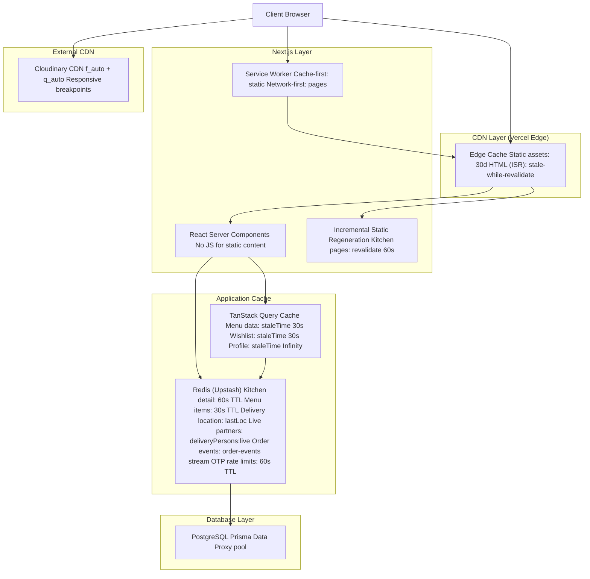
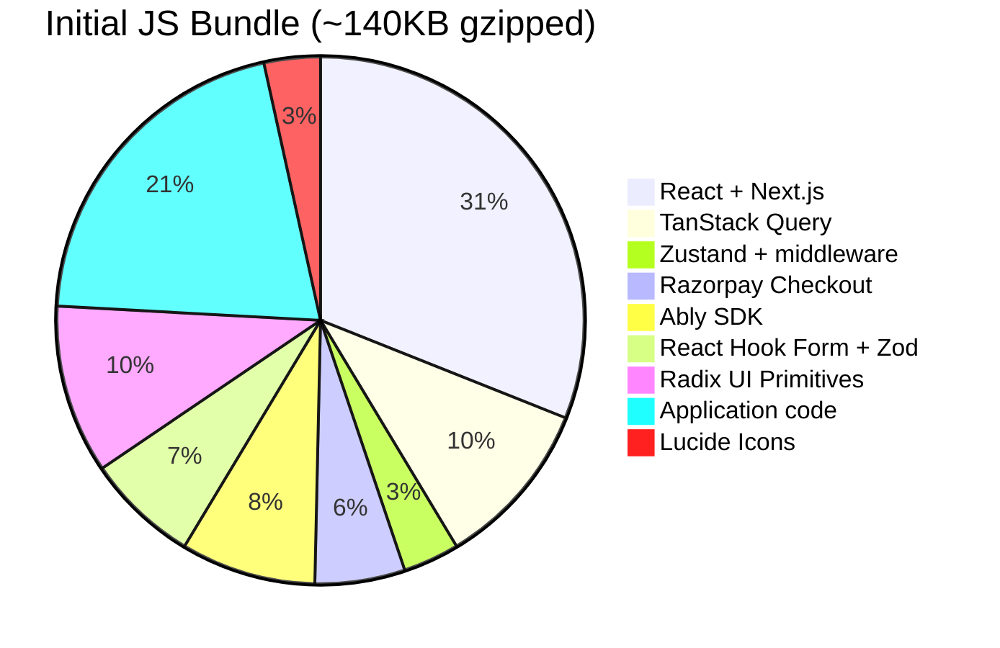
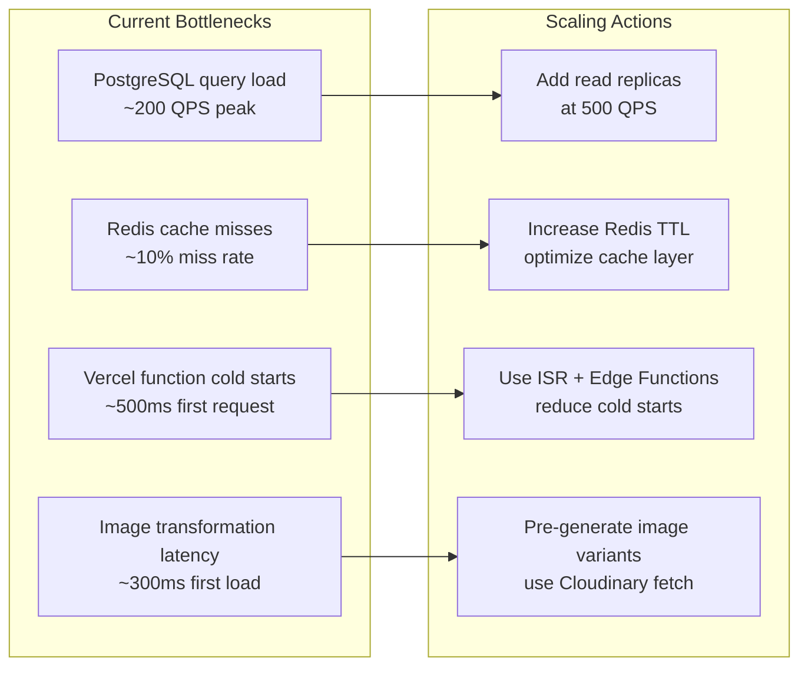

# Performance & Scaling Architecture

> **Status:** Active
> **Last updated:** 2026-08-05
> **Cross-refs:** [System Architecture](01-system-architecture.md), [PWA & Offline](10-pwa-offline.md), [Observability](12-observability.md)

---

## 1. Performance Budgets

| Metric | Budget (Mobile) | Budget (Desktop) | Measurement |
|--------|----------------|-----------------|-------------|
| **TTFB (Time to First Byte)** | <800ms p95 | <400ms p95 | Vercel Analytics |
| **FCP (First Contentful Paint)** | <1.5s | <1.0s | Lighthouse |
| **LCP (Largest Contentful Paint)** | <2.5s | <2.0s | Lighthouse |
| **TBT (Total Blocking Time)** | <200ms | <100ms | Lighthouse |
| **CLS (Cumulative Layout Shift)** | <0.1 | <0.1 | Lighthouse |
| **SI (Speed Index)** | <3.5s | <2.5s | Lighthouse |
| **Bundle size (JS gzipped)** | <150KB initial | <150KB initial | Next.js bundle analyzer |
| **Bundle size (CSS gzipped)** | <15KB initial | <15KB initial | Next.js bundle analyzer |
| **Image weight per page** | <500KB | <1MB | Lighthouse |
| **API response time** | <200ms p95 | <200ms p95 | Vercel Analytics |
| **Ably message latency** | <100ms p95 | <100ms p95 | Ably dashboard |
| **First Input Delay** | <100ms | <50ms | Web Vitals library |

---

## 2. Caching Architecture



---

## 3. Caching Strategy Details

| Layer | Type | Key | TTL | Invalidation |
|-------|------|-----|-----|--------------|
| **CDN** | Static assets | File hash in URL | 30 days | URL change on rebuild |
| **CDN** | HTML (ISR) | Kitchen slug | 60s SWR | `revalidatePath()` on menu change |
| **Redis** | Kitchen detail | `kitchen:{slug}:detail` | 60s | Manual invalidation on menu update |
| **Redis** | Menu items | `menu:{kitchenId}:items` | 30s | Manual invalidation on item CRUD |
| **Redis** | Delivery location | `deliveryOrder:{id}:lastLoc` | ephemeral | Written on every heartbeat |
| **Redis** | Live partners | `deliveryPersons:live` | ephemeral | Updated on availability toggle |
| **Redis** | Order events | `order-events` (stream) | 7 days | Drained by cron `process-order-events` |
| **Redis** | OTP limits | `otp:cooldown:{phone}`, `otp:ip:{ip}` | 60s | Expiry |
| **Redis** | Menu (prebook) | `menu:cache` | — | Menu prebooking bundle |
| **TanStack** | Menu data | Query key object | 30s stale | `invalidateQueries()` on mutation |
| **TanStack** | Wishlist | `['wishlist']` | 30s stale | `invalidateQueries()` on toggle |
| **TanStack** | Profile | `['profile']` | Infinity | `invalidateQueries()` on update |
| **TanStack** | Orders | `['orders']` | 0 (always fresh) | Manual refetch |
| **SW (Cache)** | JS/CSS | URL | 30 days | SW update on build |
| **SW (Cache)** | HTML | Page URL | network-first | Network-first always tries network |
| **Cloudinary** | Images | Public ID | 30 days | Purge on Cloudinary dashboard |

> Generic user profile, coupon and rating caches are **not** implemented — those reads hit Postgres directly (covered by indexes below).

---

## 4. Image Optimization Strategy

```typescript
// Cloudinary transformation parameters
const IMAGE_TRANSFORMS = {
  menuCard: 'w_320,h_240,c_fill,f_auto,q_auto',           // 320×240 thumbnail
  menuCard2x: 'w_640,h_480,c_fill,f_auto,q_auto',         // Retina
  hero: 'w_768,h_432,c_fill,f_auto,q_auto',               // Hero banner
  kitchenLogo: 'w_96,h_96,c_fill,f_auto,q_auto',          // Kitchen avatar
  reviewPhoto: 'w_400,h_400,c_fill,f_auto,q_auto',        // Review image
  ogImage: 'w_1200,h_630,c_fill,f_auto,q_auto',           // Open Graph
};
```

### Image Loading Strategy

| Type | Loading | Sizes | Priority |
|------|---------|-------|----------|
| Hero kitchen image | `eager` | `(max-width: 768px) 100vw, 768px` | High |
| Menu card thumbnail | `lazy` | `(max-width: 768px) 50vw, 320px` | Low |
| Kitchen logo | `eager` | `96px` | High |
| Gallery photos | `lazy` | `(max-width: 768px) 100vw, 400px` | Low |
| OG image (meta) | `eager` | `1200px` | High |

---

## 5. Bundle Optimization

### Current Bundle Breakdown



### Optimization Techniques

| Technique | Applied | Savings | Implementation |
|-----------|---------|---------|----------------|
| **Server Components** | ✓ | ~40KB | Kitchen detail, menu list, static pages — zero JS on initial load |
| **Streaming SSR** | ✓ | ~200ms faster TTFB | `loading.tsx` for Suspense boundaries |
| **Dynamic imports** | ✓ | ~25KB | Checkout modal, admin panel, maps, charts |
| `next/dynamic` | ✓ | ~15KB | CravingsPopup, AddressModal, PhotoGallery |
| **Tree shaking** | ✓ | — | ES modules, side-effect-free imports |
| **Code splitting** | ✓ | — | Automatic page-level code splitting (Next.js) |
| **Font subsetting** | ✓ | ~50KB | `next/font` with subset configuration |
| **Icon tree-shaking** | ✓ | ~20KB | Named imports from Lucide (`import { Heart } from 'lucide-react'`) |
| **SWC minification** | ✓ | — | Next.js default (SWC, not Babel) |
| **CSS purging** | ✓ | — | Tailwind JIT removes unused CSS |

---

## 6. Database Performance

### Query Optimization

```typescript
// ❌ N+1: Fetch kitchen, then menu items in loop
const kitchen = await prisma.kitchenPartner.findUnique({ where: { slug } });
const menuItems = await prisma.menuItem.findMany({
  where: { kitchenPartnerId: kitchen.id },
});

// ✅ Optimized: Single query with includes
const kitchenWithMenu = await prisma.kitchenPartner.findUnique({
  where: { slug },
  include: {
    kitchenAlias: true,
    kitchenAddress: true,
    reviews: {
      include: { user: { select: { name: true } }, photos: true },
    },
    menus: {
      include: {
        menuItems: {
          where: { isAvailable: true },
          include: {
            photos: { take: 1, orderBy: { sortOrder: 'asc' } },
          },
        },
      },
    },
    _count: { select: { reviews: true } },
  },
});
```

### Connection Pool

| Configuration | Value | Rationale |
|--------------|-------|-----------|
| Pooler | Prisma Data Proxy | Serverless, auto-scaling |
| Min connections | 1 | Serverless — no persistent pool |
| Max connections | 10 | 10 concurrent queries max |
| Idle timeout | 60s | Free up connections during idle |
| Statement limit | 5000 per connection | Prepared statement leak prevention |
| Pool timeout | 10s | Fail fast if no connection available |

### Query Performance Targets

| Query | Target | Current p95 | Index Used |
|-------|--------|-------------|------------|
| Kitchen detail page | <50ms | ~35ms | `KitchenAlias.slug` (unique) |
| Menu items by kitchen | <30ms | ~15ms | `MenuItem.kitchenAliasId` |
| Order history (user) | <100ms | ~45ms | `Order.userId` |
| Kitchen dashboard orders | <100ms | ~60ms | `Order.kitchenPartnerId` |
| Search menu items | <200ms | ~120ms | `idx_menu_item_search` (GIN) |
| Review aggregation | <50ms | ~20ms | `Review.kitchenPartnerId` |
| Payment by order | <30ms | ~10ms | `Payment.orderId` (unique) |
| Coupon validation | <20ms | ~5ms | `Coupon.code` (unique) |
| Public code allocation | <20ms | ~5ms | `PublicIdCounter.prefix` (unique) |

---

## 7. Scaling Plan

### Current Scale Assumptions

| Metric | Current | 6-Month Target | 12-Month Target |
|--------|---------|----------------|-----------------|
| Daily active users | 1,000 | 10,000 | 50,000 |
| Concurrent users (peak) | 200 | 2,000 | 10,000 |
| Orders per day | 100 | 1,000 | 5,000 |
| Menu items | 500 | 5,000 | 25,000 |
| Kitchens | 20 | 200 | 1,000 |
| Storage (DB) | 2GB | 20GB | 100GB |
| API requests/day | 10K | 100K | 500K |

### Bottleneck Analysis



### Vertical vs Horizontal Scaling

| Component | Current | Vertical | Horizontal |
|-----------|---------|----------|------------|
| **Vercel** | Serverless (auto) | N/A | Automatic (edge network) |
| **PostgreSQL DB** | 1 CPU, 4GB RAM | 4 CPU, 16GB RAM | Read replicas |
| **Redis** | 256MB | 1GB | Global replication |
| **Cloudinary** | Free tier | Growth plan | Enterprise plan |
| **Ably** | Free (250K msg/mo) | Pro ($49/mo) | Enterprise ($399/mo) |
| **Razorpay** | Standard | Standard | Custom enterprise |

### Scaling Trigger Points

| Trigger | Action | Lead Time |
|---------|--------|-----------|
| DB CPU >80% for 5min | Upgrade database plan | 1 hour |
| Redis miss rate >20% | Re-evaluate cache strategy | 1 day |
| Vercel function errors >1% | Check for cold start issue | Immediate |
| API response p95 >500ms | Profile + optimize queries | 1 day |
| Ably message limit >80% | Upgrade plan | 1 week |
| Static asset storage >5GB | Enable CDN purging | 1 day |
| Push notification failure >10% | Re-register subscriptions | 1 hour |

---

## 8. Frontend Performance Checklist

- [x] `next/image` with Cloudinary for all images
- [x] Font subsetting via `next/font`
- [x] RSC for data fetching (no client waterfalls)
- [x] Streaming SSR with Suspense boundaries
- [x] Dynamic imports for heavy third-party components
- [x] `preload` critical resources (fonts, hero image)
- [x] `preconnect` to Cloudinary, Ably, Razorpay
- [x] Bundle analyzer in CI (fails if >150KB)
- [x] No render-blocking CSS (Tailwind JIT)
- [x] `loading="lazy"` for below-the-fold images
- [x] `will-change` only on animated elements
- [x] Debounced search input (300ms)
- [x] Virtual scrolling for large lists (50+ items)
- [x] Memoized selectors for cart totals
- [x] Optimistic UI for cart and wishlist
- [x] Service worker caching for repeat visits
