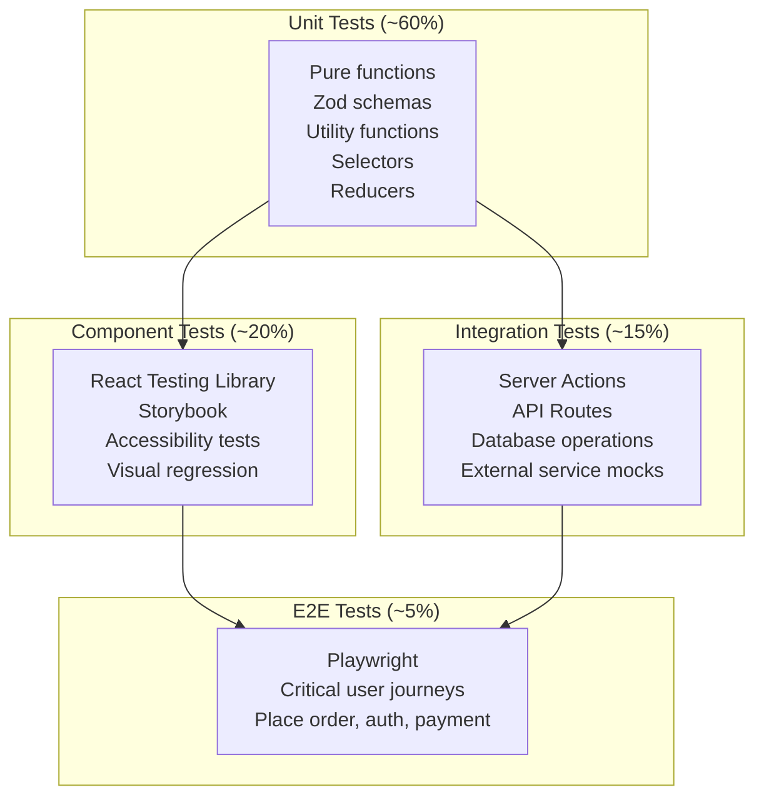

# Testing & Quality Assurance Architecture

> **Status:** Active
> **Last updated:** 2026-07-21
> **Cross-refs:** [Deployment Pipeline](14-deployment-devops.md), [Component System](07-component-system.md), [System Architecture](01-system-architecture.md)

---

## 1. Testing Philosophy

| Principle | Rationale |
|-----------|-----------|
| **Test behavior, not implementation** | Tests should survive refactoring without changes |
| **Write tests alongside code** | No "testing phase" — tests are part of development |
| **CI gates prevent regressions** | Every PR must pass all tests before merge |
| **80% coverage is the floor** | Critical paths must have 100% coverage |
| **Tests are documentation** | Test cases document expected behavior |

---

## 2. Testing Pyramid



### 2.1 Test Distribution Targets

| Layer | Framework | Count | Coverage Target | CI Stage |
|-------|-----------|-------|-----------------|----------|
| **Unit (pure logic)** | Vitest | 200+ | 90% lines | `test:unit` |
| **Component** | Vitest + RTL + Storybook | 100+ | 80% branches | `test:component` |
| **Integration** | Vitest + MSW | 50+ | 85% branches | `test:integration` |
| **E2E** | Playwright | 20+ | 100% of critical flows | `test:e2e` |
| **Accessibility** | axe-core + RTL | 30+ | — | `test:a11y` |
| **Visual** | Storybook + Chromatic | 50+ | — | `test:visual` |

---

## 3. Unit Testing

### 3.1 What to Unit Test

- **Pure functions:** Utility functions, formatters, helpers
- **Zod schemas:** Validation logic, error messages
- **Selectors:** Zustand store selectors (computed state)
- **Reducers:** Cart store actions (addItem, removeItem, etc.)
- **Types:** TypeScript type guards and assertions

### 3.2 Example: Cart Store Tests

```typescript
// stores/__tests__/cart-store.test.ts
import { describe, it, expect, beforeEach } from 'vitest';
import { useCartStore } from '../cart-store';

const mockItem = {
  id: 'item_1',
  aliasId: 'alias_1',
  name: 'Butter Chicken',
  price: 29900, // ₹299
  discountedPrice: null,
  quantity: 1,
  photoUrl: '/photo.jpg',
  isVeg: false,
  preparationTime: 15,
};

describe('Cart Store', () => {
  beforeEach(() => {
    useCartStore.setState({ items: [], couponCode: null, couponDiscount: 0 });
  });

  it('should add item with quantity 1 by default', () => {
    useCartStore.getState().addItem(mockItem);
    const items = useCartStore.getState().items;
    expect(items).toHaveLength(1);
    expect(items[0].quantity).toBe(1);
  });

  it('should increment quantity when adding existing item', () => {
    useCartStore.getState().addItem(mockItem);
    useCartStore.getState().addItem({ ...mockItem, quantity: 2 });
    const items = useCartStore.getState().items;
    expect(items).toHaveLength(1);
    expect(items[0].quantity).toBe(3);
  });

  it('should remove item on quantity update to 0', () => {
    useCartStore.getState().addItem(mockItem);
    useCartStore.getState().updateQuantity('item_1', 0);
    expect(useCartStore.getState().items).toHaveLength(0);
  });

  it('should calculate correct subtotal', () => {
    useCartStore.getState().addItem(mockItem);
    useCartStore.getState().addItem({
      ...mockItem,
      id: 'item_2',
      name: 'Naan',
      price: 5000,
    });
    expect(useCartStore.getState().items).toHaveLength(2);
    const subtotal = 29900 + 5000; // ₹349
    // Selector test
    const { selectCartSubtotal } = useCartStore;
    expect(selectCartSubtotal(useCartStore.getState())).toBe(subtotal);
  });
});
```

### 3.3 Example: Zod Schema Tests

```typescript
// schemas/__tests__/auth-schemas.test.ts
import { describe, it, expect } from 'vitest';
import { phoneSchema, otpSchema } from '../auth-schemas';

describe('Phone validation', () => {
  it('should accept valid Indian phone numbers', () => {
    expect(phoneSchema.parse('9876543210')).toBe('+919876543210');
    expect(phoneSchema.parse('6123456789')).toBe('+916123456789');
  });

  it('should reject invalid phone numbers', () => {
    expect(() => phoneSchema.parse('12345678')).toThrow();
    expect(() => phoneSchema.parse('0876543210')).toThrow(); // starts with 0
    expect(() => phoneSchema.parse('1234567890')).toThrow(); // starts with 1
    expect(() => phoneSchema.parse('abcdefghij')).toThrow();
  });
});
```

---

## 4. Component Testing

### 4.1 What to Test

- **Interaction:** Button clicks, form submissions, popup open/close
- **State rendering:** Loading, empty, error, success states
- **Conditional rendering:** Based on props or context
- **Accessibility:** Focus management, ARIA attributes, keyboard navigation

### 4.2 Example: CompoundMenuCard Tests

```typescript
// components/__tests__/compound-menu-card.test.tsx
import { describe, it, expect, vi } from 'vitest';
import { render, screen, fireEvent } from '@testing-library/react';
import { CompoundMenuCard } from '../compound-menu-card';

const mockItem = {
  id: 'item_1',
  name: 'Butter Chicken',
  price: 29900,
  isVeg: false,
  photoUrls: ['/photo.jpg'],
};

describe('CompoundMenuCard', () => {
  it('should show Add button when item not in cart', () => {
    render(
      <CompoundMenuCard.Root item={mockItem} quantity={0}>
        <CompoundMenuCard.Header />
        <CompoundMenuCard.QuantityActions />
      </CompoundMenuCard.Root>
    );
    expect(screen.getByText('Add')).toBeTruthy();
    expect(screen.queryByText('-')).toBeNull();
  });

  it('should show +/- controls when item is in cart', () => {
    render(
      <CompoundMenuCard.Root item={mockItem} quantity={2}>
        <CompoundMenuCard.Header />
        <CompoundMenuCard.QuantityActions />
      </CompoundMenuCard.Root>
    );
    expect(screen.getByText('−')).toBeTruthy();
    expect(screen.getByText('2')).toBeTruthy();
    expect(screen.getByText('+')).toBeTruthy();
    expect(screen.queryByText('Add')).toBeNull();
  });

  it('should show popup on increment', () => {
    render(
      <CompoundMenuCard.Root item={mockItem} quantity={1}>
        <CompoundMenuCard.QuantityActions />
        <CompoundMenuCard.AddToCartPopup />
      </CompoundMenuCard.Root>
    );
    fireEvent.click(screen.getByText('+'));
    expect(screen.getByText('Added!')).toBeTruthy();
  });
});
```

---

## 5. Integration Testing

### 5.1 What to Test

- **Server Actions:** Full request → validation → DB mutation → response flow
- **API Routes:** Request → handler → response with auth and validation
- **Database operations:** Complex queries, transactions, edge cases

### 5.2 Example: Place Order Integration Test

```typescript
// actions/__tests__/place-order.int.test.ts
import { describe, it, expect, beforeAll } from 'vitest';
import { prisma } from '@/lib/prisma';
import { placeOrder } from '../order-actions';

describe('Place Order (Integration)', () => {
  let userId: string;
  let menuItemId: string;

  beforeAll(async () => {
    // Setup: Create test user and menu item
    userId = await createTestUser();
    menuItemId = await createTestMenuItem();
    await addToCart(userId, menuItemId, 2);
  });

  afterAll(async () => {
    // Cleanup
    await cleanupTestData();
  });

  it('should place order successfully', async () => {
    const result = await placeOrder({
      addressId: testAddressId,
      orderType: 'instant',
      paymentMethod: 'cod',
    });

    expect(result.success).toBe(true);
    expect(result.orderId).toBeDefined();

    // Verify order in DB
    const order = await prisma.order.findUnique({
      where: { id: result.orderId },
      include: { orderItems: true, payment: true },
    });

    expect(order).toBeDefined();
    expect(order?.orderItems).toHaveLength(1);
    expect(order?.orderItems[0].quantity).toBe(2);
    expect(order?.payment?.method).toBe('cod');
  });

  it('should fail when cart is empty', async () => {
    await clearCart(userId);
    await expect(
      placeOrder({
        addressId: testAddressId,
        orderType: 'instant',
        paymentMethod: 'cod',
      })
    ).rejects.toThrow('Cart is empty');
  });
});
```

---

## 6. E2E Testing

### 6.1 Critical User Journeys

| Journey | Test File | Steps |
|---------|-----------|-------|
| **Browse → Order (Online)** | `browse-order-online.spec.ts` | Home → Kitchen → Add item → Checkout → Pay → Success |
| **Browse → Order (COD)** | `browse-order-cod.spec.ts` | Home → Kitchen → Add item → Checkout → COD → Success |
| **Auth (Phone OTP)** | `auth-phone-otp.spec.ts` | Enter phone → Enter OTP → Complete profile → Dashboard |
| **Kitchen Dashboard** | `kitchen-dashboard.spec.ts` | Login → View orders → Update status |
| **Delivery Workflow** | `delivery-workflow.spec.ts` | Login → Accept delivery → Navigate → Mark delivered |
| **Admin Panel** | `admin-panel.spec.ts` | Login + 2FA → Manage kitchens → Approve KYC |
| **Cart Persistence** | `cart-persistence.spec.ts` | Add items → Refresh → Cart preserved |
| **Offline Behavior** | `offline-behavior.spec.ts` | Visit page → Go offline → Interact with cached content |

### 6.2 Example: Browse → Order (Online)

```typescript
// e2e/browse-order-online.spec.ts
import { test, expect } from '@playwright/test';

test('Customer browses kitchen, adds to cart, and pays online', async ({ page }) => {
  // Navigate to home
  await page.goto('/');
  await expect(page).toHaveTitle(/RRC Kitchen/);

  // Browse to kitchen
  await page.click('[data-testid="kitchen-card-1"]');
  await expect(page).toHaveURL(/\/kitchen\//);

  // Add item to cart
  await page.click('[data-testid="menu-item-1"] [data-testid="add-button"]');
  await expect(page.locator('[data-testid="add-to-cart-popup"]')).toBeVisible();

  // Go to cart
  await page.click('[data-testid="view-cart"]');
  await expect(page).toHaveURL(/\/cart/);

  // Verify item in cart
  await expect(page.locator('[data-testid="cart-item"]')).toHaveCount(1);

  // Select address
  await page.click('[data-testid="select-address"]');

  // Choose payment
  await page.click('[data-testid="pay-online"]');

  // Place order
  await page.click('[data-testid="place-order"]');

  // Razorpay modal opens (handled by mock or test mode)
  await expect(page.locator('[data-testid="razorpay-modal"]')).toBeVisible();
});
```

---

## 7. Accessibility Testing

```typescript
// components/__tests__/accordion.a11y.test.tsx
import { describe, it } from 'vitest';
import { render } from '@testing-library/react';
import { axe, toHaveNoViolations } from 'jest-axe';
import { AccordionDemo } from '../accordion-demo';

expect.extend(toHaveNoViolations);

describe('Accordion Accessibility', () => {
  it('should have no accessibility violations', async () => {
    const { container } = render(<AccordionDemo />);
    const results = await axe(container);
    expect(results).toHaveNoViolations();
  });

  it('should navigate with keyboard', async () => {
    const { getByRole } = render(<AccordionDemo />);
    const trigger = getByRole('button', { name: /discover more/i });
    trigger.focus();
    expect(document.activeElement).toBe(trigger);
    // Press Enter to toggle
    fireEvent.keyDown(trigger, { key: 'Enter' });
    // Assert content is visible
    expect(getByRole('region')).toBeVisible();
  });
});
```

---

## 8. CI Quality Gates

```yaml
# .github/workflows/ci.yml (simplified)
jobs:
  quality:
    steps:
      - run: npm run lint                    # ESLint
      - run: npm run typecheck               # tsc --noEmit
      - run: npm run test:unit               # Vitest unit tests
      - run: npm run test:component          # Vitest + RTL
      - run: npm run test:integration        # Vitest + MSW
      - run: npm run test:a11y               # axe-core
      - run: npm audit                       # Vulnerability scan
      - run: npx bundle-analyzer             # Bundle size check
      - run: npx depcheck                    # Unused dependencies

  preview:
    steps:
      - run: npx chromatic                    # Visual regression
      - run: npx lighthouse-ci                # Performance budget
```

### Gate Thresholds

| Gate | Pass Condition | Fail Action |
|------|---------------|-------------|
| **Lint** | 0 errors, 0 warnings | Block merge |
| **TypeScript** | 0 errors (strict mode) | Block merge |
| **Unit tests** | 100% pass, >90% lines | Block merge |
| **Component tests** | 100% pass, >80% branches | Block merge |
| **Integration tests** | 100% pass | Block merge |
| **Accessibility** | 0 violations | Block merge |
| **Bundle size** | <150KB initial JS | Warning (manual review) |
| **npm audit** | 0 critical, <3 high | Block merge |
| **Visual regression** | <2% change threshold | Manual review |
| **Lighthouse** | Performance >80, A11y >90 | Warning |

---

## 9. Test Data Strategy

| Environment | Data Source | Reset Strategy |
|-------------|-------------|----------------|
| **Unit tests** | Factories (faker) | Fresh per test (`beforeEach`) |
| **Component tests** | Factories + Storybook fixtures | Fresh per test |
| **Integration tests** | Test DB seed (`prisma/seed.ts`) | Transaction rollback per test |
| **E2E tests** | Dedicated test DB | Fresh seed per test run |
| **Staging** | Anonymized production snapshot | Weekly refresh |

### Factory Pattern

```typescript
// factories/menu-item.ts
import { faker } from '@faker-js/faker';

export function buildMenuItem(overrides?: Partial<MenuItemInput>) {
  return {
    id: faker.string.ulid(),
    name: faker.food.dish(),
    description: faker.lorem.sentence(),
    price: faker.number.int({ min: 5000, max: 50000 }), // ₹50-500
    discountedPrice: faker.datatype.boolean(0.3)
      ? faker.number.int({ min: 3000, max: 40000 })
      : null,
    isVeg: faker.datatype.boolean(0.6),
    isAvailable: true,
    timeSlot: faker.helpers.arrayElement(['breakfast', 'lunch', 'dinner']),
    photoUrls: [faker.image.url()],
    preparationTime: faker.number.int({ min: 5, max: 30 }),
    ...overrides,
  } satisfies MenuItemInput;
}
```
