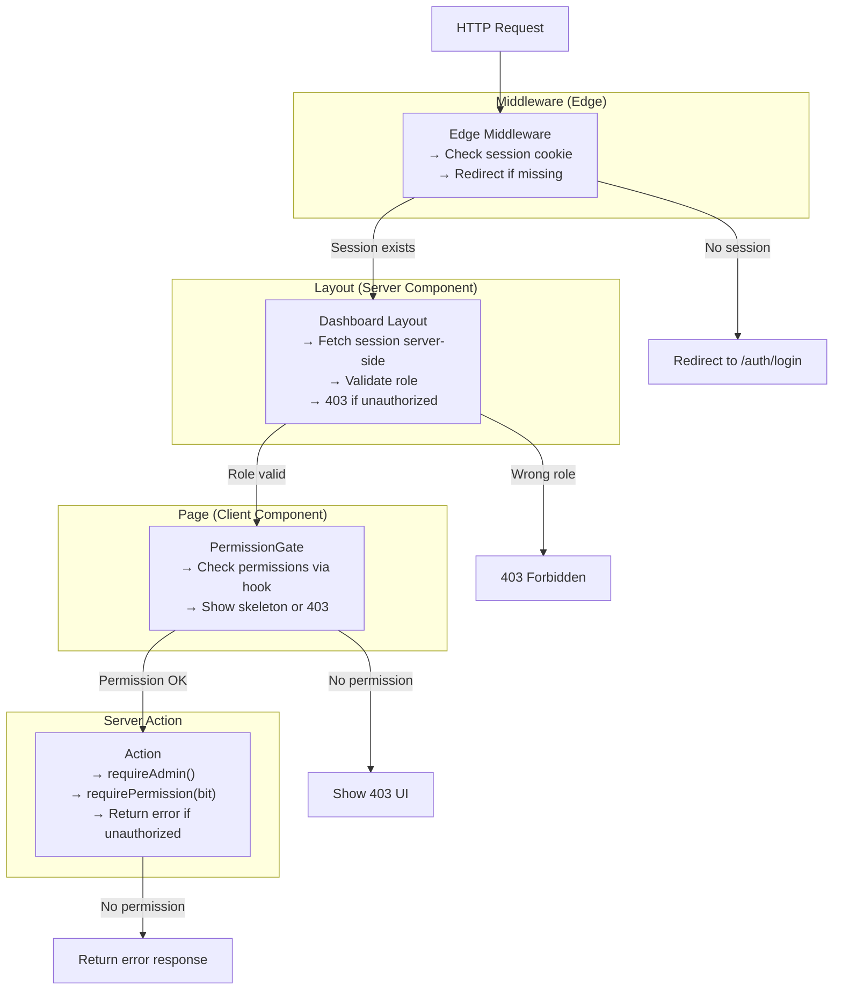
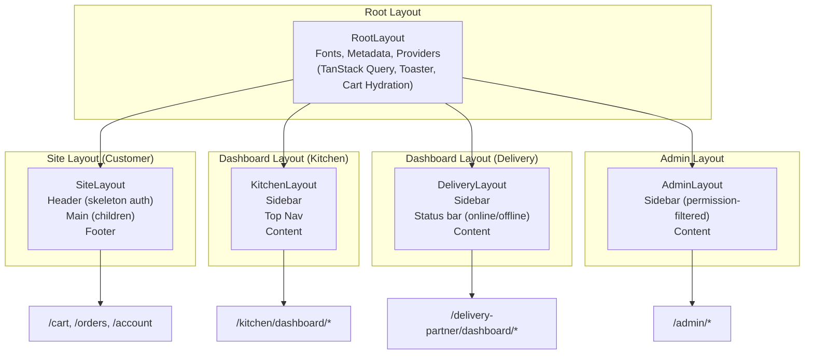

# Routing & Middleware Architecture

> **Status:** Active
> **Last updated:** 2026-07-21
> **Cross-refs:** [System Architecture](01-system-architecture.md), [Auth & Security](05-auth-security.md), [Roles & Permissions](16-roles-permissions.md)

---

## 1. Route Map

### 1.1 Public Routes

| Route | Component | Purpose | SEO |
|-------|-----------|---------|-----|
| `/` | `app/page.tsx` | Home page — featured kitchens, search | Indexed |
| `/kitchen/[slug]` | `app/kitchen/[slug]/page.tsx` | Kitchen detail + menu | Indexed |
| `/menu` | `app/menu/page.tsx` | Global menu search | Indexed |
| `/menu/[slug]` | `app/menu/[slug]/page.tsx` | Menu item detail | Indexed |

### 1.2 Auth Routes

| Route | Component | Purpose | Auth Required |
|-------|-----------|---------|---------------|
| `/auth/login` | `app/auth/login/page.tsx` | Phone login | No |
| `/auth/signup` | `app/auth/signup/page.tsx` | Profile completion | Partial (OTP verified) |

### 1.3 Customer Routes

| Route | Component | Purpose | Auth Required |
|-------|-----------|---------|---------------|
| `/cart` | `app/cart/page.tsx` | Cart + checkout | Session |
| `/orders` | `app/orders/page.tsx` | Order history | Session |
| `/orders/[id]` | `app/orders/[id]/page.tsx` | Order detail + tracking | Session + ownership |
| `/account` | `app/account/page.tsx` | User profile | Session |
| `/account/addresses` | `app/account/addresses/page.tsx` | Saved addresses | Session |
| `/wishlist` | `app/wishlist/page.tsx` | Saved items | Session |

### 1.4 Kitchen Dashboard Routes

| Route | Component | Purpose | Auth Required |
|-------|-----------|---------|---------------|
| `/kitchen/dashboard` | `app/kitchen/dashboard/page.tsx` | Kitchen overview | Kitchen role |
| `/kitchen/dashboard/orders` | `app/kitchen/dashboard/orders/page.tsx` | Order management | Kitchen role |
| `/kitchen/dashboard/menu` | `app/kitchen/dashboard/menu/page.tsx` | Menu CRUD | Kitchen role |
| `/kitchen/dashboard/earnings` | `app/kitchen/dashboard/earnings/page.tsx` | Earnings + payouts | Kitchen role |
| `/kitchen/dashboard/profile` | `app/kitchen/dashboard/profile/page.tsx` | Kitchen profile edit | Kitchen role |

### 1.5 Delivery Partner Routes

| Route | Component | Purpose | Auth Required |
|-------|-----------|---------|---------------|
| `/delivery-partner/dashboard` | `app/delivery-partner/dashboard/page.tsx` | Delivery overview | Delivery role |
| `/delivery-partner/dashboard/orders` | `app/delivery-partner/dashboard/orders/page.tsx` | Assigned deliveries | Delivery role |
| `/delivery-partner/dashboard/earnings` | `app/delivery-partner/dashboard/earnings/page.tsx` | Earnings + settlements | Delivery role |

### 1.6 Admin Routes

| Route | Component | Purpose | Auth Required |
|-------|-----------|---------|---------------|
| `/admin` | `app/admin/page.tsx` | Admin login | No |
| `/admin/dashboard` | `app/admin/dashboard/page.tsx` | Admin overview | Admin role |
| `/admin/kitchens` | `app/admin/kitchens/page.tsx` | Kitchen management | Admin + MANAGE_CATALOG |
| `/admin/delivery-partners` | `app/admin/delivery-partners/page.tsx` | Delivery partners | Admin + MANAGE_CATALOG |
| `/admin/orders` | `app/admin/orders/page.tsx` | Order management | Admin + MANAGE_ORDERS |
| `/admin/coupons` | `app/admin/coupons/page.tsx` | Coupon CRUD | Admin + MANAGE_COUPONS |
| `/admin/payments` | `app/admin/payments/page.tsx` | Payment reconciliation | Admin + VIEW_FINANCIALS |
| `/admin/payouts` | `app/admin/payouts/page.tsx` | Kitchen payouts | Admin + MANAGE_PAYOUTS |
| `/admin/users` | `app/admin/users/page.tsx` | User management | Admin + BAN_USERS |
| `/admin/support` | `app/admin/support/page.tsx` | Support tickets | Admin + MANAGE_SUPPORT |
| `/admin/admins` | `app/admin/admins/page.tsx` | Admin management | Admin + MANAGE_ADMINS |
| `/admin/audit-logs` | `app/admin/audit-logs/page.tsx` | Audit trail | Admin + VIEW_FINANCIALS |

---

## 2. Middleware Chain

```typescript
// middleware.ts
import { NextResponse } from 'next/server';
import type { NextRequest } from 'next/server';

export function middleware(request: NextRequest) {
  const { pathname } = request.nextUrl;
  const session = request.cookies.get('session_token');

  // ========================================
  // Step 1: Static files — skip all checks
  // ========================================
  if (
    pathname.startsWith('/_next') ||
    pathname.startsWith('/api/cron') ||
    pathname.startsWith('/icons') ||
    pathname.startsWith('/fonts') ||
    pathname.startsWith('/screenshots') ||
    pathname.startsWith('/images') ||
    pathname === '/favicon.ico' ||
    pathname === '/manifest.json' ||
    pathname === '/sw.js' ||
    pathname === '/offline'
  ) {
    return NextResponse.next();
  }

  // ========================================
  // Step 2: Public routes — no auth needed
  // ========================================
  if (
    pathname === '/' ||
    pathname.startsWith('/kitchen/') ||
    pathname.startsWith('/menu') ||
    pathname.startsWith('/auth/')
  ) {
    return NextResponse.next();
  }

  // ========================================
  // Step 3: API routes — validate session
  // ========================================
  if (pathname.startsWith('/api/')) {
    if (!session) {
      return Response.json({ code: 'UNAUTHORIZED', message: 'No session' }, { status: 401 });
    }
    return NextResponse.next();
  }

  // ========================================
  // Step 4: Customer protected routes
  // ========================================
  if (
    pathname.startsWith('/cart') ||
    pathname.startsWith('/orders') ||
    pathname.startsWith('/account') ||
    pathname.startsWith('/wishlist')
  ) {
    if (!session) {
      return NextResponse.redirect(new URL('/auth/login', request.url));
    }
    return NextResponse.next();
  }

  // ========================================
  // Step 5: Role-specific routes
  // ========================================
  if (pathname.startsWith('/kitchen/dashboard')) {
    if (!session) return redirectToLogin(request);
    // Session cookie contains role — validated by dashboard layout
    return NextResponse.next();
  }

  if (pathname.startsWith('/delivery-partner')) {
    if (!session) return redirectToLogin(request);
    return NextResponse.next();
  }

  if (pathname.startsWith('/admin')) {
    if (!session) return redirectToLogin(request);
    return NextResponse.next();
  }

  return NextResponse.next();
}

export const config = {
  matcher: [
    '/((?!_next/static|_next/image|favicon.ico).*)',
  ],
};
```

---

## 3. Route Guard Composition



---

## 4. Guard Implementation

### 4.1 Server-Side Guard

```typescript
// lib/auth-guards.ts
export async function requireAdmin(): Promise<AdminProfile> {
  const session = await getSession();
  if (!session?.user) {
    throw new AuthError('UNAUTHORIZED', 'Authentication required');
  }

  const admin = await prisma.adminProfile.findUnique({
    where: { userId: session.user.id },
  });

  if (!admin) {
    throw new AuthError('FORBIDDEN', 'Admin access required');
  }

  return admin;
}

export async function requirePermission(permission: AdminPermission): Promise<AdminProfile> {
  const admin = await requireAdmin();

  if (!admin.isSuperAdmin && !(admin.permissions & permission)) {
    throw new AuthError('FORBIDDEN', 'Insufficient permissions');
  }

  return admin;
}
```

### 4.2 Client-Side Guard

```typescript
// components/admin/permission-gate.tsx
interface PermissionGateProps {
  permission: AdminPermission;
  fallback?: React.ReactNode;
  children: React.ReactNode;
}

export function PermissionGate({ permission, fallback, children }: PermissionGateProps) {
  const { data: adminProfile, isLoading } = useQuery({
    queryKey: ['adminProfile'],
    queryFn: () => getAdminProfile(),
  });

  if (isLoading) {
    return <Skeleton className="h-24 w-full" />;
  }

  if (!adminProfile || adminProfile.isSuperAdmin) {
    return <>{children}</>;
  }

  if (!(adminProfile.permissions & permission)) {
    return <>{fallback ?? <ForbiddenState />}</>;
  }

  return <>{children}</>;
}
```

---

## 5. Layout Architecture



---

## 6. Route Level Code Splitting

| Route Pattern | Lazy Loaded? | Bundle |
|---------------|--------------|--------|
| `/` (Home) | No (critical) | Main bundle |
| `/kitchen/[slug]` | No (critical) | Main bundle |
| `/menu` | No | Main bundle |
| `/cart` | Yes | `cart-page.js` (~15KB) |
| `/orders/*` | Yes | `orders-page.js` (~10KB) |
| `/account/*` | Yes | `account-page.js` (~12KB) |
| `/wishlist` | Yes | `wishlist-page.js` (~5KB) |
| `/kitchen/dashboard/*` | Yes | `kitchen-dashboard.js` (~30KB) |
| `/delivery-partner/*` | Yes | `delivery-dashboard.js` (~20KB) |
| `/admin/*` | Yes | `admin-panel.js` (~50KB) |

---

## 7. API Routes vs Server Actions Decision

| Use Case | Use | Reason |
|----------|-----|--------|
| Data fetching for pages | Server Component | No JS, zero bundle cost |
| Data mutation (user actions) | Server Action | Type-safe, no API boilerplate |
| Payment webhooks | API Route | Called by Razorpay, not client |
| Image upload | API Route | Needs multipart handling |
| Ably token auth | API Route | Public endpoint for WebSocket SDK |
| Cron jobs | API Route | HTTP-triggered, verifiable via secret |
| Health check | API Route | External monitoring systems |
