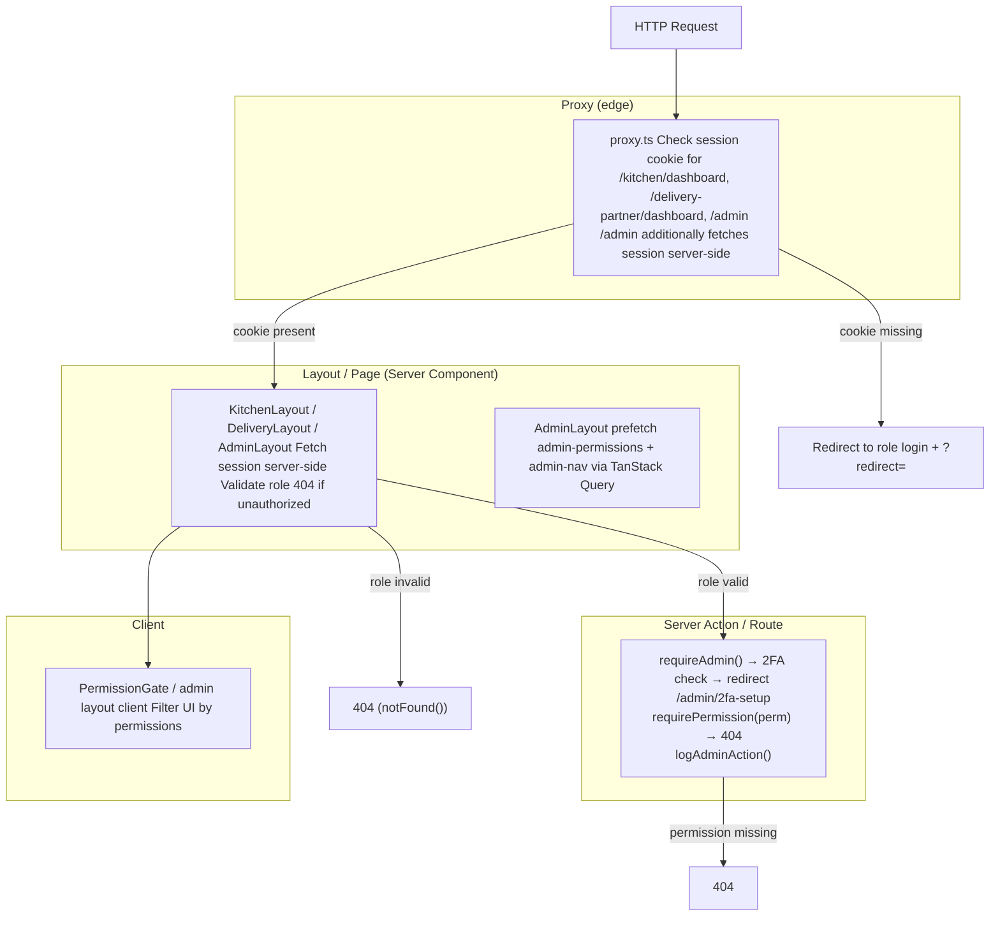
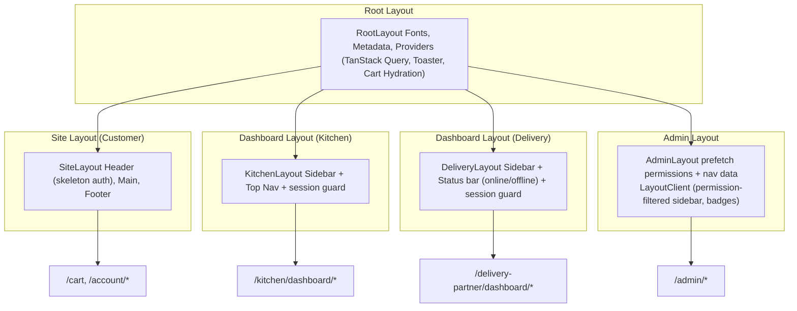

# Routing & Middleware Architecture

> **Status:** Active
> **Last updated:** 2026-08-05
> **Cross-refs:** [System Architecture](01-system-architecture.md), [Auth & Security](05-auth-security.md), [Roles & Permissions](16-roles-permissions.md)

> **Note:** This app uses **no `middleware.ts`**. Route protection is split between a Next.js 16 **proxy file** (`proxy.ts`, edge/Node runtime, cookie-only checks) and **server-side guards** (`lib/auth-guards.ts`, full session validation, used by layouts/actions).

---

## 1. Route Map (Current `app/` structure)

### 1.1 Public Routes

| Route | Purpose | Auth Required |
|-------|---------|---------------|
| `/` | Home — featured kitchens, testimonials, search | No |
| `/kitchens` | Kitchen listing | No |
| `/kitchens/[slug]` | Kitchen detail + menu (tabs: Menu / About / Info / Reviews) | No |
| `/categories/[slug]` | Category landing (CMS content) | No |
| `/menu` | Global menu page (CMS content) | No |
| `/menu/[kitchenSlug]` | Kitchen menu | No |
| `/menu/[kitchenSlug]/[itemIdentifier]` | Menu item detail | No |
| `/search` | Cross-kitchen search | No |
| `/home-chefs` | Home chefs landing | No |
| `/about-us`, `/contact`, `/help`, `/support` | Static/info pages | No |
| `/policy/privacy-policy`, `/policy/terms-of-use` | Legal pages | No |
| `/invite/[token]` | Referral landing | No |

### 1.2 Auth Routes

| Route | Purpose | Auth Required |
|-------|---------|---------------|
| `/login`, `/signup` | Customer phone OTP auth | No |
| `/kitchen/login`, `/kitchen/signup` | Kitchen partner auth | No |
| `/delivery-partner/login`, `/delivery-partner/signup` | Delivery partner auth | No |
| `/admin/2fa` | Admin 2FA challenge | Partial (session + pending 2FA) |

### 1.3 Customer (Account) Routes

| Route | Purpose | Auth Required |
|-------|---------|---------------|
| `/cart` | Cart + checkout | Session |
| `/account/favourites` | Saved items/kitchens | Session |
| `/account/loyalty` | Loyalty points + coupons | Session |
| `/account/orders` | Order history | Session |
| `/account/orders/[id]` | Order detail + tracking | Session + ownership |
| `/account/orders/[id]/track` | Live tracking | Session + ownership |
| `/account/profile` | Profile edit | Session |
| `/account/rating` | Ratings & reviews | Session |
| `/account/support` | Support tickets | Session |

### 1.4 Kitchen Dashboard Routes (proxy + layout guard)

| Route | Purpose | Auth Required |
|-------|---------|---------------|
| `/kitchen/dashboard` | Overview | Kitchen role |
| `/kitchen/dashboard/orders` | Order management | Kitchen role |
| `/kitchen/dashboard/menu` | Menu CRUD (incl. CMS) | Kitchen role |
| `/kitchen/dashboard/payments` | Earnings + payouts | Kitchen role |
| `/kitchen/dashboard/reviews` | Reviews | Kitchen role |
| `/kitchen/dashboard/profile` | Kitchen profile edit | Kitchen role |
| `/kitchen/dashboard/support` | Support tickets | Kitchen role |

### 1.5 Delivery Partner Dashboard Routes (proxy + layout guard)

| Route | Purpose | Auth Required |
|-------|---------|---------------|
| `/delivery-partner/dashboard` | Overview | Delivery role |
| `/delivery-partner/dashboard/deliveries` | Assigned deliveries | Delivery role |
| `/delivery-partner/dashboard/payments` | Earnings + settlements | Delivery role |
| `/delivery-partner/dashboard/reviews` | Reviews | Delivery role |
| `/delivery-partner/dashboard/profile` | Profile | Delivery role |
| `/delivery-partner/dashboard/support` | Support tickets | Delivery role |

### 1.6 Admin Routes (proxy + permission guards)

| Route | Purpose | Guard |
|-------|---------|-------|
| `/admin` | Admin home | Proxy (role=admin) + `requireAdmin` |
| `/admin/2fa-setup` | TOTP setup | Redirected from `requireAdmin` when 2FA off |
| `/admin/invite` | Invite new admin | `MANAGE_ADMINS` |
| `/admin/kitchens` | Kitchen management + KYC | `APPROVE_KYC` / `MANAGE_CATALOG` |
| `/admin/menu` | Menu catalog | `MANAGE_CATALOG` |
| `/admin/orders` | Order management | admin |
| `/admin/payments` | Payments overview | `VIEW_FINANCIALS` |
| `/admin/payments/coupons` | Coupon CRUD | `MANAGE_COUPONS` |
| `/admin/payments/loyalty-coupons` | Loyalty coupons | `MANAGE_COUPONS` |
| `/admin/payments/payment-offers` | Payment offers | `MANAGE_COUPONS` |
| `/admin/customers` | User management | `BAN_USERS` |
| `/admin/delivery` | Delivery partners | `APPROVE_KYC` / `MANAGE_CATALOG` |
| `/admin/support` | Support tickets | `MANAGE_SUPPORT` |
| `/admin/content/categories` | Category CMS | `MANAGE_CMS` |
| `/admin/content/category-pages` | Category page CMS | `MANAGE_CMS` |
| `/admin/content/cravings-popup` | Cravings rules | `MANAGE_CMS` |
| `/admin/content/kitchen-page` | Kitchen search page CMS | `MANAGE_CMS` |
| `/admin/content/menu-page` | Menu page CMS | `MANAGE_CMS` |
| `/admin/content/search-page` | Search page CMS | `MANAGE_CMS` |

---

## 2. Proxy File (`proxy.ts` — replaces middleware)

```typescript
// proxy.ts (Next.js 16)
import { getSessionCookie } from "better-auth/cookies";

const protectedPaths = ["/kitchen/dashboard", "/delivery-partner/dashboard", "/admin"];

const roleLoginMap: Record<string, string> = {
  "/kitchen": "/kitchen/login",
  "/delivery-partner": "/delivery-partner/login",
  "/admin": "/admin/2fa",
};

export async function proxy(request: NextRequest) {
  const { pathname } = request.nextUrl;

  // 1. Static assets (incl. sw.js) — never intercepted
  if (STATIC_EXTENSIONS.test(pathname)) return NextResponse.next();

  // 2. Cache-Control for immutable static chunks
  if (pathname.startsWith("/_next/static") || pathname.startsWith("/icons/") || pathname.startsWith("/banners/")) {
    const response = NextResponse.next();
    response.headers.set("Cache-Control", "public, max-age=31536000, immutable");
    return response;
  }

  // 3. Protected prefixes — check Better-Auth session cookie
  const matchedPrefix = protectedPaths.find((p) => pathname === p || pathname.startsWith(p + "/"));
  if (!matchedPrefix) return NextResponse.next();

  const sessionCookie = getSessionCookie(request);
  if (!sessionCookie) {
    // Redirect to role login with ?redirect= back
    const loginPath = roleLoginMap[matchedPrefix] ?? "/login";
    const loginUrl = new URL(loginPath, request.url);
    loginUrl.searchParams.set("redirect", pathname);
    return NextResponse.redirect(loginUrl);
  }

  // 4. Admin prefix — full server-side session check (extra guard)
  if (matchedPrefix === "/admin") {
    const sessionRes = await fetch(new URL("/api/auth/get-session", request.url), {
      headers: { cookie: request.headers.get("cookie") ?? "" },
    });
    if (!sessionRes.ok) return NextResponse.rewrite(new URL("/404", request.url));
    const session = await sessionRes.json();
    if (!session?.user || session.user.role !== "admin") {
      return NextResponse.rewrite(new URL("/404", request.url));
    }
  }

  return NextResponse.next();
}

export const config = {
  matcher: [
    "/kitchen/dashboard/:path*",
    "/delivery-partner/dashboard/:path*",
    "/admin/:path*",
  ],
};
```

Behavior summary:

| Prefix | No session cookie | Session cookie |
|--------|-------------------|----------------|
| `/kitchen/dashboard/*` | → `/kitchen/login?redirect=` | Pass (role re-validated in layout/actions) |
| `/delivery-partner/dashboard/*` | → `/delivery-partner/login?redirect=` | Pass |
| `/admin/*` | → `/admin/2fa?redirect=` | Server-side role check → 404 rewrite if not admin |
| Everything else | Pass (guarded at layout/action level) | Pass |

---

## 3. Route Guard Composition



---

## 4. Guard Implementation

### 4.1 Server-Side Guard (`lib/auth-guards.ts`)

```typescript
export async function requireAdmin() {
  const session = await getSession();
  if (!session?.user) notFound();                 // 404, never reveals admin surface

  const adminProfile = await prisma.adminProfile.findUnique({
    where: { userId: session.user.id },
  });
  if (!adminProfile || !adminProfile.isActive) notFound();

  if (!session.user.twoFactorEnabled) {
    redirect("/admin/2fa-setup");                  // 2FA is mandatory for admin
  }

  return { session, adminProfile };
}

export async function requirePermission(permission: AdminPermission) {
  const { session, adminProfile } = await requireAdmin();
  if (!adminProfile.permissions.includes(permission)) notFound();
  return { session, adminProfile };
}

export async function logAdminAction(params: {
  actorUserId: string;
  action: string;
  targetType?: string;
  targetId?: string;
  metadata?: object;
}) {
  await prisma.adminAuditLog.create({ data: params });
}

export async function getPostLoginRedirect(userId: string) {
  // admin → /admin · approved kitchen → /kitchen/dashboard
  // approved delivery → /delivery-partner/dashboard · else → /
}
```

### 4.2 Admin Layout Data Prefetch

```typescript
// app/admin/layout.tsx
await Promise.all([
  queryClient.prefetchQuery({ queryKey: ["admin-permissions"], queryFn: getCurrentAdminPermissions }),
  queryClient.prefetchQuery({ queryKey: ["admin-nav"], queryFn: getAdminNavData }),
]);
// <LayoutClient> renders sidebar filtered by permissions + nav badges (revenue, pending orders, tickets, KYC)
```

### 4.3 Client-Side Gate

`components/admin/permission-gate.tsx` renders children only when `adminProfile.permissions` (from `getCurrentAdminPermissions`) includes the required `AdminPermission`; super-admin bypass and fallback/forbidden states handled in the component.

---

## 5. Layout Architecture



---

## 6. Route Level Code Splitting

| Route Pattern | Lazy Loaded? | Bundle |
|---------------|--------------|--------|
| `/` (Home) | No (critical) | Main bundle |
| `/kitchens/[slug]` | No (critical) | Main bundle |
| `/menu` | No | Main bundle |
| `/cart` | Yes | `cart-page.js` (~15KB) |
| `/account/*` | Yes | `account-page.js` (~12KB) |
| `/kitchen/dashboard/*` | Yes | `kitchen-dashboard.js` (~30KB) |
| `/delivery-partner/*` | Yes | `delivery-dashboard.js` (~20KB) |
| `/admin/*` | Yes | `admin-panel.js` (~50KB) |

---

## 7. API Routes vs Server Actions Decision

| Use Case | Use | Reason |
|----------|-----|--------|
| Data fetching for pages | Server Component | No JS, zero bundle cost |
| Data mutation (user actions) | Server Action | Type-safe, no API boilerplate |
| Payment webhooks | API Route | Called by Razorpay, not client (`/api/auth/razorpay/webhook`) |
| Image upload | API Route | Needs signed upload (`/api/cloudinary/sign`, `/delete`) |
| Ably token auth | API Route | Public endpoint for WebSocket SDK (`/api/ably-token`) |
| Cron/jobs | API Route | HTTP-triggered, verifiable via `CRON_SECRET` |
| Payment confirm (create-order/verify/fail) | API Route | Razorpay SDK + mobile-safe flow |
| Rider location | API Route | High-frequency heartbeat |
| Push subscribe | API Route | Web Push subscription |
