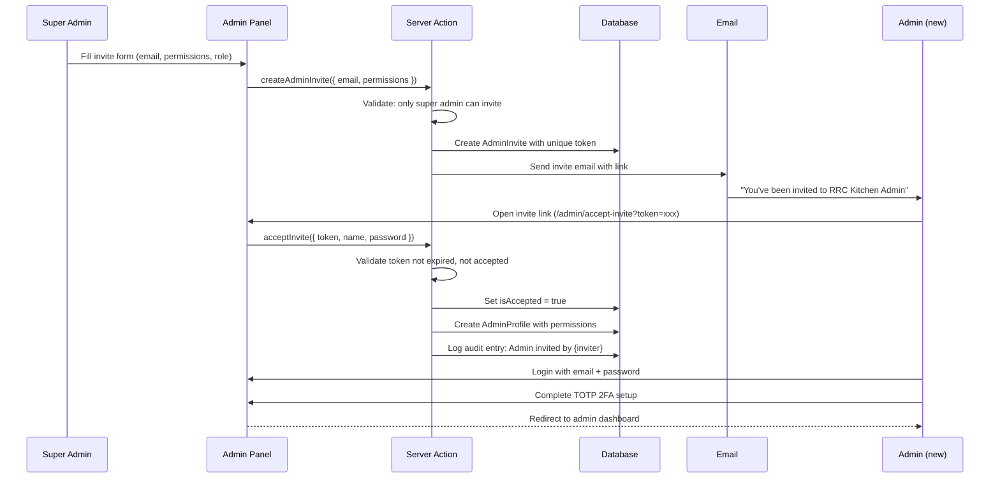

# Roles & Permissions Architecture

> **Status:** Active
> **Last updated:** 2026-07-21
> **Cross-refs:** [Auth & Security](05-auth-security.md), [Routing & Middleware](15-routing-middleware.md), [Data Model](03-data-model.md)

---

## 1. Role Definitions

```typescript
enum UserRole {
  CUSTOMER = 'customer',
  KITCHEN = 'kitchen',
  DELIVERY = 'delivery',
  ADMIN = 'admin',
}
```

## 2. Permission Architecture

### 2.1 Admin Permission Bitfield

```mermaid
graph LR
    subgraph "Permission Bitfield (32-bit integer)"
        B0["Bit 0: MANAGE_ORDERS<br/>Value: 1"]
        B1["Bit 1: MANAGE_MENU<br/>Value: 2"]
        B2["Bit 2: APPROVE_KYC<br/>Value: 4"]
        B3["Bit 3: VIEW_FINANCIALS<br/>Value: 8"]
        B4["Bit 4: MANAGE_COUPONS<br/>Value: 16"]
        B5["Bit 5: MANAGE_PAYOUTS<br/>Value: 32"]
        B6["Bit 6: BAN_USERS<br/>Value: 64"]
        B7["Bit 7: MANAGE_SUPPORT<br/>Value: 128"]
        B8["Bit 8: MANAGE_CMS<br/>Value: 256"]
        B9["Bit 9: MANAGE_ADMINS<br/>Value: 512"]
        B10["Bit 10: MANAGE_CATALOG<br/>Value: 1024"]
    end
```



### 2.2 Permission Check (Bitwise)

```typescript
// Check if admin has a specific permission
function hasPermission(adminPermissions: number, requiredPermission: AdminPermission): boolean {
  return (adminPermissions & requiredPermission) === requiredPermission;
}

// Grant permission
function grantPermission(current: number, permission: AdminPermission): number {
  return current | permission;
}

// Revoke permission
function revokePermission(current: number, permission: AdminPermission): number {
  return current & ~permission;
}

// Has any of the specified permissions
function hasAnyPermission(adminPermissions: number, permissions: AdminPermission[]): boolean {
  return permissions.some(p => hasPermission(adminPermissions, p));
}
```

### 2.3 Predefined Permission Sets

```typescript
const ROLE_PERMISSIONS = {
  // Full access — can do everything
  SUPER_ADMIN: (1 << 11) - 1, // 2047 (all 11 bits)

  // Standard admin — all except manage other admins
  FULL_ADMIN: (1 << 11) - 1 ^ AdminPermission.MANAGE_ADMINS, // 1535

  // Operations admin — orders, menu, kitchens
  OPERATIONS: AdminPermission.MANAGE_ORDERS |
    AdminPermission.MANAGE_MENU |
    AdminPermission.APPROVE_KYC |
    AdminPermission.MANAGE_CATALOG, // 1031

  // Finance admin — financials, payouts, coupons
  FINANCE: AdminPermission.VIEW_FINANCIALS |
    AdminPermission.MANAGE_COUPONS |
    AdminPermission.MANAGE_PAYOUTS, // 56

  // Support agent — only support tickets
  SUPPORT: AdminPermission.MANAGE_SUPPORT, // 128

  // Read-only auditor — can view financials and audit logs
  AUDITOR: AdminPermission.VIEW_FINANCIALS, // 8
} as const;
```

---

## 3. Permission to Route Mapping

| Route Pattern | Required Permission | Fallback |
|---------------|-------------------|----------|
| `/admin/orders/*` | `MANAGE_ORDERS` | 403 page |
| `/admin/menu/*` | `MANAGE_MENU` | 403 page |
| `/admin/kitchens/*` | `MANAGE_CATALOG` | 403 page |
| `/admin/delivery-partners/*` | `MANAGE_CATALOG` | 403 page |
| `/admin/payments/*` | `VIEW_FINANCIALS` | 403 page |
| `/admin/payouts/*` | `MANAGE_PAYOUTS` | 403 page |
| `/admin/coupons/*` | `MANAGE_COUPONS` | 403 page |
| `/admin/users/*` | `BAN_USERS` | 403 page |
| `/admin/support/*` | `MANAGE_SUPPORT` | 403 page |
| `/admin/admins/*` | `MANAGE_ADMINS` | 403 page |
| `/admin/audit-logs/*` | `VIEW_FINANCIALS` | 403 page |
| `/admin/settings/*` | `MANAGE_CMS` | 403 page |

---

## 4. Admin Profile Model

```prisma
model AdminProfile {
  id           String   @id @default(cuid())
  userId       String   @unique
  user         User     @relation(fields: [userId], references: [id])
  email        String   @unique
  passwordHash String
  isSuperAdmin Boolean  @default(false)
  permissions  Int      @default(0) // Bitfield
  createdAt    DateTime @default(now())

  invites    AdminInvite[]
  auditLogs  AdminAuditLog[]
}
```

---

## 5. Admin Invite Flow



---

## 6. Audit Trail

```typescript
// All admin actions are logged
async function logAuditEntry(params: {
  adminId: string;
  action: string;
  entityType: string;
  entityId: string;
  before: Record<string, unknown>;
  after: Record<string, unknown>;
  ipAddress: string;
}) {
  // Redact PII before storing
  const redactedBefore = redactPII(params.before);
  const redactedAfter = redactPII(params.after);

  await prisma.adminAuditLog.create({
    data: {
      adminId: params.adminId,
      action: params.action,
      entityType: params.entityType,
      entityId: params.entityId,
      before: redactedBefore,
      after: redactedAfter,
      ipAddress: params.ipAddress,
    },
  });
}

// PII Redaction
function redactPII(data: Record<string, unknown>): Record<string, unknown> {
  const sensitiveFields = ['phone', 'phoneNumber', 'email', 'passwordHash', 'bankAccount', 'ifscCode'];
  const redacted = { ...data };

  for (const field of sensitiveFields) {
    if (typeof redacted[field] === 'string') {
      const val = redacted[field] as string;
      if (field === 'phone' || field === 'phoneNumber') {
        redacted[field] = val.slice(0, 3) + '****' + val.slice(-2);
      } else if (field === 'email') {
        const [name, domain] = val.split('@');
        redacted[field] = name[0] + '****@' + domain;
      } else if (field === 'bankAccount') {
        redacted[field] = '****' + val.slice(-4);
      } else {
        redacted[field] = '[REDACTED]';
      }
    }
  }

  return redacted;
}
```

---

## 7. Sidebar Navigation (Permission-Filtered)

```typescript
// components/admin/sidebar.tsx
const NAV_ITEMS: NavItem[] = [
  { label: 'Dashboard', href: '/admin/dashboard', icon: LayoutDashboard, permission: null },
  { label: 'Orders', href: '/admin/orders', icon: ShoppingCart, permission: AdminPermission.MANAGE_ORDERS },
  { label: 'Kitchens', href: '/admin/kitchens', icon: Store, permission: AdminPermission.MANAGE_CATALOG },
  { label: 'Delivery Partners', href: '/admin/delivery-partners', icon: Truck, permission: AdminPermission.MANAGE_CATALOG },
  { label: 'Menu Items', href: '/admin/menu', icon: Utensils, permission: AdminPermission.MANAGE_MENU },
  { label: 'Coupons', href: '/admin/coupons', icon: Percent, permission: AdminPermission.MANAGE_COUPONS },
  { label: 'Payments', href: '/admin/payments', icon: CreditCard, permission: AdminPermission.VIEW_FINANCIALS },
  { label: 'Payouts', href: '/admin/payouts', icon: Banknote, permission: AdminPermission.MANAGE_PAYOUTS },
  { label: 'Users', href: '/admin/users', icon: Users, permission: AdminPermission.BAN_USERS },
  { label: 'Support', href: '/admin/support', icon: MessageSquare, permission: AdminPermission.MANAGE_SUPPORT },
  { label: 'Admins', href: '/admin/admins', icon: Shield, permission: AdminPermission.MANAGE_ADMINS },
  { label: 'Audit Logs', href: '/admin/audit-logs', icon: ScrollText, permission: AdminPermission.VIEW_FINANCIALS },
];

export function Sidebar() {
  const { data: adminProfile } = useQuery({
    queryKey: ['adminProfile'],
    queryFn: getAdminProfile,
  });

  const visibleItems = NAV_ITEMS.filter((item) => {
    if (!item.permission) return true; // Always visible
    if (adminProfile?.isSuperAdmin) return true;
    return hasPermission(adminProfile?.permissions ?? 0, item.permission);
  });

  return (
    <nav>
      {visibleItems.map((item) => (
        <NavLink key={item.href} href={item.href} icon={item.icon}>
          {item.label}
        </NavLink>
      ))}
    </nav>
  );
}
```

---

## 8. Role Transition Rules

| From Role | To Role | Process |
|-----------|---------|---------|
| Customer | Kitchen Partner | Sign up as kitchen → KYC verification → Admin approval |
| Customer | Delivery Partner | Sign up as delivery → Document verification → Admin approval |
| Customer | Admin | Not possible (invite-only) |
| Kitchen Partner | Customer | Already is customer (same User record, multi-role) |
| Delivery Partner | Customer | Already is customer (same User record, multi-role) |
| Admin (deactivated) | None | Profile disabled, cannot login |

### Multi-Role Support

A single `User` record can be a customer AND kitchen partner simultaneously (multi-role via `User.role` + `KitchenPartner` and `DeliveryPartner` relations). A user cannot have multiple admin profiles.

---

## 9. Permission Audit Query

```sql
-- Find all admins and their effective permissions
SELECT
  u.name,
  ap.email,
  ap.is_super_admin,
  ap.permissions,
  -- Decode bits to human-readable
  bool_and(ap.permissions & 1 = 1) AS can_manage_orders,
  bool_and(ap.permissions & 2 = 2) AS can_manage_menu,
  bool_and(ap.permissions & 4 = 4) AS can_approve_kyc,
  bool_and(ap.permissions & 8 = 8) AS can_view_financials,
  bool_and(ap.permissions & 16 = 16) AS can_manage_coupons,
  bool_and(ap.permissions & 32 = 32) AS can_manage_payouts,
  bool_and(ap.permissions & 64 = 64) AS can_ban_users,
  bool_and(ap.permissions & 128 = 128) AS can_manage_support,
  bool_and(ap.permissions & 256 = 256) AS can_manage_cms,
  bool_and(ap.permissions & 512 = 512) AS can_manage_admins,
  bool_and(ap.permissions & 1024 = 1024) AS can_manage_catalog
FROM admin_profile ap
JOIN users u ON u.id = ap.user_id
WHERE ap.deleted_at IS NULL
GROUP BY u.name, ap.email, ap.is_super_admin, ap.permissions;
```
