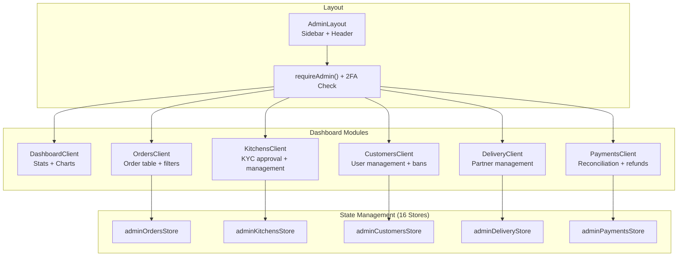

# Admin Dashboard Architecture

> **Status:** Active
> **Last updated:** 2026-09-20
> **Cross-refs:** [Roles & Permissions](16-roles-permissions.md), [State Management](06-state-data-flow.md), [Component System](07-component-system.md)

---

## 1. Overview

The Admin Dashboard is a comprehensive control panel for platform administrators to manage orders, kitchens, customers, delivery partners, payments, content, and support tickets. Built with role-based access control (RBAC) and granular permissions.

### Key Features

- **Order Management**: View, update, and track all platform orders
- **Kitchen Management**: Approve KYC, manage profiles, moderate menus
- **Customer Management**: View profiles, ban/unban users, loyalty management
- **Delivery Partner Management**: Approve applications, track deliveries, settlements
- **Payment Management**: Payment reconciliation, refunds, settlement processing
- **Content Management**: Category pages, cravings popup rules, search pages
- **Support Management**: Ticket queue, responses, escalations
- **Analytics Dashboard**: Revenue, order trends, user metrics

---

## 2. Architecture



---

## 3. Component Structure

### 3.1 DashboardClient

**Location:** `components/admin/dashboard-client.tsx`

**Purpose:** Overview dashboard with key metrics and charts.

**Sections:**
1. Stats Cards (revenue, orders, kitchens, approvals)
2. Revenue Chart (Recharts)
3. Recent Orders Table
4. Kitchen Applications
5. Support Queue

### 3.2 OrdersClient

**Location:** `components/admin/orders-client.tsx`

**Purpose:** Order management table with filters and bulk actions.

**Features:**
- Server-side pagination with TanStack Table
- Filters: status, kitchen, date range, payment method
- Real-time updates via Ably
- Export to CSV

**Store:** `adminOrdersStore.ts`

### 3.3 DeliveryClient

**Location:** `components/admin/delivery-client.tsx`

**Purpose:** Delivery partner management with document verification and performance tracking.

---

## 4. Admin Store Registry (16 Stores)

| Store | Purpose |
|-------|---------|
| **adminStore** | Admin session, permissions, navigation |
| **adminOrdersStore** | Order management table state |
| **adminKitchensStore** | Kitchen approval, KYC management |
| **adminCustomersStore** | Customer list, filters, bans |
| **adminDeliveryStore** | Delivery partner management |
| **adminMenuStore** | Menu item moderation |
| **adminCouponsStore** | Coupon CRUD, usage analytics |
| **adminPaymentsStore** | Payment reconciliation table |
| **adminPaymentOffersStore** | Payment offer management |
| **adminLoyaltyCouponsStore** | Loyalty reward catalog |
| **adminInvitesStore** | Admin invite management |
| **adminSupportStore** | Support ticket queue |
| **adminCategoriesStore** | Category management |
| **adminTwoFactorStore** | 2FA login flow |
| **adminTwoFactorSetupStore** | 2FA enrollment flow |
| **cravingsPopupStore** | Cross-sell rule management |

---

## 5. Server Actions

Admin operations use server actions:

### 5.1 Action Organization

```
actions/admin/
├── admin-actions.ts           # Generic admin utilities
├── admin-cms.ts               # CMS content management
├── admin-coupons.ts           # Coupon management
├── admin-customers.ts         # Customer management
├── admin-menu.ts              # Menu moderation
├── admin-partners.ts          # Kitchen/delivery partner management
├── admin-payments.ts          # Payment reconciliation
├── approval-actions.ts        # KYC approval workflow
├── ban-actions.ts             # Ban/unban users
├── dashboard.ts               # Dashboard stats
└── invites-actions.ts         # Admin invites
```

### 5.2 Permission Enforcement

```typescript
'use server';

import { requireAdmin } from '@/lib/auth-guards';
import { AdminPermission } from '@/types/permissions';

export async function updateOrderStatus(
  orderId: string,
  status: OrderStatus
) {
  const admin = await requireAdmin([AdminPermission.MANAGE_ORDERS]);
  
  const order = await prisma.order.update({
    where: { id: orderId },
    data: { status, updatedBy: admin.id },
  });
  
  // Audit log
  await prisma.auditLog.create({
    data: {
      action: 'ORDER_STATUS_UPDATE',
      entityType: 'order',
      entityId: orderId,
      userId: admin.id,
      changes: { status },
    },
  });
  
  return order;
}
```

---

## 6. Permissions Matrix

| Module | Permission | Actions Allowed |
|--------|------------|-----------------|
| **Orders** | MANAGE_ORDERS | View, update status, refund, export |
| **Kitchens** | APPROVE_KYC | View applications, approve/reject KYC |
| **Customers** | BAN_USERS | View profiles, ban/unban, adjust loyalty |
| **Delivery** | MANAGE_DELIVERY | Approve partners, settlements |
| **Payments** | VIEW_FINANCIALS | View transactions, reconciliation |
| **CMS** | MANAGE_CMS | Edit category pages, cravings rules |
| **Support** | MANAGE_SUPPORT | View tickets, respond, escalate |
| **Admins** | MANAGE_ADMINS | Invite admins, manage permissions |

---

## 7. Security

### 7.1 Authentication Flow

All admin routes require:
1. Valid session
2. Role = 'admin'
3. 2FA verification
4. Granular permission for specific actions

### 7.2 Audit Logging

Every admin action is logged with:
- Action type
- Entity type and ID
- Admin user ID
- Changes made
- IP address and user agent
- Timestamp

---

## 8. Real-Time Features

### 8.1 Ably Channels

Admin subscribes to:
- `admin:orders` - New orders, status updates
- `admin:kitchens` - New applications
- `admin:support` - New support tickets
- `admin:payments` - Payment events

### 8.2 Toast Notifications

Real-time notifications for:
- New order placed
- Kitchen application submitted
- Payment refund completed
- Support ticket escalated
