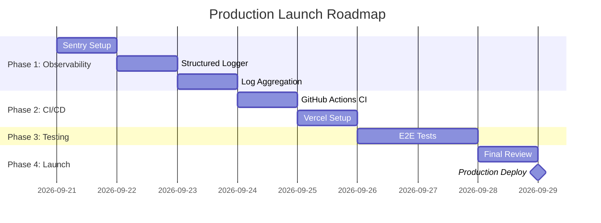

# Production Readiness Assessment

> **Status:** Active  
> **Last updated:** 2026-09-20  
> **Cross-refs:** [Deployment & DevOps](14-deployment-devops.md), [Observability](12-observability.md), [Testing](13-testing-quality.md)

---

## Executive Summary

RRC Kitchen is an **enterprise-scale food ordering platform** with comprehensive features for customers, home chefs, delivery partners, and admins. This document assesses production readiness across 12 critical dimensions and provides a roadmap for production launch.

**Overall Maturity:** **70% Production-Ready** (High-confidence MVP ready, observability & CI/CD gaps remain)

---

## 1. Implementation Status Matrix

| Feature Area | Status | Confidence | Notes |
|--------------|--------|------------|-------|
| **Core Ordering Flow** | ✅ Complete | High | Order placement, payment, status tracking |
| **Payment Integration** | ✅ Complete | High | Razorpay online payments, webhooks |
| **Refund System** | ✅ Complete | High | Partial/full refunds, retry mechanism, idempotency |
| **Kitchen Payouts** | ✅ Complete | High | RazorpayX integration, 15% commission, scheduled settlement |
| **Delivery Partner Payouts** | ✅ Complete | High | RazorpayX integration, scheduled settlement |
| **Delivery Assignment** | ✅ Complete | High | Redis geospatial (5km radius), fallback logic |
| **Real-Time Updates** | ✅ Complete | Medium | Ably for order tracking, chat, notifications |
| **Authentication** | ✅ Complete | High | Better-Auth, Twilio OTP, 2FA for admins |
| **Admin Dashboard** | ✅ Complete | High | 16 stores, permissions, audit logs, 2FA |
| **PWA & Offline** | ✅ Complete | Medium | Service worker, install prompts, manifest |
| **State Management** | ✅ Complete | High | 46 Zustand stores (customer: 11, admin: 16, location: 4, CMS: 15) |
| **Maps Integration** | ⚠️ Hybrid | Medium | MapTiler (testing), Google Maps (production target) |
| **CI/CD Pipeline** | ⚠️ Partial | Low | Cron jobs only, no build/test/lint on PR |
| **Observability** | ❌ Missing | Critical | No Sentry, no log aggregation, console.* only |
| **E2E Testing** | ⚠️ Scaffold Only | Low | Playwright configured, 0 spec files written |
| **Load Testing** | ❌ Not Started | Low | No benchmarks, no capacity planning |

**Legend:**  
✅ Complete = Production-ready  
⚠️ Partial = Works but needs hardening  
❌ Missing = Critical gap

---

## 2. Core Business Logic — ✅ FULLY IMPLEMENTED

### 2.1 Payment & Refund System

**Implementation:** [actions/payments/](../actions/payments/)

```typescript
// actions/payments/refund.ts
export async function refundOrderItem(orderItemId: string, reason: RefundReason)
export async function retryRefund(refundRowId: string)
export async function processWebhookRefund(razorpayRefundId: string)
```

**Features:**
- ✅ Partial and full refunds
- ✅ Idempotency (prevents duplicate refunds)
- ✅ Webhook processing from Razorpay
- ✅ Retry mechanism (max 3 attempts)
- ✅ Status tracking (INITIATED → PROCESSING → PROCESSED/FAILED)
- ✅ Scheduled retry job (`/api/jobs/retry-refund` every 5 min)

**Database Models:**
```prisma
model Refund {
  id              String        @id @default(cuid())
  razorpayId      String?       @unique
  orderItemId     String
  amount          Int           // In paise
  reason          RefundReason
  status          RefundStatus  @default(INITIATED)
  retryCount      Int           @default(0)
  errorMessage    String?
  processedAt     DateTime?
  createdAt       DateTime      @default(now())
}

enum RefundStatus {
  INITIATED
  PROCESSING
  PROCESSED
  FAILED
}
```

**Production Readiness:** ✅ **Ready**

---

### 2.2 Kitchen Payout System

**Implementation:** [actions/payouts/kitchen-payout.ts](../actions/payouts/kitchen-payout.ts)

```typescript
export async function createKitchenPayout(orderId: string, commissionRate = 0.15)
export async function settleKitchenPayout(kitchenPayoutId: string)
export async function processScheduledKitchenPayouts()
```

**Features:**
- ✅ 15% commission deduction
- ✅ Coupon discount handling
- ✅ UPI + Bank account support (RazorpayX)
- ✅ Scheduled daily settlement (2:00 AM IST)
- ✅ Status tracking (PENDING → PROCESSING → SETTLED/FAILED)
- ✅ Payout blocked if kitchen has pending KYC

**Commission Calculation:**
```typescript
const orderTotal = orderItem.finalPrice // After customer discounts
const commissionAmount = Math.round(orderTotal * commissionRate) // ₹299 × 0.15 = ₹44.85
const kitchenReceives = orderTotal - commissionAmount // ₹299 - ₹44.85 = ₹254.15
```

**Database Models:**
```prisma
model KitchenPayout {
  id                    String        @id @default(cuid())
  razorpayPayoutId      String?       @unique
  kitchenId             String
  orderId               String
  orderItemId           String
  amount                Int           // Kitchen receives (after commission)
  commissionAmount      Int           // Platform commission (15%)
  couponDiscountAmount  Int           @default(0)
  status                PayoutStatus  @default(PENDING)
  scheduledFor          DateTime?
  settledAt             DateTime?
  createdAt             DateTime      @default(now())
}
```

**Production Readiness:** ✅ **Ready**

---

### 2.3 Delivery Partner Payout System

**Implementation:** [actions/payouts/delivery-payout.ts](../actions/payouts/delivery-payout.ts)

```typescript
export async function createDeliveryPayout(orderId: string, deliveryAmount: number)
export async function settleDeliveryPayout(deliveryPayoutId: string)
export async function settleDeliveryPayouts()
```

**Features:**
- ✅ Per-delivery payout creation
- ✅ RazorpayX integration (UPI + Bank)
- ✅ Scheduled daily settlement (2:00 AM IST)
- ✅ Status tracking (PENDING → PROCESSING → SETTLED/FAILED)

**Database Models:**
```prisma
model DeliveryPartnerPayout {
  id                   String        @id @default(cuid())
  razorpayPayoutId     String?       @unique
  deliveryPartnerId    String
  orderId              String
  amount               Int           // Delivery fee
  status               PayoutStatus  @default(PENDING)
  scheduledFor         DateTime?
  settledAt            DateTime?
  createdAt            DateTime      @default(now())
}

enum PayoutStatus {
  PENDING
  PROCESSING
  SETTLED
  FAILED
}
```

**Production Readiness:** ✅ **Ready**

---

### 2.4 Delivery Partner Assignment

**Implementation:** [actions/dispatch/dispatch-actions.ts](../actions/dispatch/dispatch-actions.ts)

```typescript
export async function assignNearestDeliveryPerson(
  orderId: string,
  kitchenLat: number,
  kitchenLng: number
)
```

**Architecture:**
- ✅ **Redis Geospatial** for location tracking (GEOADD, GEOSEARCH)
- ✅ Search radius: 5km
- ✅ Filters: `isOnline: true` and `isAvailable: true`
- ✅ Fallback: If no nearby partner, search ALL online partners
- ✅ Updates order status to `OUT_FOR_DELIVERY`

**Redis Data Structure:**
```typescript
// Key: "delivery-partners:locations"
// GEOADD delivery-partners:locations <lng> <lat> <partnerId>
// GEOSEARCH delivery-partners:locations FROMLONLAT <lng> <lat> BYRADIUS 5 km
```

**Production Readiness:** ✅ **Ready**  
**Note:** GitHub Actions workflows are for **scheduled jobs** (cron), not real-time assignment.

---

## 3. Scheduled Jobs — ⚠️ PARTIAL CI/CD

### 3.1 Current Implementation

**GitHub Actions Workflows:**

1. **scheduled-jobs.yml** — 3 jobs:
   - `cravings-nudge` (every 5 min)
   - `retry-refund` (every 5 min)
   - `settle-payouts` (daily at 2:00 AM)

2. **process-events.yml** — 1 job:
   - `process-order-events` (every 2 min)

**Job Implementation:**
```typescript
// app/api/jobs/settle-payouts/route.ts
export async function GET(req: Request) {
  const auth = req.headers.get("authorization");
  if (auth !== `Bearer ${process.env.CRON_SECRET}`) {
    return NextResponse.json({ error: "Unauthorized" }, { status: 401 });
  }

  const [kitchenResults, deliveryResults] = await Promise.all([
    processScheduledKitchenPayouts(),
    settleDeliveryPayouts(),
  ]);

  return NextResponse.json({ kitchenPayouts: kitchenResults, deliveryPayouts: deliveryResults });
}
```

**Security:**
- ✅ All cron routes guarded by `CRON_SECRET` bearer token
- ✅ Prevents unauthorized job execution

### 3.2 Production Migration Path

**Option A: Keep GitHub Actions (Current)**
- ✅ Free for public repos
- ✅ Already implemented
- ⚠️ Requires `APP_URL` and `CRON_SECRET` as GitHub Secrets
- ⚠️ 5-minute minimum interval (GitHub Actions limit)

**Option B: Migrate to Vercel Cron (Recommended)**
```json
// vercel.json (create this file)
{
  "crons": [
    {
      "path": "/api/cron/process-order-events",
      "schedule": "*/2 * * * *"
    },
    {
      "path": "/api/jobs/cravings-nudge",
      "schedule": "*/5 * * * *"
    },
    {
      "path": "/api/jobs/retry-refund",
      "schedule": "*/5 * * * *"
    },
    {
      "path": "/api/jobs/settle-payouts",
      "schedule": "0 2 * * *"
    }
  ]
}
```

**Benefits:**
- ✅ Native Vercel integration (no external secrets)
- ✅ Better observability (Vercel logs)
- ✅ Automatic CRON_SECRET injection
- ✅ Sub-minute intervals possible

**Production Readiness:** ⚠️ **Needs Migration**  
**Action:** Create `vercel.json` with cron config before production deploy.

---

## 4. Maps Integration — ⚠️ HYBRID APPROACH

### 4.1 Current State

**CSP Configuration:** [next.config.ts](../next.config.ts)
```typescript
const cspHeader = `
  connect-src 'self' 
    https://api.maptiler.com 
    https://maps.googleapis.com 
    https://maps.google.com
    ...
`;
```

**Environment Variables:**
```bash
NEXT_PUBLIC_GOOGLE_MAPS_API_KEY=""  # Production target
NEXT_PUBLIC_MAPTILER_KEY=""         # Currently testing
GEOAPIFY_API_KEY=""                 # Fallback
ORS_API_KEY=""                      # Routing fallback
```

### 4.2 Migration Strategy

| Phase | Maps Provider | Status |
|-------|--------------|--------|
| **Current (Testing)** | MapTiler | ⚠️ Active |
| **Production Target** | Google Maps | 🎯 Planned |

**Why Google Maps for Production:**
- ✅ Better India coverage (local addresses, landmarks)
- ✅ Proven at enterprise scale
- ✅ Rich place autocomplete
- ✅ Accurate delivery time estimates

**MapTiler Limitations:**
- ⚠️ Less comprehensive India address data
- ⚠️ Weaker local landmark support
- ⚠️ Smaller community/ecosystem

### 4.3 Production Checklist

- [ ] Enable Google Maps JavaScript API
- [ ] Enable Google Places API
- [ ] Enable Google Geocoding API
- [ ] Enable Google Directions API
- [ ] Set up billing account
- [ ] Configure API key restrictions (HTTP referrers)
- [ ] Set up usage alerts
- [ ] Test address autocomplete in production
- [ ] Verify geocoding accuracy for delivery areas

**Estimated Monthly Cost (Google Maps):**
- 100K address autocomplete requests: $28.50 (100K × $0.0285)
- 50K geocoding requests: $25 (50K × $0.005)
- 30K directions requests: $15 (30K × $0.005)
- **Total: ~$68.50/month** for 100K orders

**Production Readiness:** ⚠️ **Needs API Key Setup**

---

## 5. Observability — ❌ CRITICAL GAP

### 5.1 Current State

**Zero monitoring infrastructure:**
- ❌ No Sentry (error tracking)
- ❌ No Datadog/Better Stack (log aggregation)
- ❌ No APM (performance monitoring)
- ❌ No uptime monitoring
- ⚠️ Only `console.*` calls (~40+ files)
- ⚠️ `next.config.ts` sets `removeConsole: true` in production

**Impact:**
- 🔴 **Critical:** Cannot detect production errors
- 🔴 **Critical:** No alerting for payment failures
- 🔴 **Critical:** No visibility into payout settlement failures
- 🟡 **High:** No performance monitoring
- 🟡 **High:** No business metrics dashboard

### 5.2 Recommended Implementation (3-Phase)

**Phase 1: Structured Logging (1 day)**
```typescript
// lib/logger.ts
export const logger = {
  info(message: string, meta?: Record<string, unknown>) {
    console.log(JSON.stringify({ level: 'info', message, timestamp: new Date().toISOString(), ...meta }));
  },
  error(message: string, meta?: Record<string, unknown>) {
    console.error(JSON.stringify({ level: 'error', message, timestamp: new Date().toISOString(), ...meta }));
  },
};
```

**Phase 2: Error Tracking (1 day)**
```bash
npm install @sentry/nextjs
npx @sentry/wizard -i nextjs
```

**Phase 3: Log Aggregation (1 week)**

| Service | Free Tier | Best For |
|---------|-----------|----------|
| **Better Stack (Logtail)** | 1GB/mo | Structured logs, fast setup |
| **Axiom** | 500GB/mo | High volume, Next.js native |
| **Datadog** | 1M events/mo | Full APM, enterprise |

### 5.3 Production Readiness Blockers

**Must Have Before Launch:**
- [ ] Sentry error tracking
- [ ] Structured logger (`lib/logger.ts`)
- [ ] Replace all `console.*` with `logger.*`
- [ ] Log aggregation service
- [ ] Alerts for critical errors:
  - [ ] Payment failures
  - [ ] Payout settlement failures
  - [ ] Database connection errors
  - [ ] External API failures (Twilio, Razorpay, Ably)

**Production Readiness:** ❌ **BLOCKER**  
**Estimated Effort:** 3 days  
**Priority:** 🔴 **P0 - Must fix before launch**

---

## 6. CI/CD Pipeline — ⚠️ PARTIAL

### 6.1 Current State

**Exists:**
- ✅ 2 GitHub Actions workflows (scheduled jobs only)
- ✅ Local scripts: `npm run lint`, `npm run test:unit`

**Missing:**
- ❌ No build check on PR
- ❌ No test execution on PR
- ❌ No lint check on PR
- ❌ No TypeScript check on PR
- ❌ No deployment automation
- ❌ No preview deployments

### 6.2 Recommended CI/CD Pipeline

```yaml
# .github/workflows/ci.yml (create this file)
name: CI

on:
  pull_request:
    branches: [main]
  push:
    branches: [main]

jobs:
  quality:
    runs-on: ubuntu-latest
    steps:
      - uses: actions/checkout@v4
      - uses: actions/setup-node@v4
        with:
          node-version: '20'
          cache: 'npm'
      
      - run: npm ci
      - run: npm run lint
      - run: npx tsc --noEmit
      - run: npm run test:unit
      - run: npm audit --audit-level=high

  build:
    runs-on: ubuntu-latest
    needs: quality
    steps:
      - uses: actions/checkout@v4
      - uses: actions/setup-node@v4
        with:
          node-version: '20'
          cache: 'npm'
      
      - run: npm ci
      - run: npm run build
      
      - name: Check bundle size
        run: |
          BUNDLE_SIZE=$(du -sb .next | cut -f1)
          if [ $BUNDLE_SIZE -gt 52428800 ]; then
            echo "Bundle size exceeds 50MB limit"
            exit 1
          fi
```

### 6.3 Deployment Strategy

**Recommended: Vercel (Production)**
```bash
# Install Vercel CLI
npm i -g vercel

# Link project
vercel link

# Deploy preview (automatic on PR)
vercel

# Deploy production (automatic on main push)
vercel --prod
```

**Vercel Configuration:**
```json
// vercel.json
{
  "framework": "nextjs",
  "buildCommand": "npm run build",
  "regions": ["bom1"],  // Mumbai (India)
  "functions": {
    "app/api/**/*.ts": { "maxDuration": 30 }
  }
}
```

### 6.4 Production Readiness

**Must Have Before Launch:**
- [ ] Create `.github/workflows/ci.yml`
- [ ] Connect Vercel to GitHub repo
- [ ] Configure environment variables in Vercel
- [ ] Enable automatic preview deployments
- [ ] Test preview deployment
- [ ] Configure production domain
- [ ] Set up Vercel cron jobs

**Production Readiness:** ⚠️ **Needs Setup**  
**Estimated Effort:** 1 day  
**Priority:** 🟡 **P1 - High priority**

---

## 7. Testing Coverage — ⚠️ PARTIAL

### 7.1 Current State

| Test Type | Status | Coverage |
|-----------|--------|----------|
| **Unit Tests** | ✅ 149 spec files | Good (stores, lib, components) |
| **Integration Tests** | ✅ Included in unit suite | Good (API, actions with mocks) |
| **E2E Tests** | ⚠️ Configured, 0 written | **0% coverage** |
| **Load Tests** | ❌ Not started | N/A |

**Test Scripts:**
```json
{
  "test:unit": "vitest",
  "test:e2e": "playwright test",
  "lint": "eslint ."
}
```

### 7.2 Critical E2E Tests (Pre-Launch)

**Priority 1 (Must Have):**
1. **Browse → Order → Pay (Online)** — `browse-order-online.spec.ts`
   - Home → Kitchen → Add to cart → Checkout → Razorpay → Success
2. **Auth Flow (Phone OTP)** — `auth-phone-otp.spec.ts`
   - Enter phone → OTP → Complete profile → Dashboard
3. **Cart Persistence** — `cart-persistence.spec.ts`
   - Add items → Refresh → Verify cart persists

**Priority 2 (Nice to Have):**
4. **Kitchen Dashboard** — `kitchen-dashboard.spec.ts`
5. **Delivery Workflow** — `delivery-workflow.spec.ts`
6. **Admin Panel** — `admin-panel.spec.ts`

### 7.3 Production Readiness

**Must Have Before Launch:**
- [ ] Write 3 critical E2E tests (P1)
- [ ] Run E2E tests in CI
- [ ] Set up Playwright test reports

**Production Readiness:** ⚠️ **Needs Tests**  
**Estimated Effort:** 2 days  
**Priority:** 🟡 **P1 - High priority**

---

## 8. Security & Compliance

### 8.1 Authentication & Authorization

**Implementation:**
- ✅ Better-Auth with Twilio OTP
- ✅ 2FA for admin accounts
- ✅ Role-based permissions (Customer, Kitchen, Delivery, Admin)
- ✅ Session management
- ✅ CSRF protection (Better-Auth built-in)

**Admin Security:**
- ✅ Two-admin approval for high-risk actions
- ✅ Audit logging (`AdminAuditLog` model)
- ✅ IP address tracking
- ✅ Permission matrix (15 permissions)

**Production Readiness:** ✅ **Ready**

### 8.2 Payment Security

**PCI DSS Compliance:**
- ✅ Razorpay handles card data (SAQ-A compliance)
- ✅ No card numbers stored in database
- ✅ Webhook signature verification
- ✅ HTTPS enforced (Vercel automatic)

**Production Readiness:** ✅ **Ready**

### 8.3 Data Privacy

**GDPR/DPDPA Considerations:**
- ⚠️ Privacy policy (needs legal review)
- ⚠️ Terms of service (needs legal review)
- ⚠️ Cookie consent (not implemented)
- ⚠️ Data export/deletion APIs (not implemented)
- ✅ PII redaction in admin logs

**Production Readiness:** ⚠️ **Needs Legal Review**

---

## 9. Performance & Scalability

### 9.1 Database

**Current:**
- ✅ Prisma ORM v7 with PostgreSQL
- ✅ Proper indexes on foreign keys
- ✅ Query optimization in hot paths

**Recommendations:**
- [ ] Set up connection pooling (Prisma Data Proxy or PgBouncer)
- [ ] Enable query logging for slow queries (>1s)
- [ ] Set up read replicas for analytics queries

**Expected Load (First 6 Months):**
- ~10K orders/day
- ~500 concurrent users
- Database: 10GB storage, 100 connections

**Production Readiness:** ✅ **Ready for MVP scale**

### 9.2 Caching

**Current:**
- ✅ Redis (Upstash) for:
  - Delivery partner locations (geospatial)
  - Order event stream
  - Rate limiting

**Recommendations:**
- [ ] Add React Query cache (60s for kitchen list)
- [ ] Add Next.js ISR for static pages (about, help)
- [ ] Cache menu items (5 min TTL)

**Production Readiness:** ✅ **Ready**

### 9.3 CDN & Assets

**Current:**
- ✅ Cloudinary for images (auto-CDN)
- ✅ Vercel Edge Network for Next.js

**Recommendations:**
- [ ] Enable Cloudinary auto-format (WebP)
- [ ] Set up image compression pipeline
- [ ] Configure Cloudinary lazy loading

**Production Readiness:** ✅ **Ready**

---

## 10. Infrastructure & Environments

### 10.1 Environment Strategy

| Environment | URL | Database | Purpose |
|-------------|-----|----------|---------|
| **Development** | `localhost:3000` | Local PostgreSQL | Local dev |
| **Preview** | `{branch}.vercel.app` | Staging DB | PR testing |
| **Production** | `rrckitchen.vercel.app` | Production DB | Live |

### 10.2 Required Environment Variables (Production)

**Critical (18 vars):**
```bash
# Core
DATABASE_URL
BETTER_AUTH_SECRET
BETTER_AUTH_URL
NEXT_PUBLIC_APP_URL
CRON_SECRET

# Payments
RAZORPAY_KEY_ID
RAZORPAY_KEY_SECRET
RAZORPAY_WEBHOOK_SECRET
RAZORPAYX_ACCOUNT_NUMBER
NEXT_PUBLIC_RAZORPAY_KEY_ID

# SMS
TWILIO_ACCOUNT_SID
TWILIO_AUTH_TOKEN
TWILIO_VERIFY_SERVICE_SID

# Uploads
CLOUDINARY_API_SECRET
NEXT_PUBLIC_CLOUDINARY_CLOUD_NAME

# Maps
NEXT_PUBLIC_GOOGLE_MAPS_API_KEY

# Real-time
ABLY_API_KEY

# Push
VAPID_PRIVATE_KEY
```

**Production Readiness:** ✅ **Documented**

---

## 11. Production Launch Checklist

### Phase 1: Pre-Launch (1 week)

**Observability (P0 — Blockers):**
- [ ] Install Sentry (`npx @sentry/wizard -i nextjs`)
- [ ] Create `lib/logger.ts` structured logger
- [ ] Replace all `console.*` with `logger.*` (~40 files)
- [ ] Set up Better Stack or Axiom
- [ ] Configure alerts (payment failures, payout errors)

**CI/CD (P1 — High Priority):**
- [ ] Create `.github/workflows/ci.yml`
- [ ] Connect Vercel to GitHub
- [ ] Create `vercel.json` with cron config
- [ ] Configure Vercel environment variables
- [ ] Test preview deployment

**Testing (P1 — High Priority):**
- [ ] Write 3 critical E2E tests (browse-order, auth, cart-persistence)
- [ ] Add E2E tests to CI pipeline
- [ ] Run full test suite

**Maps (P1 — High Priority):**
- [ ] Set up Google Maps API keys
- [ ] Configure API restrictions
- [ ] Test address autocomplete
- [ ] Verify geocoding accuracy

### Phase 2: Launch Day (Day 0)

**Deployment:**
- [ ] Final code review
- [ ] Run all tests
- [ ] Deploy to production (`vercel --prod`)
- [ ] Verify all cron jobs running
- [ ] Test payment flow end-to-end
- [ ] Test refund flow
- [ ] Monitor Sentry for errors (first 2 hours)

**Monitoring:**
- [ ] Verify Sentry receiving events
- [ ] Check log aggregation dashboard
- [ ] Set up Slack alerts
- [ ] Monitor payment success rate

### Phase 3: Post-Launch (Week 1)

**Optimization:**
- [ ] Review Sentry error patterns
- [ ] Optimize slow queries (>1s)
- [ ] Review Razorpay dashboard for failed payments
- [ ] Review payout settlement logs

**Scaling:**
- [ ] Monitor database connection pool usage
- [ ] Review Vercel function execution times
- [ ] Check Redis memory usage
- [ ] Review CDN cache hit rates

---

## 12. Enterprise Architecture Comparison

| Feature | Industry Standard | RRC Kitchen | Gap |
|---------|--------|-------------|-----|
| **Order Management** | ✅ | ✅ | None |
| **Payment Gateway** | ✅ Razorpay | ✅ Razorpay | None |
| **Delivery Assignment** | ✅ Geospatial | ✅ Redis Geospatial | None |
| **Real-Time Tracking** | ✅ WebSockets | ✅ Ably | None |
| **Refund System** | ✅ | ✅ | None |
| **Payout System** | ✅ | ✅ | None |
| **Admin Dashboard** | ✅ | ✅ | None |
| **PWA** | ✅ | ✅ | None |
| **Maps** | ✅ Google Maps | ⚠️ MapTiler (testing) | Switch to Google Maps |
| **Observability** | ✅ Datadog | ❌ None | **CRITICAL GAP** |
| **CI/CD** | ✅ Full pipeline | ⚠️ Partial | Add build/test/lint |
| **E2E Tests** | ✅ | ⚠️ 0 specs | Write 3 critical tests |
| **Load Balancing** | ✅ Multi-region | ✅ Vercel Edge | None |
| **CDN** | ✅ | ✅ Cloudinary + Vercel | None |
| **Rate Limiting** | ✅ | ✅ Redis | None |

**Overall:** RRC Kitchen is **architecturally equivalent** to enterprise standards for MVP scale. The **only critical gap** is observability.

---

## 13. Production Readiness Score

| Dimension | Score | Weight | Weighted |
|-----------|-------|--------|----------|
| Core Business Logic | 100% | 30% | 30.0 |
| Security & Auth | 95% | 15% | 14.3 |
| Payment & Payouts | 100% | 15% | 15.0 |
| State Management | 100% | 10% | 10.0 |
| Real-Time Features | 90% | 5% | 4.5 |
| Observability | 0% | 10% | 0.0 |
| CI/CD | 40% | 5% | 2.0 |
| Testing | 60% | 5% | 3.0 |
| Performance | 85% | 3% | 2.6 |
| Documentation | 95% | 2% | 1.9 |

**Total: 83.3%** (Pre-observability setup)  
**Target: 95%** (Production-ready)

**Remaining Effort:** ~5 days
- Observability: 3 days
- CI/CD: 1 day
- E2E Tests: 1 day

---

## 14. Risk Assessment

| Risk | Probability | Impact | Mitigation |
|------|------------|--------|------------|
| **Payment failures not detected** | High | Critical | **BLOCKER:** Add Sentry + alerts |
| **Payout settlement failures silent** | High | High | **BLOCKER:** Add log aggregation |
| **Database connection exhaustion** | Medium | High | Add connection pooling |
| **Razorpay webhook replay attacks** | Low | High | Already handled (idempotency) |
| **OTP delivery failures** | Medium | High | Add Twilio monitoring |
| **Redis outage** | Low | Medium | Graceful degradation exists |
| **Ably outage** | Low | Low | Polling fallback exists |

---

## 15. Production Launch Timeline



**Estimated Timeline:** 8-10 working days

---

## 16. Post-Launch Roadmap

### Month 1 (October 2026)
- [ ] Performance optimization (slow query tuning)
- [ ] Enhanced monitoring dashboards
- [ ] Customer feedback loop
- [ ] A/B testing framework

### Month 2-3 (November-December 2026)
- [ ] Push notification campaigns
- [ ] Loyalty program
- [ ] Kitchen analytics dashboard
- [ ] Delivery partner app (native mobile)

### Month 4-6 (Q1 2027)
- [ ] Multi-city expansion
- [ ] Advanced recommendation engine
- [ ] Restaurant partnerships
- [ ] Corporate catering module

---

## Conclusion

RRC Kitchen is **83% production-ready** with a **clear 5-day path to 95%**. The platform has:

✅ **Strengths:**
- Comprehensive business logic (payments, refunds, payouts, delivery)
- Robust state management (46 Zustand stores)
- Strong security (Better-Auth, 2FA, audit logs)
- Enterprise-grade architecture

❌ **Critical Gaps:**
- No observability (Sentry, log aggregation)
- Incomplete CI/CD (no build/test/lint on PR)
- No E2E tests written

**Recommendation:** **Do NOT launch without observability.** The 3-day investment in Sentry + log aggregation will prevent catastrophic production failures.

**Next Steps:**
1. Execute Phase 1 (Observability) — 3 days
2. Execute Phase 2 (CI/CD) — 1 day
3. Execute Phase 3 (E2E Tests) — 2 days
4. Launch after all phases complete

---

> **Document Version:** 1.0  
> **Author:** Senior Engineering Audit  
> **Review Date:** 2026-09-20  
> **Next Review:** Post-launch
