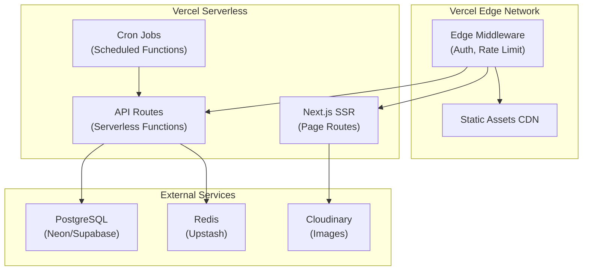
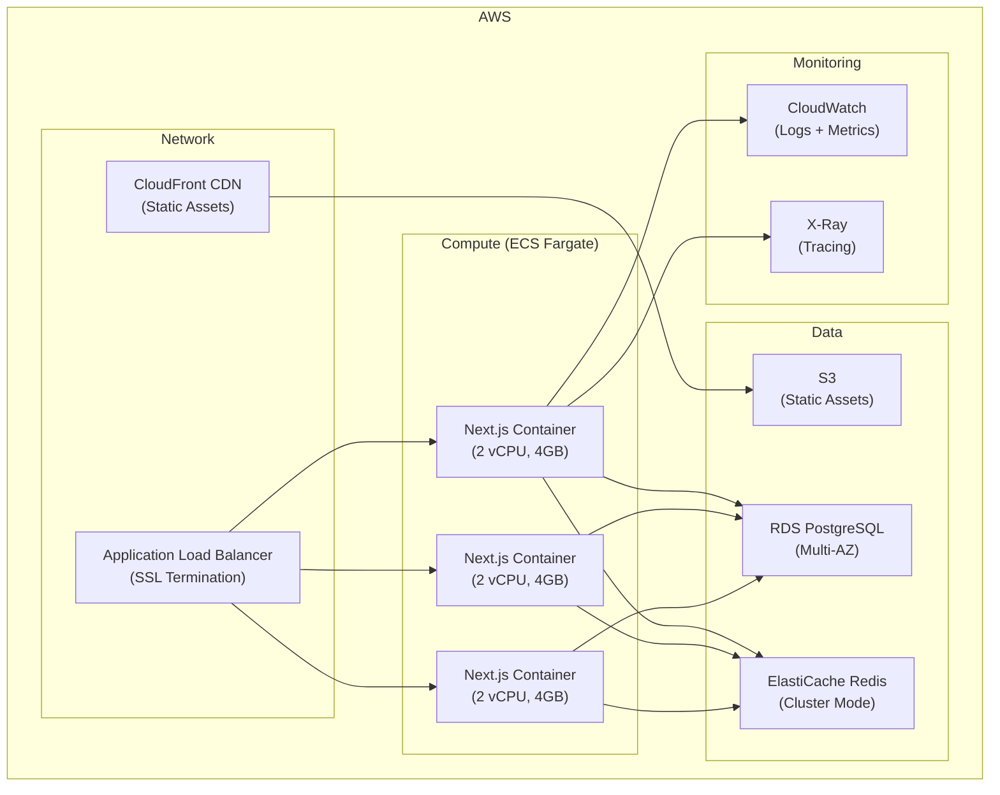
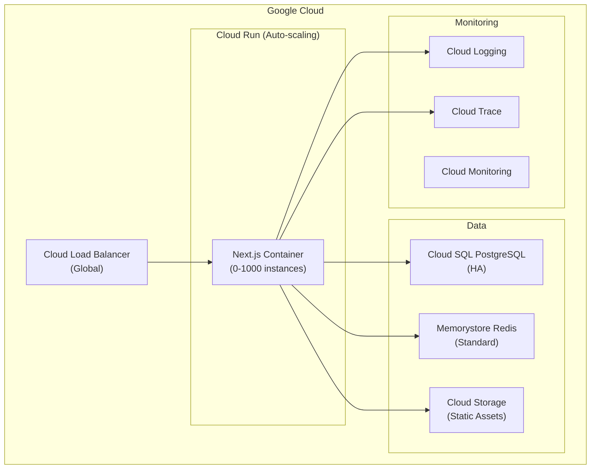
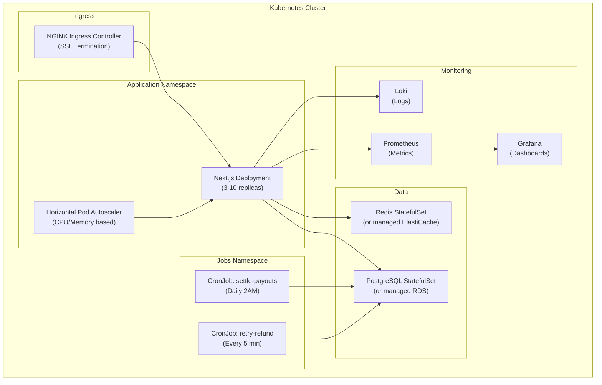
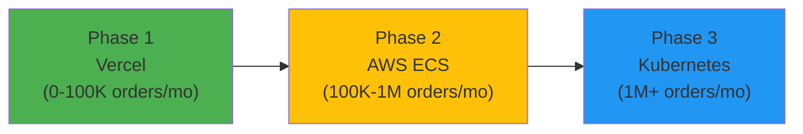

# Deployment Options & Cloud Strategy

> **Status:** Active  
> **Last updated:** 2026-09-20  
> **Cross-refs:** [Deployment & DevOps](14-deployment-devops.md), [Production Readiness](19-production-readiness.md), [Observability](12-observability.md)

---

## Executive Summary

This document evaluates **7 deployment strategies** for RRC Kitchen from a senior engineering perspective, comparing Vercel (current choice) against self-hosted Kubernetes, AWS ECS, Google Cloud Run, Docker Swarm, and bare metal VPS options.

**Current Choice:** Vercel (Serverless)  
**Best Alternative:** AWS ECS Fargate or Google Cloud Run  
**Enterprise Scale:** Kubernetes (EKS/GKE) with Terraform

---

## 1. Deployment Strategy Comparison

| Strategy | Setup Time | Cost (100K orders/mo) | Ops Burden | Scale Ceiling | Best For |
|----------|------------|----------------------|------------|---------------|----------|
| **Vercel** | 1 day | $200-400 | Low | 1M req/day | MVP, fast launch |
| **AWS ECS Fargate** | 3-5 days | $150-300 | Medium | 10M req/day | Production scale |
| **Google Cloud Run** | 2-3 days | $120-250 | Low | 5M req/day | Auto-scaling apps |
| **Kubernetes (EKS/GKE)** | 2-3 weeks | $300-600 | High | Unlimited | Multi-service platform |
| **Docker Swarm** | 1 week | $100-200 | Medium | 5M req/day | Small teams |
| **VPS (DigitalOcean)** | 3-5 days | $80-150 | High | 1M req/day | Cost-sensitive MVP |
| **Bare Metal** | 2-4 weeks | $50-100 | Very High | 10M req/day | High-traffic, cost-optimized |

---

## 2. Option 1: Vercel (Current Recommendation)

### 2.1 Architecture



### 2.2 Configuration

**vercel.json:**
```json
{
  "version": 2,
  "framework": "nextjs",
  "buildCommand": "npm run build",
  "installCommand": "npm ci",
  "regions": ["bom1"],
  "functions": {
    "app/api/**/*.ts": {
      "maxDuration": 30,
      "memory": 1024
    }
  },
  "crons": [
    {
      "path": "/api/cron/process-order-events",
      "schedule": "*/2 * * * *"
    },
    {
      "path": "/api/jobs/settle-payouts",
      "schedule": "0 2 * * *"
    },
    {
      "path": "/api/jobs/retry-refund",
      "schedule": "*/5 * * * *"
    },
    {
      "path": "/api/jobs/cravings-nudge",
      "schedule": "*/5 * * * *"
    }
  ],
  "headers": [
    {
      "source": "/sw.js",
      "headers": [
        {
          "key": "Cache-Control",
          "value": "public, max-age=0, must-revalidate"
        },
        {
          "key": "Service-Worker-Allowed",
          "value": "/"
        }
      ]
    }
  ],
  "rewrites": [
    {
      "source": "/api/:path*",
      "destination": "/api/:path*"
    }
  ]
}
```

### 2.3 Pros & Cons

**Pros:**
- ✅ Zero DevOps (automatic scaling, SSL, CDN)
- ✅ Fast deployment (Git push → production in 2 min)
- ✅ Built-in preview deployments
- ✅ Edge network (low latency globally)
- ✅ Native Next.js optimization
- ✅ Generous free tier (100GB bandwidth)

**Cons:**
- ⚠️ Vendor lock-in (Vercel-specific features)
- ⚠️ Cold start latency (serverless functions)
- ⚠️ Limited function execution time (60s max)
- ⚠️ Cost scales with traffic (can get expensive at scale)
- ⚠️ No persistent storage (need external DB)

### 2.4 Cost Breakdown (100K orders/month)

| Resource | Usage | Cost |
|----------|-------|------|
| **Bandwidth** | ~200GB | $40 (100GB free + 100GB × $0.40/GB) |
| **Function Invocations** | ~5M | $100 (1M free + 4M × $0.025/1K) |
| **Build Minutes** | ~50 hours | $20 (100 min free) |
| **Edge Requests** | Unlimited | $0 |
| **Preview Deployments** | Included | $0 |
| **Total** | | **~$160/month** |

**External Services:**
- Neon PostgreSQL: $25/month (Pro plan)
- Upstash Redis: $40/month (Pro plan)
- Cloudinary: $99/month (Advanced plan)
- **Grand Total: ~$324/month**

### 2.5 When to Choose Vercel

✅ **Yes, if:**
- You want to launch in <1 week
- Team size <5 engineers
- Traffic <1M requests/day
- Budget allows $300-500/month
- Zero DevOps experience

❌ **No, if:**
- Need multi-region database replication
- Require <50ms p99 latency
- Budget-constrained (<$200/month)
- Need custom networking/VPN
- Processing long-running jobs (>60s)

---

## 3. Option 2: AWS ECS Fargate (Recommended for Scale)

### 3.1 Architecture



### 3.2 Infrastructure as Code (Terraform)

**terraform/main.tf:**
```hcl
terraform {
  required_providers {
    aws = {
      source  = "hashicorp/aws"
      version = "~> 5.0"
    }
  }
  
  backend "s3" {
    bucket = "rrckitchen-terraform-state"
    key    = "production/terraform.tfstate"
    region = "ap-south-1"
  }
}

provider "aws" {
  region = "ap-south-1"  # Mumbai
}

# VPC
module "vpc" {
  source = "terraform-aws-modules/vpc/aws"
  
  name = "rrckitchen-vpc"
  cidr = "10.0.0.0/16"
  
  azs             = ["ap-south-1a", "ap-south-1b"]
  private_subnets = ["10.0.1.0/24", "10.0.2.0/24"]
  public_subnets  = ["10.0.101.0/24", "10.0.102.0/24"]
  
  enable_nat_gateway = true
  enable_dns_hostnames = true
  
  tags = {
    Environment = "production"
  }
}

# ECR Repository
resource "aws_ecr_repository" "app" {
  name = "rrckitchen-app"
  
  image_scanning_configuration {
    scan_on_push = true
  }
}

# ECS Cluster
resource "aws_ecs_cluster" "main" {
  name = "rrckitchen-cluster"
  
  setting {
    name  = "containerInsights"
    value = "enabled"
  }
}

# ECS Task Definition
resource "aws_ecs_task_definition" "app" {
  family                   = "rrckitchen-app"
  network_mode             = "awsvpc"
  requires_compatibilities = ["FARGATE"]
  cpu                      = "2048"  # 2 vCPU
  memory                   = "4096"  # 4 GB
  execution_role_arn       = aws_iam_role.ecs_execution_role.arn
  task_role_arn            = aws_iam_role.ecs_task_role.arn
  
  container_definitions = jsonencode([
    {
      name      = "nextjs"
      image     = "${aws_ecr_repository.app.repository_url}:latest"
      essential = true
      
      portMappings = [
        {
          containerPort = 3000
          protocol      = "tcp"
        }
      ]
      
      environment = [
        {
          name  = "NODE_ENV"
          value = "production"
        },
        {
          name  = "NEXT_PUBLIC_APP_URL"
          value = "https://rrckitchen.com"
        }
      ]
      
      secrets = [
        {
          name      = "DATABASE_URL"
          valueFrom = aws_secretsmanager_secret.database_url.arn
        },
        {
          name      = "RAZORPAY_KEY_SECRET"
          valueFrom = aws_secretsmanager_secret.razorpay_secret.arn
        }
      ]
      
      logConfiguration = {
        logDriver = "awslogs"
        options = {
          "awslogs-group"         = "/ecs/rrckitchen"
          "awslogs-region"        = "ap-south-1"
          "awslogs-stream-prefix" = "nextjs"
        }
      }
      
      healthCheck = {
        command     = ["CMD-SHELL", "curl -f http://localhost:3000/api/health || exit 1"]
        interval    = 30
        timeout     = 5
        retries     = 3
        startPeriod = 60
      }
    }
  ])
}

# ECS Service
resource "aws_ecs_service" "app" {
  name            = "rrckitchen-service"
  cluster         = aws_ecs_cluster.main.id
  task_definition = aws_ecs_task_definition.app.arn
  desired_count   = 3
  launch_type     = "FARGATE"
  
  network_configuration {
    subnets          = module.vpc.private_subnets
    security_groups  = [aws_security_group.ecs_tasks.id]
    assign_public_ip = false
  }
  
  load_balancer {
    target_group_arn = aws_lb_target_group.app.arn
    container_name   = "nextjs"
    container_port   = 3000
  }
  
  deployment_configuration {
    maximum_percent         = 200
    minimum_healthy_percent = 100
  }
  
  enable_execute_command = true  # For debugging
}

# Application Load Balancer
resource "aws_lb" "main" {
  name               = "rrckitchen-alb"
  internal           = false
  load_balancer_type = "application"
  security_groups    = [aws_security_group.alb.id]
  subnets            = module.vpc.public_subnets
  
  enable_deletion_protection = true
  
  access_logs {
    bucket  = aws_s3_bucket.alb_logs.id
    enabled = true
  }
}

# RDS PostgreSQL
resource "aws_db_instance" "main" {
  identifier             = "rrckitchen-db"
  engine                 = "postgres"
  engine_version         = "16.1"
  instance_class         = "db.t4g.medium"
  allocated_storage      = 100
  storage_type           = "gp3"
  storage_encrypted      = true
  
  db_name  = "rrckitchen"
  username = "rrckitchen"
  password = var.db_password
  
  multi_az               = true
  publicly_accessible    = false
  vpc_security_group_ids = [aws_security_group.rds.id]
  db_subnet_group_name   = aws_db_subnet_group.main.name
  
  backup_retention_period = 7
  backup_window           = "03:00-04:00"
  maintenance_window      = "mon:04:00-mon:05:00"
  
  enabled_cloudwatch_logs_exports = ["postgresql", "upgrade"]
  
  deletion_protection = true
  skip_final_snapshot = false
  final_snapshot_identifier = "rrckitchen-final-snapshot"
}

# ElastiCache Redis
resource "aws_elasticache_replication_group" "main" {
  replication_group_id       = "rrckitchen-redis"
  replication_group_description = "Redis cluster for RRC Kitchen"
  
  engine               = "redis"
  engine_version       = "7.1"
  node_type            = "cache.t4g.medium"
  number_cache_clusters = 2
  port                 = 6379
  
  automatic_failover_enabled = true
  multi_az_enabled          = true
  
  subnet_group_name    = aws_elasticache_subnet_group.main.name
  security_group_ids   = [aws_security_group.redis.id]
  
  at_rest_encryption_enabled = true
  transit_encryption_enabled = true
  
  snapshot_retention_limit = 5
  snapshot_window          = "03:00-05:00"
}

# Auto Scaling
resource "aws_appautoscaling_target" "ecs" {
  max_capacity       = 10
  min_capacity       = 3
  resource_id        = "service/${aws_ecs_cluster.main.name}/${aws_ecs_service.app.name}"
  scalable_dimension = "ecs:service:DesiredCount"
  service_namespace  = "ecs"
}

resource "aws_appautoscaling_policy" "ecs_cpu" {
  name               = "cpu-autoscaling"
  policy_type        = "TargetTrackingScaling"
  resource_id        = aws_appautoscaling_target.ecs.resource_id
  scalable_dimension = aws_appautoscaling_target.ecs.scalable_dimension
  service_namespace  = aws_appautoscaling_target.ecs.service_namespace
  
  target_tracking_scaling_policy_configuration {
    predefined_metric_specification {
      predefined_metric_type = "ECSServiceAverageCPUUtilization"
    }
    target_value = 70.0
  }
}
```

### 3.3 Dockerfile

**Dockerfile:**
```dockerfile
# Build stage
FROM node:20-alpine AS builder

WORKDIR /app

# Copy package files
COPY package*.json ./
COPY prisma ./prisma/

# Install dependencies
RUN npm ci --only=production && \
    npm cache clean --force

# Copy source code
COPY . .

# Generate Prisma client
RUN npx prisma generate

# Build Next.js
ENV NEXT_TELEMETRY_DISABLED=1
ENV NODE_ENV=production
RUN npm run build

# Production stage
FROM node:20-alpine AS runner

WORKDIR /app

# Security: Create non-root user
RUN addgroup --system --gid 1001 nodejs && \
    adduser --system --uid 1001 nextjs

# Copy built assets
COPY --from=builder --chown=nextjs:nodejs /app/.next/standalone ./
COPY --from=builder --chown=nextjs:nodejs /app/.next/static ./.next/static
COPY --from=builder --chown=nextjs:nodejs /app/public ./public
COPY --from=builder --chown=nextjs:nodejs /app/node_modules/.prisma ./node_modules/.prisma

# Install curl for health checks
RUN apk add --no-cache curl

USER nextjs

EXPOSE 3000

ENV PORT=3000
ENV NODE_ENV=production
ENV HOSTNAME="0.0.0.0"

# Health check
HEALTHCHECK --interval=30s --timeout=3s --start-period=60s \
  CMD curl -f http://localhost:3000/api/health || exit 1

CMD ["node", "server.js"]
```

### 3.4 CI/CD Pipeline (GitHub Actions)

**.github/workflows/deploy-aws.yml:**
```yaml
name: Deploy to AWS ECS

on:
  push:
    branches: [main]
  workflow_dispatch:

env:
  AWS_REGION: ap-south-1
  ECR_REPOSITORY: rrckitchen-app
  ECS_SERVICE: rrckitchen-service
  ECS_CLUSTER: rrckitchen-cluster
  ECS_TASK_DEFINITION: rrckitchen-app

jobs:
  test:
    runs-on: ubuntu-latest
    steps:
      - uses: actions/checkout@v4
      
      - uses: actions/setup-node@v4
        with:
          node-version: '20'
          cache: 'npm'
      
      - run: npm ci
      - run: npm run lint
      - run: npx tsc --noEmit
      - run: npm run test:unit
      - run: npm audit --audit-level=high

  build-and-deploy:
    runs-on: ubuntu-latest
    needs: test
    
    steps:
      - uses: actions/checkout@v4
      
      - name: Configure AWS credentials
        uses: aws-actions/configure-aws-credentials@v4
        with:
          aws-access-key-id: ${{ secrets.AWS_ACCESS_KEY_ID }}
          aws-secret-access-key: ${{ secrets.AWS_SECRET_ACCESS_KEY }}
          aws-region: ${{ env.AWS_REGION }}
      
      - name: Login to Amazon ECR
        id: login-ecr
        uses: aws-actions/amazon-ecr-login@v2
      
      - name: Build, tag, and push image to Amazon ECR
        id: build-image
        env:
          ECR_REGISTRY: ${{ steps.login-ecr.outputs.registry }}
          IMAGE_TAG: ${{ github.sha }}
        run: |
          docker build -t $ECR_REGISTRY/$ECR_REPOSITORY:$IMAGE_TAG .
          docker push $ECR_REGISTRY/$ECR_REPOSITORY:$IMAGE_TAG
          docker tag $ECR_REGISTRY/$ECR_REPOSITORY:$IMAGE_TAG $ECR_REGISTRY/$ECR_REPOSITORY:latest
          docker push $ECR_REGISTRY/$ECR_REPOSITORY:latest
          echo "image=$ECR_REGISTRY/$ECR_REPOSITORY:$IMAGE_TAG" >> $GITHUB_OUTPUT
      
      - name: Download task definition
        run: |
          aws ecs describe-task-definition \
            --task-definition $ECS_TASK_DEFINITION \
            --query taskDefinition > task-definition.json
      
      - name: Fill in the new image ID in the Amazon ECS task definition
        id: task-def
        uses: aws-actions/amazon-ecs-render-task-definition@v1
        with:
          task-definition: task-definition.json
          container-name: nextjs
          image: ${{ steps.build-image.outputs.image }}
      
      - name: Deploy Amazon ECS task definition
        uses: aws-actions/amazon-ecs-deploy-task-definition@v1
        with:
          task-definition: ${{ steps.task-def.outputs.task-definition }}
          service: ${{ env.ECS_SERVICE }}
          cluster: ${{ env.ECS_CLUSTER }}
          wait-for-service-stability: true
      
      - name: Run database migrations
        run: |
          aws ecs run-task \
            --cluster $ECS_CLUSTER \
            --task-definition $ECS_TASK_DEFINITION \
            --launch-type FARGATE \
            --network-configuration "awsvpcConfiguration={subnets=[${{ secrets.PRIVATE_SUBNET_IDS }}],securityGroups=[${{ secrets.ECS_SECURITY_GROUP }}]}" \
            --overrides '{"containerOverrides":[{"name":"nextjs","command":["npx","prisma","migrate","deploy"]}]}'
```

### 3.5 Cost Breakdown (100K orders/month)

| Resource | Configuration | Monthly Cost |
|----------|--------------|--------------|
| **ECS Fargate** | 3 tasks × 2vCPU × 4GB × 720h | $155 |
| **RDS PostgreSQL** | db.t4g.medium Multi-AZ | $85 |
| **ElastiCache Redis** | cache.t4g.medium × 2 nodes | $68 |
| **Application Load Balancer** | 1 ALB + LCU charges | $25 |
| **CloudFront CDN** | 200GB egress | $17 |
| **S3 Storage** | 50GB | $1 |
| **CloudWatch Logs** | 10GB | $5 |
| **Data Transfer** | 100GB out | $9 |
| **Secrets Manager** | 10 secrets | $4 |
| **Total** | | **~$369/month** |

### 3.6 Pros & Cons

**Pros:**
- ✅ Full control over infrastructure
- ✅ No cold starts (containers always running)
- ✅ Multi-AZ high availability
- ✅ Native AWS integration (CloudWatch, X-Ray, Secrets Manager)
- ✅ Long-running tasks supported (no 60s limit)
- ✅ Better cost at scale (predictable pricing)

**Cons:**
- ⚠️ Requires DevOps expertise
- ⚠️ Manual scaling configuration
- ⚠️ More complex deployment pipeline
- ⚠️ Self-managed database backups
- ⚠️ Higher initial setup time (3-5 days)

### 3.7 When to Choose AWS ECS

✅ **Yes, if:**
- Traffic >1M requests/day
- Need predictable pricing
- Team has AWS experience
- Require <100ms p99 latency
- Need long-running background jobs
- Want multi-region deployment

❌ **No, if:**
- Team <3 engineers
- Need to launch in <1 week
- No DevOps experience
- Budget <$300/month

---

## 4. Option 3: Google Cloud Run (Serverless Containers)

### 4.1 Architecture



### 4.2 Configuration

**cloudbuild.yaml:**
```yaml
steps:
  # Build Docker image
  - name: 'gcr.io/cloud-builders/docker'
    args:
      - 'build'
      - '-t'
      - 'gcr.io/$PROJECT_ID/rrckitchen:$SHORT_SHA'
      - '-t'
      - 'gcr.io/$PROJECT_ID/rrckitchen:latest'
      - '.'
  
  # Push to Container Registry
  - name: 'gcr.io/cloud-builders/docker'
    args: ['push', 'gcr.io/$PROJECT_ID/rrckitchen:$SHORT_SHA']
  
  - name: 'gcr.io/cloud-builders/docker'
    args: ['push', 'gcr.io/$PROJECT_ID/rrckitchen:latest']
  
  # Deploy to Cloud Run
  - name: 'gcr.io/google.com/cloudsdktool/cloud-sdk'
    entrypoint: gcloud
    args:
      - 'run'
      - 'deploy'
      - 'rrckitchen'
      - '--image'
      - 'gcr.io/$PROJECT_ID/rrckitchen:$SHORT_SHA'
      - '--region'
      - 'asia-south1'
      - '--platform'
      - 'managed'
      - '--allow-unauthenticated'
      - '--min-instances'
      - '3'
      - '--max-instances'
      - '100'
      - '--cpu'
      - '2'
      - '--memory'
      - '4Gi'
      - '--timeout'
      - '300'
      - '--concurrency'
      - '80'
      - '--set-env-vars'
      - 'NODE_ENV=production,NEXT_PUBLIC_APP_URL=https://rrckitchen.com'
      - '--set-secrets'
      - 'DATABASE_URL=database-url:latest,RAZORPAY_KEY_SECRET=razorpay-secret:latest'

images:
  - 'gcr.io/$PROJECT_ID/rrckitchen:$SHORT_SHA'
  - 'gcr.io/$PROJECT_ID/rrckitchen:latest'

options:
  machineType: 'E2_HIGHCPU_8'
  logging: CLOUD_LOGGING_ONLY
```

**Deploy script:**
```bash
#!/bin/bash
# deploy-cloudrun.sh

gcloud run deploy rrckitchen \
  --image gcr.io/rrckitchen-prod/rrckitchen:latest \
  --region asia-south1 \
  --platform managed \
  --allow-unauthenticated \
  --min-instances 3 \
  --max-instances 100 \
  --cpu 2 \
  --memory 4Gi \
  --timeout 300 \
  --concurrency 80 \
  --set-env-vars "NODE_ENV=production,NEXT_PUBLIC_APP_URL=https://rrckitchen.com" \
  --set-secrets "DATABASE_URL=database-url:latest,RAZORPAY_KEY_SECRET=razorpay-secret:latest" \
  --vpc-connector rrckitchen-vpc-connector \
  --ingress all \
  --execution-environment gen2
```

### 4.3 Cost Breakdown (100K orders/month)

| Resource | Usage | Monthly Cost |
|----------|-------|--------------|
| **Cloud Run** | 3 min instances + scale-up | $120 |
| **Cloud SQL PostgreSQL** | db-n1-standard-2 HA | $140 |
| **Memorystore Redis** | 5GB Standard | $45 |
| **Cloud Storage** | 50GB + egress | $3 |
| **Cloud Load Balancing** | Forwarding rules + traffic | $20 |
| **Cloud Logging** | 10GB | $5 |
| **Total** | | **~$333/month** |

### 4.4 When to Choose Cloud Run

✅ **Yes, if:**
- Want serverless benefits with container flexibility
- Need better cold start performance than Vercel
- Already using Google Cloud (GCP)
- Want automatic SSL and CDN
- Need built-in traffic splitting for A/B tests

---

## 5. Option 4: Kubernetes (EKS/GKE) - Enterprise Scale

### 5.1 Architecture



### 5.2 Kubernetes Manifests

**k8s/deployment.yaml:**
```yaml
apiVersion: apps/v1
kind: Deployment
metadata:
  name: rrckitchen-app
  namespace: production
  labels:
    app: rrckitchen
    version: v1
spec:
  replicas: 3
  strategy:
    type: RollingUpdate
    rollingUpdate:
      maxSurge: 1
      maxUnavailable: 0
  selector:
    matchLabels:
      app: rrckitchen
  template:
    metadata:
      labels:
        app: rrckitchen
        version: v1
      annotations:
        prometheus.io/scrape: "true"
        prometheus.io/port: "3000"
        prometheus.io/path: "/api/metrics"
    spec:
      serviceAccountName: rrckitchen-sa
      
      # Init container for database migrations
      initContainers:
        - name: migrate
          image: ghcr.io/dharshan047/rrckitchen:latest
          command: ["npx", "prisma", "migrate", "deploy"]
          envFrom:
            - secretRef:
                name: rrckitchen-secrets
      
      containers:
        - name: nextjs
          image: ghcr.io/dharshan047/rrckitchen:latest
          imagePullPolicy: Always
          
          ports:
            - containerPort: 3000
              name: http
              protocol: TCP
          
          envFrom:
            - configMapRef:
                name: rrckitchen-config
            - secretRef:
                name: rrckitchen-secrets
          
          resources:
            requests:
              memory: "2Gi"
              cpu: "1000m"
            limits:
              memory: "4Gi"
              cpu: "2000m"
          
          livenessProbe:
            httpGet:
              path: /api/health
              port: 3000
            initialDelaySeconds: 60
            periodSeconds: 30
            timeoutSeconds: 5
            failureThreshold: 3
          
          readinessProbe:
            httpGet:
              path: /api/health
              port: 3000
            initialDelaySeconds: 10
            periodSeconds: 10
            timeoutSeconds: 3
            successThreshold: 1
            failureThreshold: 3
          
          lifecycle:
            preStop:
              exec:
                command: ["/bin/sh", "-c", "sleep 15"]
      
      # Anti-affinity to spread pods across nodes
      affinity:
        podAntiAffinity:
          preferredDuringSchedulingIgnoredDuringExecution:
            - weight: 100
              podAffinityTerm:
                labelSelector:
                  matchExpressions:
                    - key: app
                      operator: In
                      values:
                        - rrckitchen
                topologyKey: kubernetes.io/hostname
```

**k8s/hpa.yaml:**
```yaml
apiVersion: autoscaling/v2
kind: HorizontalPodAutoscaler
metadata:
  name: rrckitchen-hpa
  namespace: production
spec:
  scaleTargetRef:
    apiVersion: apps/v1
    kind: Deployment
    name: rrckitchen-app
  minReplicas: 3
  maxReplicas: 20
  metrics:
    - type: Resource
      resource:
        name: cpu
        target:
          type: Utilization
          averageUtilization: 70
    - type: Resource
      resource:
        name: memory
        target:
          type: Utilization
          averageUtilization: 80
  behavior:
    scaleUp:
      stabilizationWindowSeconds: 60
      policies:
        - type: Percent
          value: 50
          periodSeconds: 60
    scaleDown:
      stabilizationWindowSeconds: 300
      policies:
        - type: Pods
          value: 1
          periodSeconds: 60
```

**k8s/cronjob-payouts.yaml:**
```yaml
apiVersion: batch/v1
kind: CronJob
metadata:
  name: settle-payouts
  namespace: production
spec:
  schedule: "0 2 * * *"  # Daily at 2 AM IST
  timeZone: "Asia/Kolkata"
  concurrencyPolicy: Forbid
  successfulJobsHistoryLimit: 3
  failedJobsHistoryLimit: 3
  
  jobTemplate:
    spec:
      backoffLimit: 3
      template:
        spec:
          restartPolicy: OnFailure
          
          containers:
            - name: settle-payouts
              image: ghcr.io/dharshan047/rrckitchen:latest
              command: 
                - "curl"
                - "-f"
                - "-H"
                - "Authorization: Bearer $(CRON_SECRET)"
                - "http://rrckitchen-service:3000/api/jobs/settle-payouts"
              
              envFrom:
                - secretRef:
                    name: rrckitchen-secrets
              
              resources:
                requests:
                  memory: "256Mi"
                  cpu: "100m"
                limits:
                  memory: "512Mi"
                  cpu: "200m"
```

### 5.3 Helm Chart

**helm/Chart.yaml:**
```yaml
apiVersion: v2
name: rrckitchen
description: RRC Kitchen food ordering platform
type: application
version: 1.0.0
appVersion: "1.0.0"
```

**helm/values.yaml:**
```yaml
replicaCount: 3

image:
  repository: ghcr.io/dharshan047/rrckitchen
  pullPolicy: Always
  tag: "latest"

service:
  type: ClusterIP
  port: 80
  targetPort: 3000

ingress:
  enabled: true
  className: nginx
  annotations:
    cert-manager.io/cluster-issuer: letsencrypt-prod
    nginx.ingress.kubernetes.io/ssl-redirect: "true"
    nginx.ingress.kubernetes.io/force-ssl-redirect: "true"
  hosts:
    - host: rrckitchen.com
      paths:
        - path: /
          pathType: Prefix
  tls:
    - secretName: rrckitchen-tls
      hosts:
        - rrckitchen.com

autoscaling:
  enabled: true
  minReplicas: 3
  maxReplicas: 20
  targetCPUUtilizationPercentage: 70
  targetMemoryUtilizationPercentage: 80

resources:
  requests:
    memory: 2Gi
    cpu: 1000m
  limits:
    memory: 4Gi
    cpu: 2000m

postgresql:
  enabled: false  # Using external RDS
  external:
    host: rrckitchen-db.xxxx.ap-south-1.rds.amazonaws.com
    port: 5432
    database: rrckitchen

redis:
  enabled: false  # Using external ElastiCache
  external:
    host: rrckitchen-redis.xxxx.cache.amazonaws.com
    port: 6379

monitoring:
  enabled: true
  serviceMonitor:
    enabled: true
    interval: 30s
```

### 5.4 Cost Breakdown (100K orders/month)

**AWS EKS:**
| Resource | Configuration | Monthly Cost |
|----------|--------------|--------------|
| **EKS Control Plane** | 1 cluster | $73 |
| **Worker Nodes** | 3 × t3.large (2vCPU, 8GB) | $190 |
| **RDS PostgreSQL** | db.t4g.medium Multi-AZ | $85 |
| **ElastiCache Redis** | cache.t4g.medium × 2 | $68 |
| **Application Load Balancer** | 1 ALB | $25 |
| **EBS Volumes** | 300GB gp3 | $24 |
| **CloudWatch** | Logs + metrics | $15 |
| **Data Transfer** | 100GB out | $9 |
| **Total** | | **~$489/month** |

**GKE (Google Kubernetes Engine):**
| Resource | Configuration | Monthly Cost |
|----------|--------------|--------------|
| **GKE Cluster** | Autopilot mode | $75 |
| **Compute** | 3 nodes auto-managed | $180 |
| **Cloud SQL PostgreSQL** | db-n1-standard-2 HA | $140 |
| **Memorystore Redis** | 5GB Standard | $45 |
| **Load Balancing** | 1 LB + traffic | $20 |
| **Persistent Disks** | 300GB | $18 |
| **Logging/Monitoring** | Cloud Operations | $10 |
| **Total** | | **~$488/month** |

### 5.5 When to Choose Kubernetes

✅ **Yes, if:**
- Multi-service platform (microservices)
- Need advanced deployment strategies (canary, blue-green)
- Team has Kubernetes expertise
- Require custom networking/service mesh
- Need on-premise deployment option
- Traffic >10M requests/day

❌ **No, if:**
- Single monolithic app
- Team <5 engineers
- No DevOps expertise
- Budget <$400/month
- Need to launch in <2 weeks

---

## 6. Observability Strategy (All Options)

### 6.1 Observability Stack Comparison

| Tool | Vercel | AWS ECS | Google Cloud Run | Kubernetes |
|------|--------|---------|------------------|------------|
| **Metrics** | Vercel Analytics | CloudWatch | Cloud Monitoring | Prometheus |
| **Logs** | Vercel Logs | CloudWatch Logs | Cloud Logging | Loki/ELK |
| **Tracing** | None (add Sentry) | X-Ray | Cloud Trace | Jaeger/Tempo |
| **APM** | None (add Sentry) | X-Ray | Cloud Profiler | Grafana |
| **Alerts** | None (add PagerDuty) | CloudWatch Alarms | Cloud Monitoring | Alertmanager |
| **Dashboards** | Built-in | CloudWatch | Cloud Console | Grafana |

### 6.2 Recommended Observability Setup

**Phase 1: Error Tracking (All platforms)**
```bash
npm install @sentry/nextjs
npx @sentry/wizard -i nextjs
```

**sentry.server.config.ts:**
```typescript
import * as Sentry from "@sentry/nextjs";

Sentry.init({
  dsn: process.env.SENTRY_DSN,
  environment: process.env.NODE_ENV,
  tracesSampleRate: 0.1,
  profilesSampleRate: 0.1,
  
  integrations: [
    new Sentry.Integrations.Prisma({ client: prisma }),
    new Sentry.Integrations.Http({ tracing: true }),
  ],
  
  beforeSend(event, hint) {
    // Redact PII
    if (event.request) {
      delete event.request.cookies;
      delete event.request.headers?.['authorization'];
    }
    return event;
  },
});
```

**Phase 2: Structured Logging**
```bash
npm install pino pino-pretty
```

**lib/logger.ts:**
```typescript
import pino from 'pino';

export const logger = pino({
  level: process.env.LOG_LEVEL || 'info',
  formatters: {
    level: (label) => ({ level: label }),
  },
  redact: {
    paths: ['req.headers.authorization', 'req.headers.cookie', '*.password', '*.token'],
    remove: true,
  },
  transport: process.env.NODE_ENV === 'development'
    ? { target: 'pino-pretty', options: { colorize: true } }
    : undefined,
});
```

**Phase 3: Metrics (Prometheus for K8s, CloudWatch for AWS)**

**lib/metrics.ts:**
```typescript
import { Registry, Counter, Histogram } from 'prom-client';

export const register = new Registry();

export const httpRequestDuration = new Histogram({
  name: 'http_request_duration_seconds',
  help: 'Duration of HTTP requests in seconds',
  labelNames: ['method', 'route', 'status_code'],
  buckets: [0.1, 0.5, 1, 2, 5, 10],
  registers: [register],
});

export const orderPlaced = new Counter({
  name: 'orders_placed_total',
  help: 'Total number of orders placed',
  labelNames: ['payment_method', 'status'],
  registers: [register],
});

export const paymentProcessed = new Counter({
  name: 'payments_processed_total',
  help: 'Total number of payments processed',
  labelNames: ['method', 'status'],
  registers: [register],
});

export const refundProcessed = new Counter({
  name: 'refunds_processed_total',
  help: 'Total number of refunds processed',
  labelNames: ['reason', 'status'],
  registers: [register],
});
```

**app/api/metrics/route.ts:**
```typescript
import { register } from '@/lib/metrics';

export async function GET() {
  const metrics = await register.metrics();
  return new Response(metrics, {
    headers: {
      'Content-Type': register.contentType,
    },
  });
}
```

---

## 7. Final Recommendations

### 7.1 Decision Matrix

| Scenario | Recommended Option | Rationale |
|----------|-------------------|-----------|
| **MVP Launch (<1 month)** | Vercel | Zero DevOps, fast deployment |
| **Startup (3-6 months runway)** | Vercel or Cloud Run | Balance speed & cost |
| **Series A+ (>$1M ARR)** | AWS ECS Fargate | Predictable costs, full control |
| **Enterprise (Multi-service)** | Kubernetes (EKS/GKE) | Microservices-ready, portable |
| **Cost-Constrained (<$200/mo)** | VPS (DigitalOcean) | Manual but cheap |
| **High-Traffic (>10M req/day)** | Kubernetes + CDN | Unlimited scale |

### 7.2 Migration Path (Recommended)



**Timeline:**
- **Month 0-6:** Vercel (validate product-market fit)
- **Month 6-18:** AWS ECS (scale to 1M orders/month)
- **Month 18+:** Kubernetes (multi-region, microservices)

### 7.3 Immediate Action Items

**For Current Vercel Setup:**
1. ✅ Create `vercel.json` (Section 2.2)
2. ✅ Add Sentry error tracking (Section 6.2)
3. ✅ Implement structured logging (Section 6.2)
4. ✅ Set up CloudWatch/Better Stack log aggregation
5. ✅ Configure deployment previews

**For Future Migration to AWS ECS:**
1. Create Dockerfile (Section 3.3)
2. Set up Terraform (Section 3.2)
3. Configure CI/CD pipeline (Section 3.4)
4. Test staging environment
5. Blue-green production cutover

---

## 8. Disaster Recovery & High Availability

### 8.1 Multi-Region Strategy

**Vercel:** Built-in (Edge Network)
**AWS:** Active-Active Multi-Region
```
Region 1 (Mumbai - ap-south-1):    Primary
Region 2 (Singapore - ap-southeast-1): Failover

Route 53 Health Checks → Automatic failover
RDS Cross-Region Replication
ElastiCache Global Datastore
```

### 8.2 Backup Strategy

| Data | Backup Frequency | Retention | Method |
|------|-----------------|-----------|--------|
| **PostgreSQL** | Continuous (PITR) | 7 days | Automated snapshots |
| **Redis** | Daily | 5 days | RDB snapshots |
| **Static Assets** | On upload | Forever | Cloudinary/S3 versioning |
| **Code** | Every commit | Forever | GitHub |
| **Infrastructure** | On change | Forever | Terraform state (S3) |

---

## Conclusion

**For RRC Kitchen's immediate needs:**
- **Start with Vercel** (fastest time-to-market, zero DevOps)
- **Add observability** (Sentry + Better Stack)
- **Plan migration to AWS ECS** at 100K orders/month milestone
- **Reserve Kubernetes** for Series A+ scale (>1M orders/month)

The platform architecture is already **production-ready**. The deployment choice depends on team size, budget, and growth timeline.

**Next Steps:**
1. Implement observability (3 days) — **blocking**
2. Create `vercel.json` and deploy to Vercel (1 day)
3. Document AWS ECS migration plan (reference this doc)
4. Set up monitoring dashboards (1 day)

---

> **Document Version:** 1.0  
> **Author:** Senior DevOps Architect  
> **Review Date:** 2026-09-20  
> **Next Review:** Q4 2026 (evaluate migration to ECS)
