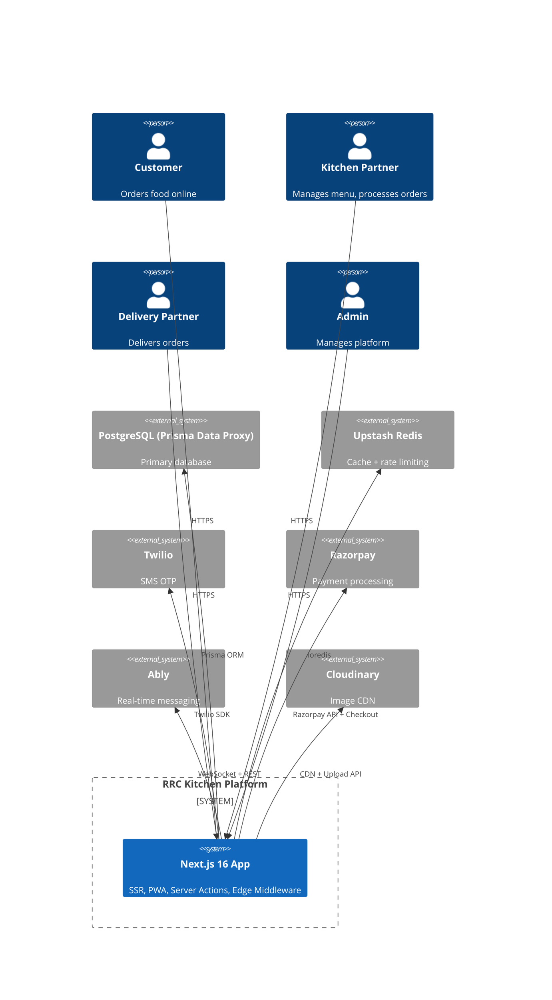

# RRC Kitchen — Architecture Documentation

> **Version:** 1.1.0
> **Last Updated:** 2026-08-05
> **Repository:** [github.com/dharshan47/rrckitchen](https://github.com/dharshan47/rrckitchen)

---

## Overview

RRC Kitchen is a full-stack food ordering platform connecting customers with local kitchens. Built on Next.js 16 with App Router, it serves four user roles: Customers, Kitchen Partners, Delivery Partners, and Platform Admins.

### Quick Facts

| Aspect | Detail |
|--------|--------|
| **Language** | TypeScript (strict) |
| **Framework** | Next.js 16 (App Router) |
| **Database** | PostgreSQL (Prisma Data Proxy) |
| **State** | TanStack Query (server) + Zustand (client) |
| **Auth** | Better-Auth (phone OTP + admin 2FA) |
| **Payments** | Razorpay (Checkout + UPI Smart Collect) |
| **Real-time** | Ably WebSocket |
| **Deployment** | Vercel (Edge + Serverless) |
| **Observability** | (none — production gap) |

---

## Documentation Index

| # | Document | Description | Audience |
|---|----------|-------------|----------|
| 01 | [System Architecture](01-system-architecture.md) | C4 diagrams (context → code), deployment diagram, tech stack matrix with rationale | All engineers |
| 02 | [Architecture Decisions](02-architecture-decisions.md) | 18 formal ADRs with context, options, decision, consequences | All engineers |
| 03 | [Data Model](03-data-model.md) | Complete ERD, index strategy, migration policy, N+1 prevention | Backend, DB |
| 04 | [API Design](04-api-design.md) | Full API contracts, error taxonomy, rate limiting, versioning | Frontend, Backend |
| 05 | [Auth & Security](05-auth-security.md) | Auth flows (OTP, 2FA), RBAC matrix, threat model, data classification | All engineers |
| 06 | [State & Data Flow](06-state-data-flow.md) | State architecture, data flow diagrams, optimistic updates, offline sync | Frontend |
| 07 | [Component System](07-component-system.md) | Component hierarchy, composition patterns, design tokens, accessibility | Frontend, UI |
| 08 | [Payment System](08-payment-system.md) | Online + COD flows, reconciliation engine, refund lifecycle, fraud detection | Backend, Finance |
| 09 | [Real-Time System](09-real-time-system.md) | WebSocket architecture, channel design, event schema, reliability | Backend, Frontend |
| 10 | [PWA & Offline](10-pwa-offline.md) | Service worker, caching strategies, push notifications, background sync | Frontend |
| 11 | [Performance & Scaling](11-performance-scaling.md) | Performance budgets, caching layers, bundle optimization, scaling plan | All engineers |
| 12 | [Observability](12-observability.md) | Logging, monitoring plan, production gaps, alerting runbooks | DevOps, Backend |
| 13 | [Testing & Quality](13-testing-quality.md) | Testing pyramid, coverage targets, CI gates, test patterns | All engineers |
| 14 | [Deployment & DevOps](14-deployment-devops.md) | CI/CD pipeline, environment strategy, rollback runbook, DR plan | DevOps |
| 15 | [Routing & Middleware](15-routing-middleware.md) | Route map, middleware chain, guard composition, layout architecture | Frontend |
| 16 | [Roles & Permissions](16-roles-permissions.md) | RBAC model, permission bitfield design, audit trail, admin scoping | All engineers |
| 17 | [Cravings Popup](17-cravings-popup.md) | Cross-sell rules (schema, actions, store), admin UI, customer popup + Ably events | All engineers |

---

## System at a Glance



---

## Architecture Principles

| # | Principle | Rationale |
|---|-----------|-----------|
| 1 | **Optimistic UI First** | Every mutation reflects instantly; server confirms in background |
| 2 | **Fail Gracefully** | Every external dependency has a fallback (degraded UX, retry, queue) |
| 3 | **Mobile First** | All layouts designed for mobile; desktop is progressive enhancement |
| 4 | **Type Safety** | No `any` in production code; runtime validation at API boundaries |
| 5 | **Observability by Default** | Every significant operation logs structured data |
| 6 | **Server Actions > REST** | Type-safe, colocated, zero serialization boilerplate |
| 7 | **Single Source of Truth** | Server data in TanStack Query; client UI state in Zustand; never duplicated |
| 8 | **Accessible by Default** | Radix UI primitives for WCAG 2.1 compliance; axe-core in CI |

---

## Quick Reference

### Common Commands

```bash
npm run dev          # Local development
npm run build        # Production build
npm run lint         # ESLint
npm run typecheck    # TypeScript check
npm run test:unit    # Unit tests
npm run test:e2e     # Playwright E2E tests
npm run storybook    # Component library
```

### Environment Variables Required

```bash
NEXT_PUBLIC_APP_URL=
DATABASE_URL=
UPSTASH_REDIS_REST_URL=
UPSTASH_REDIS_REST_TOKEN=
BETTER_AUTH_SECRET=
TWILIO_ACCOUNT_SID= 
TWILIO_AUTH_TOKEN=
TWILIO_PHONE_NUMBER=
RAZORPAY_KEY_ID= 
RAZORPAY_KEY_SECRET=
NEXT_PUBLIC_RAZORPAY_KEY_ID=
ABLY_API_KEY=
CLOUDINARY_CLOUD_NAME=
```

### Key Dependencies

```json
{
  "next": "^16",
  "react": "^19",
  "@prisma/client": "^7",
  "@tanstack/react-query": "^5",
  "zustand": "^5",
  "better-auth": "latest",
  "razorpay": "^2",
  "ably": "^2",
  "react-hook-form": "^7",
  "zod": "^4",
  "@radix-ui/*": "^2",
  "tailwindcss": "^4",
  "lucide-react": "latest"
}
```
