# How RRC Kitchen Works — Complete System Guide

> Everything from architecture and patterns to client-server data flow, with Mermaid diagrams.

---

## 1. High-Level Architecture

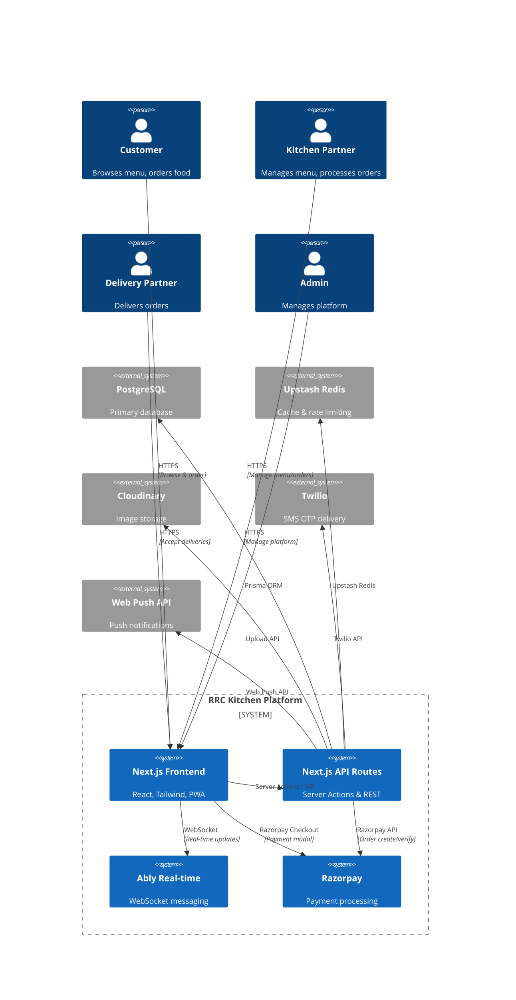

---

## 2. Technology Stack

| Layer | Technology | Purpose |
|-------|-----------|---------|
| Framework | Next.js (App Router) | Full-stack React framework |
| Language | TypeScript | Type safety throughout |
| Styling | Tailwind CSS v4 | Utility-first styling |
| Database ORM | Prisma | Type-safe database access |
| Database | PostgreSQL | Relational data store |
| Cache | Upstash Redis (Serverless) | Caching, rate limiting |
| Auth | Better-Auth | Phone OTP + Admin 2FA |
| Payments | Razorpay | Online payments |
| Real-time | Ably | WebSocket messaging |
| State (Server) | TanStack React Query v5 | API data caching |
| State (Client) | Zustand v5 | UI state management |
| Forms | React Hook Form v7 | Form handling |
| Images | Cloudinary | Image upload & delivery |
| SMS | Twilio | OTP delivery |
| PWA | Service Worker | Offline, push notifications |

---

## 3. Design Patterns

### 3.1 Server Action Pattern

Business logic lives in **server actions** under `actions/`. Components import and call them directly.

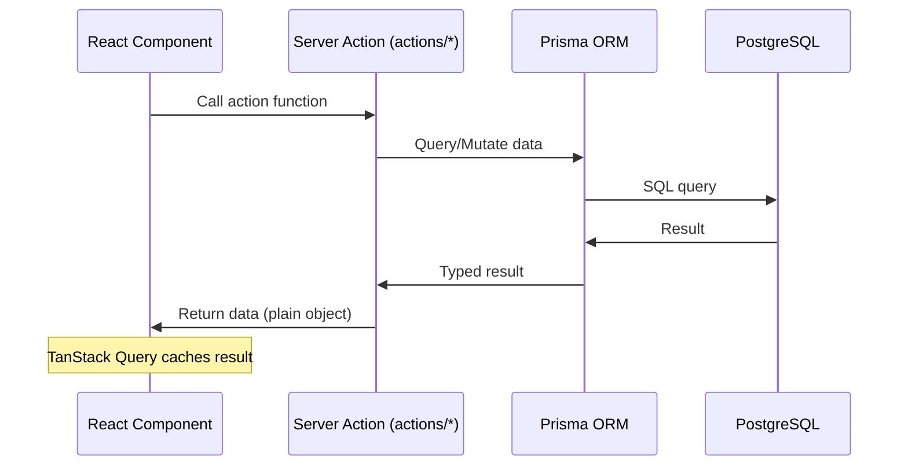

### 3.2 Repository Pattern

Data access is encapsulated in reusable action functions, not spread across components.

```
actions/
  catalog/       - Menu queries (reads)
  orders/        - Order queries/mutations
  payments/      - Payment processing
  admin/         - Admin operations
  reviews/       - Review submissions
  delivery/      - Delivery operations
  notifications/ - Push notifications
  cart-checkout/ - Cart & checkout
  payouts/       - Settlement
```

### 3.3 State Management Pattern

**Three-layer state architecture:**

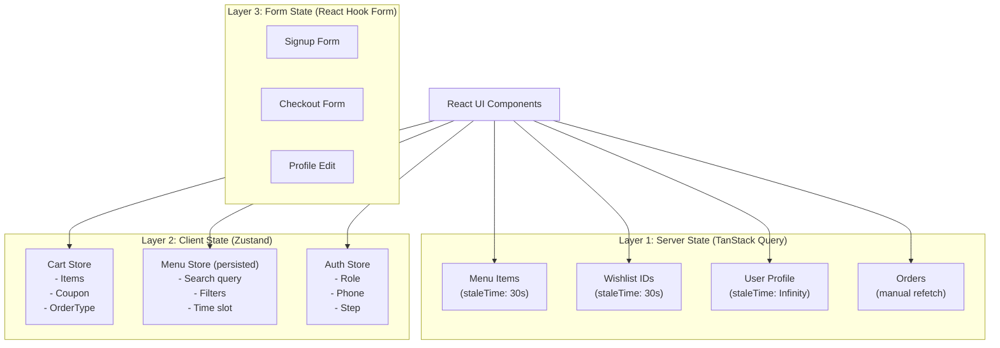

### 3.4 Optimistic Update Pattern

Cart and wishlist updates are optimistic — the UI changes immediately, then syncs to server.

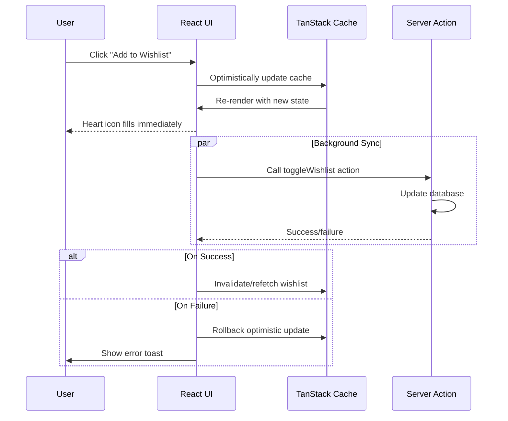

### 3.5 Component Composition Pattern

Large pages are composed of small, focused components:

```
Home Page (app/page.tsx)
  ├── HomeHeroCarousel      - Top carousel banner
  ├── TopRatedKitchens      - Horizontal scrollable kitchen cards
  ├── RecentlyJoinedKitchens - New kitchens section
  ├── TimeSlotMenuSections  - Menu grouped by time slot
  │   ├── BreakfastSection  - Scrollable breakfast items
  │   ├── LunchSection      - Scrollable lunch items
  │   ├── SnacksSection     - Scrollable snacks items
  │   └── DinnerSection     - Scrollable dinner items
  └── HomeMobileNav        - Bottom navigation bar
```

---

## 4. Client-Server Data Flow

### 4.1 Home Page Load

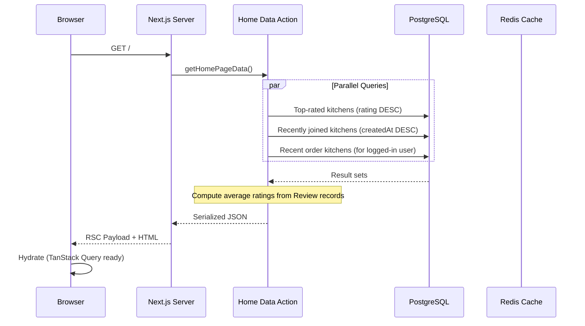

### 4.2 Menu Page Load & Filter

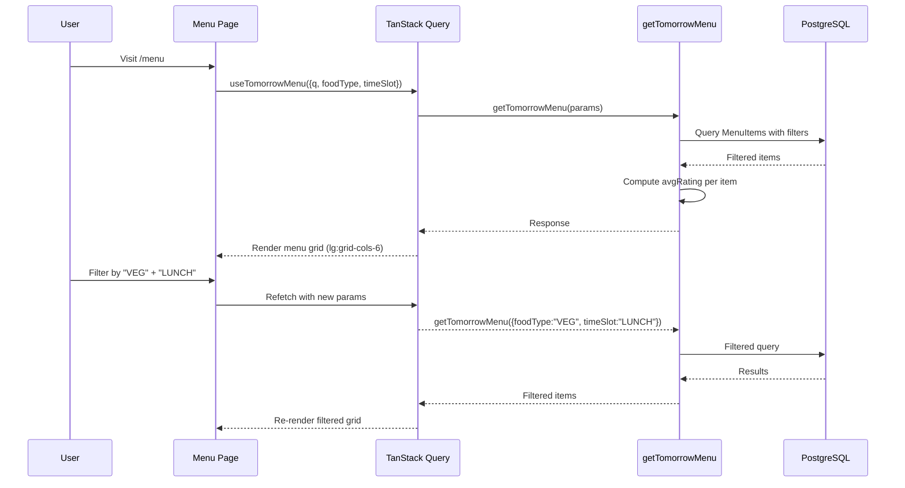

### 4.3 Cart to Checkout Flow

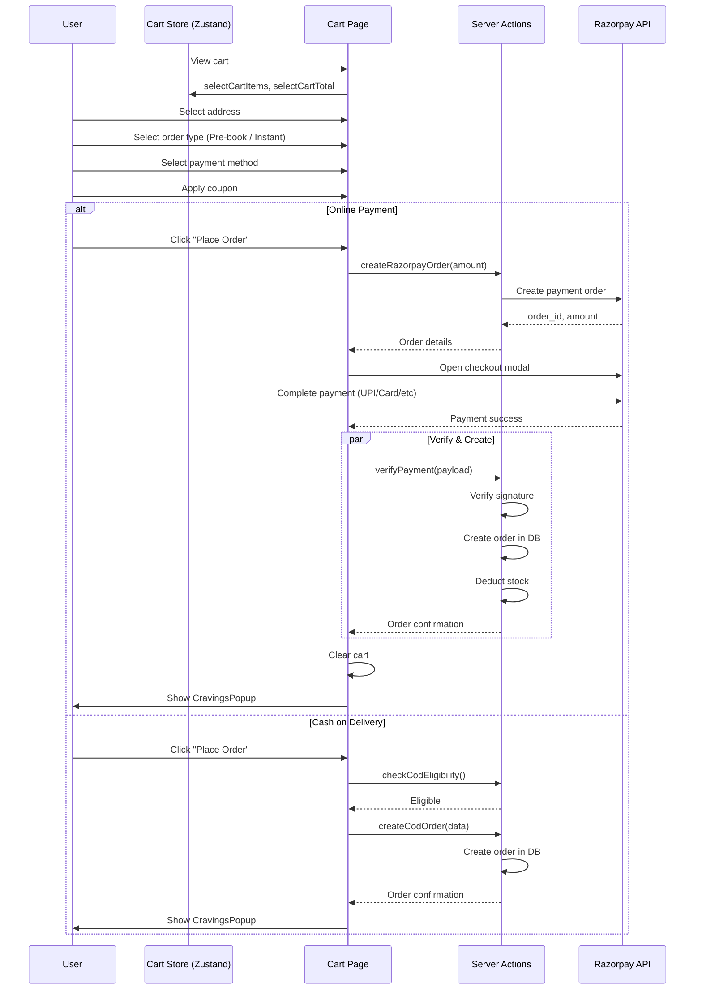

---

## 5. Authentication Flow

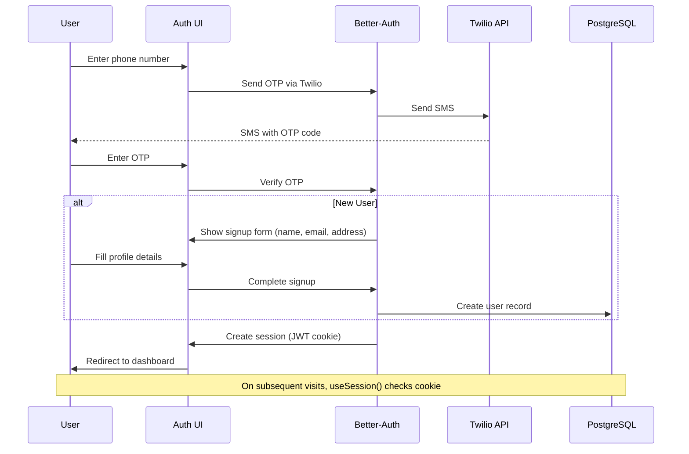

**Admin auth adds 2FA:**

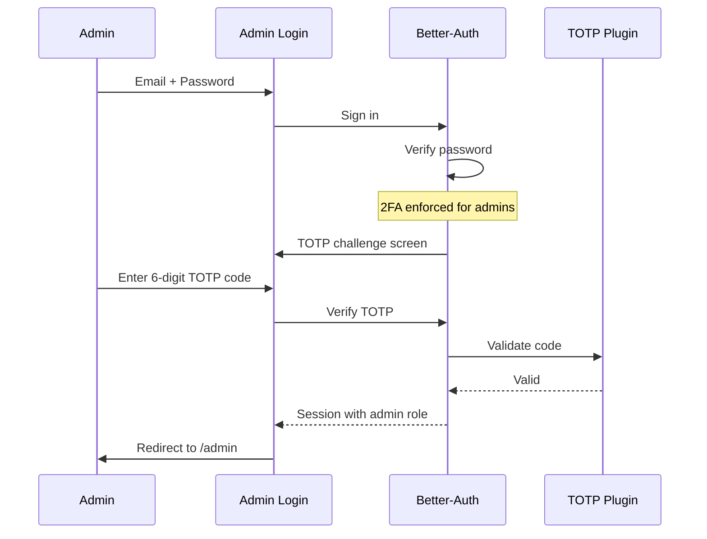

---

## 6. Real-time Order Flow

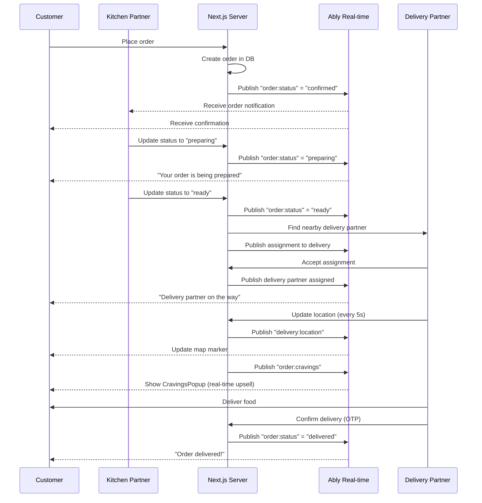

---

## 7. Payment Architecture

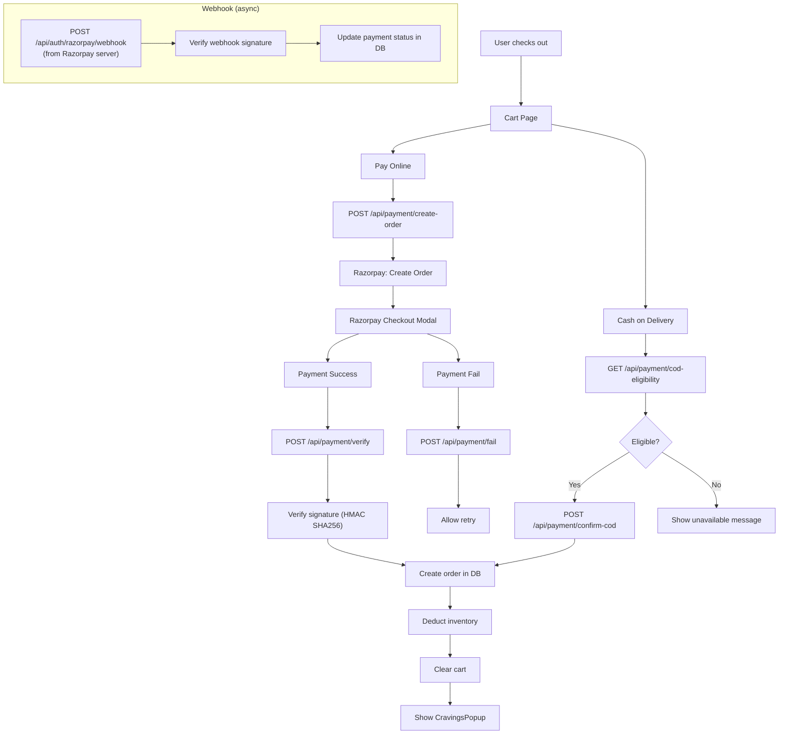

---

## 8. Database Schema (Relationships)

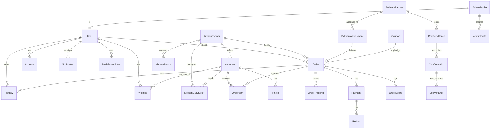

---

## 9. Component Tree (Major Routes)

```mermaid
graph TD
    Root["app/layout.tsx<br/>- Providers:<br/>  QueryClient<br/>  Session<br/>  Theme<br/>- SiteHeader<br/>- SiteFooter"]

    Root --> Home["app/page.tsx<br/>Home page (RSC)"]
    Root --> Menu["app/menu/page.tsx<br/>Menu page (RSC)"]
    Root --> Cart["app/cart/page.tsx<br/>Cart page"]
    Root --> Account["app/account/*<br/>Customer area"]
    Root --> Kitchen["app/kitchen/dashboard/*<br/>Kitchen portal"]
    Root --> Delivery["app/delivery-partner/dashboard/*<br/>Delivery portal"]
    Root --> Admin["app/admin/*<br/>Admin panel"]
    Root --> NotFound["app/not-found.tsx<br/>404 page"]

    Home --> Hero["HomeHeroCarousel"]
    Home --> TopK["TopRatedKitchens"]
    Home --> NewK["RecentlyJoinedKitchens"]
    Home --> TimeSlots["TimeSlotMenuSections"]
    TimeSlots --> BF["Breakfast Section"]
    TimeSlots --> Lunch["Lunch Section"]
    TimeSlots --> Snacks["Snacks Section"]
    TimeSlots --> Dinner["Dinner Section"]

    Menu --> MenuContent["MenuContent<br/>(Search + Filters + Grid)"]
    MenuContent --> MenuCard["MenuItemCard<br/>(WishlistButton + AddToCart)"]

    Cart --> CartItems["CartItemList"]
    Cart --> AddressSel["AddressSelector"]
    Cart --> CouponSel["CouponSelector"]
    Cart --> PaymentSel["PaymentMethodSelector"]
    Cart --> OrderTypeSel["OrderTypeSelector"]
    Cart --> Cravings["CravingsPopup"]

    Account --> Profile["Profile page"]
    Account --> Orders["Order history"]
    Account --> Addresses["Saved addresses"]
    Account --> WishlistPg["Wishlist page"]
    Account --> Loyalty["Loyalty points"]
```

---

## 10. PWA & Offline Architecture

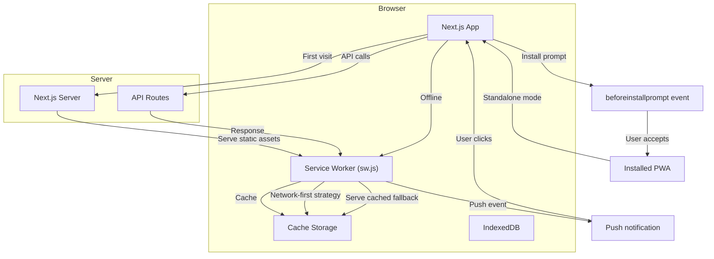

---

## 11. Folder Structure

```
src/
  app/                 - Next.js App Router pages
    page.tsx             Home page
    menu/                Menu page + filters
    cart/                Cart + checkout
    account/             Customer profile, orders
    admin/               Admin panel
    kitchen/dashboard/   Kitchen partner portal
    delivery-partner/    Delivery partner portal
    api/                 REST API routes
    not-found.tsx        404 page
    loading.tsx          Loading spinner (delayed 300ms)
    layout.tsx           Root layout (providers, header, footer)

  components/          - React components
    home/                Home page components
    menu/                Menu card, wishlist button
    order/               Order tracking, cravings
    cart/                Cart item, selectors
    location/            Map, address picker
    site/                Header, footer, mobile nav
    ui/                  Button, Input, Badge, etc.
    admin/               Admin-specific components
    patterns/            Install prompt, PWA

  actions/             - Server Actions
    catalog/             Menu queries
    orders/              Order CRUD
    payments/            Payment processing
    admin/               Admin operations
    reviews/             Review submission
    delivery/            Delivery operations
    notifications/       Push nudges
    cart-checkout/       Cart & checkout
    payouts/             Payout settlement

  lib/                 - Utilities
    auth.ts              Better-Auth server config
    auth-client.ts       Better-Auth client hooks
    prisma.ts            Prisma client singleton
    redis.ts             Redis client
    razorpay.ts          Razorpay SDK
    cloudinary.ts        Cloudinary upload
    twilio.ts            Twilio SMS
    ably/                Ably real-time config

  stores/              - Zustand stores
    cartStore.ts         Cart state
    menuStore.ts         Menu filters (persisted)
    authStore.ts         Auth form state

  hooks/               - Custom React hooks
    useTomorrowMenu.ts   Menu data fetching
    useRazorpay.ts       Payment flow
    usePhoneAuth.ts      OTP auth flow
    usePWA.ts            Install prompt
    use-mobile.ts        Mobile detection
    useAblySubscribe.ts  Real-time subscription
    useAblyOrderChannel.ts Order channel

  styles/              - Global styles
    globals.css          Tailwind imports, CSS vars
```

---

## 12. Key Design Decisions

| Decision | Rationale |
|----------|-----------|
| **Server Actions over REST** | Type-safe, no API route boilerplate, colocated with pages |
| **Zustand over Redux** | Minimal boilerplate, no providers needed, good TS support |
| **TanStack Query** | Built-in caching, deduplication, refetch, optimistic updates |
| **Better-Auth** | Phone OTP out of the box, admin 2FA, session management |
| **Prisma** | Type-safe queries, migrations, good relation handling |
| **Time-slot menu grouping** | Matches real kitchen workflows (breakfast/lunch/dinner) |
| **PWA without splash screen** | Instant loading feel, no white screen flash |
| **Ably for real-time** | Managed WebSocket infrastructure, no server overhead |
| **Optimistic wishlist** | Instant feedback, background sync, rollback on failure |
| **Mobile-first responsive** | Majority of users on mobile; desktop is progressive enhancement |
